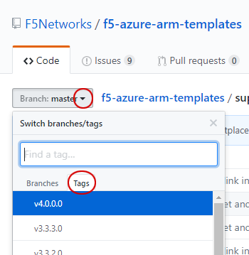

# Changing the BIG-IP VE image in an F5 ARM template

The following procedure describes how to update an F5 ARM template to use a different BIG-IP image than the one referenced in the template.  This is useful if your organization has standardized on a particular version of a template, and the BIG-IP image SKU  referenced by the template has been retired from the Azure platform, for reasons such as a vulnerability is discovered in the BIG-IP image used by the template.

Refer to the [Azure ARM Template Matrix](https://github.com/F5Networks/f5-azure-arm-templates/blob/master/azure-bigip-version-matrix.md) to ensure proper compatibility of BIG-IP versions for particular releases.  The BIG-IP version must be in the same family (for example, if you deployed using a v13 image, you use any v13.x image in the template).

*Important*  This procedure is only necessary if you need to modify a template that was contained in a previous tagged release.  If you do not need to use an older template, we recommend using the latest templates.

## To change the BIG-IP VE image in a template

1.  Determine the F5 ARM template you want to deploy (for example, standalone, 1-NIC).
2.  Select the release Tag that corresponds to the template.  To select the release tag:
  *  Go to the F5 ARM Template main page (https://github.com/F5Networks/f5-azure-arm-templates).
  *  From the **Branch** list, click the arrow, and then click the **Tags** tab. <br> <br>
  *  Select the Tagged version that contains the template you want to update.
3.  Browse to the template file (**azuredeploy.json**) which contains the BIG-IP image you want to replace.  For example, for a 1-NIC, new stack, PAYG template, we click **supported > standalone > 1nic > new_stack > PAYG > azuredeploy.json**.
4.  Click the **Raw** button and save the file locally.
5.  Open the azuredeploy.json file and search for the BIG-IP version (image SKU) you want to replace (for example, **13.0.021**).  Replace this number with the new BIG-IP version (image SKU) everywhere it appears in the file (for example, with **13.0.0300**) .   The following is a snippet of the file showing where you would change the version.
    ```json
    "bigIpVersion": {
            "allowedValues": [
                "13.0.021",
                "12.1.24",
                "latest"
            ],
            "defaultValue": "13.0.021", 
            "metadata": {
                "description": "F5 BIG-IP version you want to use."
            },
            "type": "string"
    ```
6.  Save the new file.
7.  Deploy the ARM template as you typically do.  For example, you can:
    - Use CLI tools to deploy the template.  See the individual README file for instructions.
    - Deploy using the Azure portal by uploading the template file using the Templates blade.  Once it is uploaded, you can launch the new template from there.
    - This is not an exhaustive list, simply deploy the new template as you normally would in Azure.