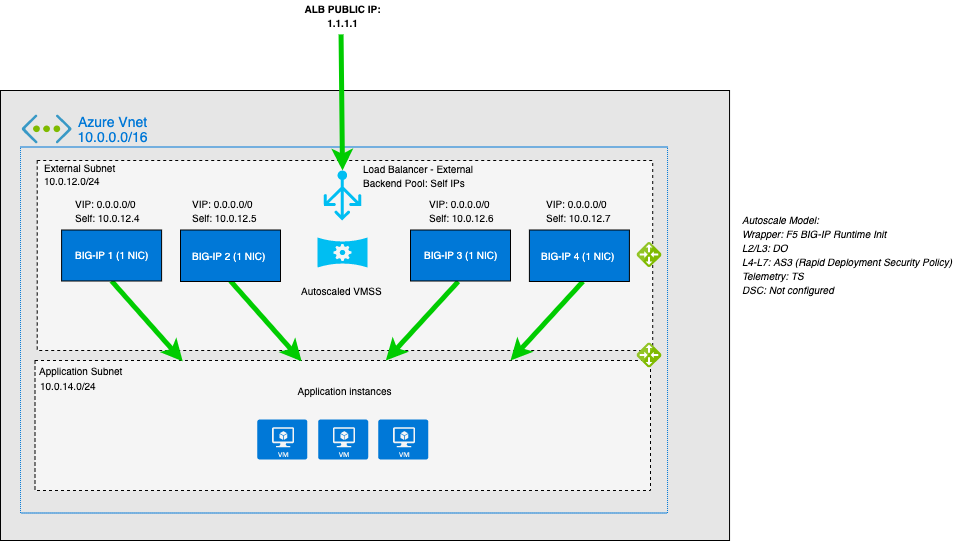

# Deploying the BIG-IP VE in Azure - Example Auto Scale BIG-IP WAF (LTM + ASM) - VM Scale Set (Frontend via ALB) - PAYG Licensing

[](https://f5cloudsolutions.herokuapp.com)
[](https://github.com/f5networks/f5-azure-arm-templates/releases)
[](https://github.com/f5networks/f5-azure-arm-templates/issues)

## Contents

- [Introduction](#introduction)
- [Prerequisites](#prerequisites)
- [Important Configuration Notes](#important-configuration-notes)
- [Template Input Parameters](#template-input-parameters)
- [Template Outputs](#template-outputs)
- [Security](#security)
- [Installation](#installation)
- [Configuration Example](#configuration-example)
- [Getting Help](#getting-help)

## Introduction

This solution uses a parent template to launch several linked child templates (modules) to create a full example stack for the BIG-IP autoscale solution. The linked templates are located in the examples/modules directories in this repository. **F5 encourages you to clone this repository and modify these templates to fit your use case.** 

The modules below create the following resources:

- **Network**: This template creates Azure Virtual Networks, subnets, and the management Network Security Group.
- **Application**: This template creates a generic example application for use when demonstrating live traffic through the BIG-IPs.
- **Disaggregation** *(DAG)*: This template creates resources required to get traffic to the BIG-IP, including Azure Public IP Addresses, internal/external Load Balancers, and accompanying resources such as load balancing rules, NAT rules, and probes.
- **Access**: This template creates an Azure Managed User Identity, KeyVault, and secret used to set the admin password on the BIG-IP instances.
- **BIG-IP**: This template creates the Microsoft Azure VM Scale Set with F5 BIG-IP Virtual Editions provisioned with Local Traffic Manager (LTM) and Application Security Manager (ASM). Traffic flows from the Azure load balancer to the BIG-IP VE instances and then to the application servers. The BIG-IP VE(s) are configured in single-NIC mode. Auto scaling means that as certain thresholds are reached, the number of BIG-IP VE instances automatically increases or decreases accordingly. The BIG-IP module template can be deployed separately from the example template provided here into an "existing" stack.

This solution leverages more traditional Auto Scale configuration management practices where each instance is created with an identical configuration as defined in the Scale Set's "model". Scale Set sizes are no longer restricted to the small limitations of the cluster. The BIG-IP's configuration, now defined in a single convenient YAML or JSON [F5 BIG-IP Runtime Init](https://github.com/f5devcentral/f5-bigip-runtime-init) *(IN PREVIEW)* configuration file, leverages [F5 Automation Tool Chain](https://www.f5.com/pdf/products/automation-toolchain-overview.pdf) declarations which are easier to author, validate and maintain as code. For instance, if you need to change the configuration on the BIG-IPs in the deployment, you update the instance model by passing a new config file (which references the updated Automation Toolchain declarations) via template's runtimeConfig input parameter. New instances will be deployed with the updated configurations.  

In most cases, it is especially expected that WAF or Application Service (as defined in AS3 declaration) will be customized, but if you use the default value from the example below for any of the service operations, the corresponding example declaration from the BIG-IP module folder will be used.

F5 has provided the following example declarations for the supported Automation Toolchain components in the examples/autoscale folder:

- autoscale_do_payg.json: The Declarative Onboarding declaration configures L2/L3 networking and system settings on BIG-IP. See the [DO documentation](https://clouddocs.f5.com/products/extensions/f5-declarative-onboarding/) for details on how to use DO.
- autoscale_as3.json: The Application Services declaration configures L4-L7 application services on BIG-IP, including service discovery. See the [AS3 documentation](https://clouddocs.f5.com/products/extensions/f5-appsvcs-extension/) for details on how to use AS3.
- autoscale_ts.json: The Telemetry Streaming declaration configures BIG-IP to declaratively aggregate, normalize, and forward statistics and events to a consumer application. See the [TS documentation](https://clouddocs.f5.com/products/extensions/f5-telemetry-streaming/) for details on how to use TS.


Here is an example F5 BIG-IP Runtime Init configuration that uses the previously referenced Automation Toolchain declarations:

```yaml
---
extension_packages:
  install_operations:
  - extensionHash: e7c9acb0ddfc9e9949c48b9a8de686c365764f28347aacf194a6de7e3ed183be
    extensionType: do
    extensionVersion: 1.13.0
  - extensionHash: ba2db6e1c57d2ce6f0ca20876c820555ffc38dd0a714952b4266c4daf959d987
    extensionType: as3
    extensionVersion: 3.20.0
  - extensionHash: d52ad1ca23df1d9c81a9e3641fc25b593dd0c0a17cc3a90316067ae78e41a990
    extensionType: ts
    extensionVersion: 1.12.0
extension_services:
  service_operations:
  - extensionType: do
    type: inline
    value:
      Common:
        class: Tenant
        dbvars:
          class: DbVariables
          provision.extramb: 500
          restjavad.useextramb: true
        myDns:
          class: DNS
          nameServers:
          - 8.8.8.8
        myNtp:
          class: NTP
          servers:
          - 0.pool.ntp.org
          timezone: UTC
        myProvisioning:
          asm: nominal
          class: Provision
          ltm: nominal
        mySystem:
          autoPhonehome: true
          class: System
          hostname: "{{HOST_NAME}}.local"
      async: true
      class: Device
      label: myBIG-IPdeclarationfordeclarativeonboarding
      schemaVersion: 1.0.0
  - extensionType: as3
    type: inline
    value:
      action: deploy
      class: AS3
      declaration:
        Sample_http_01:
          A1:
            My_ASM_Policy:
              class: WAF_Policy
              ignoreChanges: true
              enforcementMode: blocking
              url: https://raw.githubusercontent.com/f5devcentral/f5-asm-policy-templates/master/generic_ready_template/Rapid_Depolyment_Policy_13_1.xml
            class: Application
            serviceMain:
              class: Service_HTTP
              policyWAF:
                use: My_ASM_Policy
              pool: webPool
              virtualAddresses:
              - 0.0.0.0
              virtualPort: 80
            template: http
            webPool:
              class: Pool
              members:
              - serverAddresses:
                - 10.0.1.4
                servicePort: 80
              monitors:
              - http
          class: Tenant
        class: ADC
        label: Sample1
        remark: HTTPwithcustompersistence
        schemaVersion: 3.0.0
      persist: true
  - extensionType: ts
    type: inline
    value:
      Azure_Consumer:
        appInsightsResourceName: dd-app-*
        class: Telemetry_Consumer
        maxBatchIntervalMs: 5000
        maxBatchSize: 250
        trace: true
        type: Azure_Application_Insights
        useManagedIdentity: true
      Bigip_Poller:
        actions:
        - includeData: {}
          locations:
            system:
              cpu: true
              networkInterfaces:
                '1.0':
                  counters.bitsIn: true
        class: Telemetry_System_Poller
        interval: 60
      class: Telemetry
      controls:
        class: Controls
        debug: true
        logLevel: debug
post_onboard_enabled: []
pre_onboard_enabled: []
runtime_parameters:
- name: HOST_NAME
  type: metadata
  metadataProvider:
    environment: azure
    type: compute
    field: name
```

And which you would reference in your parameter file:

```json
        "useAvailabilityZones": {
            "value": false
        },
        "runtimeConfig": {
            "value": "https://raw.githubusercontent.com/myorg/mydeployment/0.0.1/bigip-configs/bigip-init-config.yaml"
        },
```

Or the same F5 BIG-IP Runtime Init configuration as json:

```json
{"extension_packages":{"install_operations":[{"extensionHash":"e7c9acb0ddfc9e9949c48b9a8de686c365764f28347aacf194a6de7e3ed183be","extensionType":"do","extensionVersion":"1.13.0"},{"extensionHash":"ba2db6e1c57d2ce6f0ca20876c820555ffc38dd0a714952b4266c4daf959d987","extensionType":"as3","extensionVersion":"3.20.0"},{"extensionHash":"d52ad1ca23df1d9c81a9e3641fc25b593dd0c0a17cc3a90316067ae78e41a990","extensionType":"ts","extensionVersion":"1.12.0"}]},"extension_services":{"service_operations":[{"extensionType":"do","type":"inline","value":{"Common":{"class":"Tenant","dbvars":{"class":"DbVariables","provision.extramb":500,"restjavad.useextramb":true},"myDns":{"class":"DNS","nameServers":["8.8.8.8"]},"myNtp":{"class":"NTP","servers":["0.pool.ntp.org"],"timezone":"UTC"},"myProvisioning":{"asm":"nominal","class":"Provision","ltm":"nominal"},"mySystem":{"autoPhonehome":true,"class":"System","hostname":"{{HOST_NAME}}.local"}},"async":true,"class":"Device","label":"myBIG-IPdeclarationfordeclarativeonboarding","schemaVersion":"1.0.0"}},{"extensionType":"as3","type":"inline","value":{"action":"deploy","class":"AS3","declaration":{"Sample_http_01":{"A1":{"My_ASM_Policy":{"class":"WAF_Policy","ignoreChanges":true,"enforcementMode":"blocking","url":"https://raw.githubusercontent.com/f5devcentral/f5-asm-policy-templates/master/generic_ready_template/Rapid_Depolyment_Policy_13_1.xml"},"class":"Application","serviceMain":{"class":"Service_HTTP","policyWAF":{"use":"My_ASM_Policy"},"pool":"webPool","virtualAddresses":["0.0.0.0"],"virtualPort":80},"template":"http","webPool":{"class":"Pool","members":[{"serverAddresses":["10.0.1.4"],"servicePort":80}],"monitors":["http"]}},"class":"Tenant"},"class":"ADC","label":"Sample1","remark":"HTTPwithcustompersistence","schemaVersion":"3.0.0"},"persist":true}},{"extensionType":"ts","type":"inline","value":{"Azure_Consumer":{"appInsightsResourceName":"dd-app-*","class":"Telemetry_Consumer","maxBatchIntervalMs":5000,"maxBatchSize":250,"trace":true,"type":"Azure_Application_Insights","useManagedIdentity":true},"Bigip_Poller":{"actions":[{"includeData":{},"locations":{"system":{"cpu":true,"networkInterfaces":{"1.0":{"counters.bitsIn":true}}}}}],"class":"Telemetry_System_Poller","interval":60},"class":"Telemetry","controls":{"class":"Controls","debug":true,"logLevel":"debug"}}}]},"post_onboard_enabled":[],"pre_onboard_enabled":[],"runtime_parameters":[{"name":"HOST_NAME","type":"metadata","metadataProvider":{"environment":"azure","type":"compute","field":"name"}}]}
```

which you would provide in your parameter file as a url or inline:

```json
        "useAvailabilityZones": {
            "value": false
        },
        "runtimeConfig": {
            "value": "{\"extension_packages\":{\"install_operations\":[{\"extensionHash\":\"e7c9acb0ddfc9e9949c48b9a8de686c365764f28347aacf194a6de7e3ed183be\",\"extensionType\":\"do\",\"extensionVersion\":\"1.13.0\"},{\"extensionHash\":\"ba2db6e1c57d2ce6f0ca20876c820555ffc38dd0a714952b4266c4daf959d987\",\"extensionType\":\"as3\",\"extensionVersion\":\"3.20.0\"},{\"extensionHash\":\"d52ad1ca23df1d9c81a9e3641fc25b593dd0c0a17cc3a90316067ae78e41a990\",\"extensionType\":\"ts\",\"extensionVersion\":\"1.12.0\"}]},\"extension_services\":{\"service_operations\":[{\"extensionType\":\"do\",\"type\":\"inline\",\"value\":{\"Common\":{\"class\":\"Tenant\",\"dbvars\":{\"class\":\"DbVariables\",\"provision.extramb\":500,\"restjavad.useextramb\":true},\"myDns\":{\"class\":\"DNS\",\"nameServers\":[\"8.8.8.8\"]},\"myNtp\":{\"class\":\"NTP\",\"servers\":[\"0.pool.ntp.org\"],\"timezone\":\"UTC\"},\"myProvisioning\":{\"asm\":\"nominal\",\"class\":\"Provision\",\"ltm\":\"nominal\"},\"mySystem\":{\"autoPhonehome\":true,\"class\":\"System\",\"hostname\":\"{{HOST_NAME}}.local\"}},\"async\":true,\"class\":\"Device\",\"label\":\"myBIG-IPdeclarationfordeclarativeonboarding\",\"schemaVersion\":\"1.0.0\"}},{\"extensionType\":\"as3\",\"type\":\"inline\",\"value\":{\"action\":\"deploy\",\"class\":\"AS3\",\"declaration\":{\"Sample_http_01\":{\"A1\":{\"My_ASM_Policy\":{\"class\":\"WAF_Policy\",\"ignoreChanges\":true,\"enforcementMode\":\"blocking\",\"url\":\"https://raw.githubusercontent.com/f5devcentral/f5-asm-policy-templates/master/generic_ready_template/Rapid_Depolyment_Policy_13_1.xml\"},\"class\":\"Application\",\"serviceMain\":{\"class\":\"Service_HTTP\",\"policyWAF\":{\"use\":\"My_ASM_Policy\"},\"pool\":\"webPool\",\"virtualAddresses\":[\"0.0.0.0\"],\"virtualPort\":80},\"template\":\"http\",\"webPool\":{\"class\":\"Pool\",\"members\":[{\"serverAddresses\":[\"10.0.1.4\"],\"servicePort\":80}],\"monitors\":[\"http\"]}},\"class\":\"Tenant\"},\"class\":\"ADC\",\"label\":\"Sample1\",\"remark\":\"HTTPwithcustompersistence\",\"schemaVersion\":\"3.0.0\"},\"persist\":true}},{\"extensionType\":\"ts\",\"type\":\"inline\",\"value\":{\"Azure_Consumer\":{\"appInsightsResourceName\":\"dd-app-*\",\"class\":\"Telemetry_Consumer\",\"maxBatchIntervalMs\":5000,\"maxBatchSize\":250,\"trace\":true,\"type\":\"Azure_Application_Insights\",\"useManagedIdentity\":true},\"Bigip_Poller\":{\"actions\":[{\"includeData\":{},\"locations\":{\"system\":{\"cpu\":true,\"networkInterfaces\":{\"1.0\":{\"counters.bitsIn\":true}}}}}],\"class\":\"Telemetry_System_Poller\",\"interval\":60},\"class\":\"Telemetry\",\"controls\":{\"class\":\"Controls\",\"debug\":true,\"logLevel\":\"debug\"}}}]},\"post_onboard_enabled\":[],\"pre_onboard_enabled\":[],\"runtime_parameters\":[{\"name\":\"HOST_NAME\",\"type\":\"metadata\",\"metadataProvider\":{\"environment\":\"azure\",\"type\":\"compute\",\"field\":\"name\"}}]}"
        },
```

Note: You must escape all double quotes when supplying the inline configuration as a template parameter.

For information on getting started using F5's ARM templates on GitHub, see [Microsoft Azure: Solutions 101](http://clouddocs.f5.com/cloud/public/v1/azure/Azure_solutions101.html).

## Prerequisites

 - This solution requires a valid F5 BIG-IP Runtime Init configuration URL or string in escaped JSON format. See above for links to example configuration, as well as an inline example.
 - This solution requires outbound Internet access for downloading the F5 BIG-IP Runtime Init and Automation Toolchain installation packages.
 - This solution makes requests to the Azure REST API to read and update Azure resources such as KeyVault secrets. For the solution to function correctly, you must ensure that the BIG-IP(s) can connect to the Azure REST API on port 443.
 - This solution makes requests  to the Azure REST API to read and update Azure resources, this has specifically been tested in Azure Commercial Cloud. Additional cloud environments such as Azure Government, Azure Germany and Azure China cloud have not yet been tested.
 - This template requires an SSH public key for access to the BIG-IP instances. 
 - If you provide a value for the newPassword template input parameter, the value is stored in an Azure KeyVault secret. The secret is read securely at deployment time and injected into the sample F5 Declarative Onboarding declaration. When deployment is complete, you can authenticate using the admin account using this password.
   -   **Disclaimer:** ***Accessing or logging into the instances themselves is for demonstration and debugging purposes only. All configuration changes should be applied by updating the model via the template instead.***   

## Important configuration notes

- If you have cloned this repository to an internally hosted location in order to modify the templates, you can use the templateBaseUrl and artifactLocation input parameters to specify the location of the modules.

- To facilitate this immutable deployment model, the BIG-IP leverages the F5 BIG-IP Runtime Init package.  The BIG-IP template requires a valid f5-bigip-runtime-init configuration file and execution command to be specified in the properties of the Azure Virtual Machine Scale Set resource. See <a href="https://github.com/f5devcentral/f5-bigip-runtime-init">F5 BIG-IP Runtime Init</a> for more information.<br>

- In this solution, the BIG-IP VEs must have the [LTM](https://f5.com/products/big-ip/local-traffic-manager-ltm) and [ASM](https://f5.com/products/big-ip/application-security-manager-asm) modules enabled to provide advanced traffic management and web application security functionality. The provided Declarative Onboarding declaration describes how to provision these modules. This template uses BIG-IP **private** management address when license is requested via BIG-IQ.

- This template can send non-identifiable statistical information to F5 Networks to help us improve our templates. You can disable this functionality by setting the **autoPhonehome** system class property value to false in the F5 Declarative Onboarding declaration. See [Sending statistical information to F5](#sending-statistical-information-to-f5).

- F5 has created a matrix that contains all of the tagged releases of the F5 ARM templates for Microsoft Azure and the corresponding BIG-IP versions, license types, and throughput levels available for a specific tagged release. See [azure-bigip-version-matrix](https://github.com/F5Networks/f5-azure-arm-templates/blob/master/azure-bigip-version-matrix.md).

- F5 ARM templates now capture all deployment logs to the BIG-IP VE in **/var/log/cloud/azure**. Depending on which template you are using, this includes deployment logs (stdout/stderr) and more. Logs from Automation Toolchain components are located at **/var/log/restnoded/restnoded.log** on each BIG-IP instance.

- F5 ARM templates do not reconfigure existing Azure resources, such as network security groups. Depending on your configuration, you may need to configure these resources to allow the BIG-IP VE(s) to receive traffic for your application. Similarly, the DAG example template that deploys Azure Load Balancer(s) configures load balancing rules and probes on those resources to forward external traffic to the BIG-IP(s) on standard ports 443 and 80. F5 recommends cloning this repository and modifying the module templates to fit your use case.

- See the **[Configuration Example](#configuration-example)** section for a configuration diagram and description for this solution.


### Template Input Parameters

| Parameter | Required | Description |
| --- | --- | --- |
| templateBaseUrl | Yes | The publicly accessible URL where the linked ARM templates are located. |
| artifactLocation | Yes | The directory, relative to the templateBaseUrl, where the modules folder is located. |
| uniqueString | Yes | A prefix that will be used to name template resources. Because some resources require globally unique names, we recommend using a unique value. |
| sshKey | Yes | Supply the public key that will be used for SSH authentication to the BIG-IP and application virtual machines. Note: This should be the public key as a string, typically starting with **---- BEGIN SSH2 PUBLIC KEY ----** and ending with **---- END SSH2 PUBLIC KEY ----**. |
| newPassword | No | The new password to be used for the admin user on the BIG-IP instances. This is required for creating the AZURE_PASSWORD secret referenced in the runtimeConfig template parameter. If this value is left blank, the access module template is not deployed. |
| appContainer | No | The name of a container to download and install which is used for the example application server. If this value is left blank, the application module template is not deployed. |
| restrictedSrcMgmtAddress | Yes | When creating management security group, this field restricts management access to a specific network or address. Enter an IP address or address range in CIDR notation, or asterisk for all sources. |
| runtimeConfig | Yes | Supply a URL to the bigip-runtime-init configuration file in YAML or JSON format, or an escaped JSON string to use for f5-bigip-runtime-init configuration. |
| useAvailabilityZones | Yes | This deployment can deploy resources into Azure Availability Zones (if the region supports it).  If that is not desired the input should be set 'No'. If the region does not support availability zones the input should be set to No. |
| tagValues | Yes | Default key/value resource tags will be added to the resources in this deployment, if you would like the values to be unique adjust them as needed for each key. |

### Template Outputs

| Name | Description | Required Resource | Type |
| --- | --- | --- | --- |
| virtualNetworkId | Virtual Network resource ID | Network Template | string |
| appVmName | Application Virtual Machine name | Application Template | string |
| appPublicIps | Application Public IP Addresses | Application Template | array |
| appPrivateIp | Application Private IP Address | Application Template | string |
| appUsername | Application user name | Application Template | string |
| vmssId | Virtual Machine Scale Set resource ID | BIG-IP Template | string |
| bigipUsername | BIG-IP user name | BIG-IP Template | string |
| bigipPassword | BIG-IP password | BIG-IP Template | string |

## Security

This ARM template downloads helper code to configure the BIG-IP system:

- f5-bigip-runtime-init.gz.run: The self-extracting installer for the F5 BIG-IP Runtime Init RPM can be verified against a SHA256 checksum provided as a release asset on the F5 BIG-IP Runtime Init public Github repository, for example: https://github.com/f5devcentral/f5-bigip-runtime-init/releases/download/0.11.0/default.dist.f5-bigip-runtime-init-0.11.0-1.gz.run.sha256.
- F5 BIG-IP Runtime Init: The self-extracting installer script extracts, verifies, and installs the F5 BIG-IP Runtime Init RPM package. Package files are signed by F5 and automatically verified using GPG.
- F5 Automation Toolchain components: F5 BIG-IP Runtime Init downloads, installs, and configures the F5 Automation Toolchain components. Although it is optional, F5 recommends adding the extensionHash field to each extension install operation in the configuration file. The presence of this field triggers verification of the downloaded component package checksum against the provided value. The checksum values are published as release assets on each extension's public Github repository, for example: https://github.com/F5Networks/f5-appsvcs-extension/releases/download/v3.18.0/f5-appsvcs-3.18.0-4.noarch.rpm.sha256

The following configuration file will verify the Declarative Onboarding and Application Services extensions before configuring AS3 from a local file:

```yaml
runtime_parameters: []
extension_packages:
    install_operations:
        - extensionType: do
          extensionVersion: 1.10.0
          extensionHash: 190b9bb7e0f6e20aa344a36bcabeeb76c2af26e8b9c9a93d62bd6d4a26337cae
        - extensionType: as3
          extensionVersion: 3.17.0
          extensionHash: 41151962912408d9fc6fc6bde04c006b6e4e155fc8cc139d1797411983b7afa6
extension_services:
    service_operations:
      - extensionType: as3
        type: url
        value: file:///examples/declarations/as3.json
```

More information about F5 BIG-IP Runtime Init and additional examples can be found in the [Github repository](https://github.com/f5devcentral/f5-bigip-runtime-init/blob/develop/README.md).

If you want to verify the integrity of the template itself, F5 provides checksums for all of our templates. For instructions and the checksums to compare against, see [checksums-for-f5-supported-cft-and-arm-templates-on-github](https://devcentral.f5.com/codeshare/checksums-for-f5-supported-cft-and-arm-templates-on-github-1014).

## BIG-IP versions

The following is a map that shows the available options for the template variable **image** as it corresponds to the BIG-IP version itself. Only the latest version of BIG-IP VE is posted in the Azure Marketplace. For older versions, see downloads.f5.com.

| Azure BIG-IP Image Version | BIG-IP Version |
| --- | --- |
| 15.1.004000 | 15.1.0 Build 0.0.4 |
| 14.1.206000 | 14.1.2 Build 0.0.6 |
| latest | This will select the latest BIG-IP version available |

These templates have been tested and validated with the following versions of BIG-IP. 

| BIG-IP Version | Build Number |
| --- | --- |
| 15.1.0 | 0.0.4 |
| 14.1.2 | 0.0.6 |

## Supported instance types and hypervisors

- For a list of supported Azure instance types for this solution, see the [Azure instances for BIG-IP VE](http://clouddocs.f5.com/cloud/public/v1/azure/Azure_singleNIC.html#azure-instances-for-big-ip-ve).

- For a list of versions of the BIG-IP Virtual Edition (VE) and F5 licenses that are supported on specific hypervisors and Microsoft Azure, see [supported-hypervisor-matrix](https://support.f5.com/kb/en-us/products/big-ip_ltm/manuals/product/ve-supported-hypervisor-matrix.html).


## Installation

You have three options for deploying this solution:

- Using the Azure deploy buttons
- Using [PowerShell](#powershell-script-example)
- Using [CLI Tools](#azure-cli-10-script-example)

### Azure deploy buttons

Use the appropriate button below to deploy:

- **PAYG**: This allows you to use pay-as-you-go hourly billing.

  [](https://portal.azure.com/#create/Microsoft.Template/uri/https%3A%2F%2Fraw.githubusercontent.com%2FF5Networks%2Ff5-azure-arm-templates%2Fv9.0.0.0%2Fexamples%2Fautoscale%2Fpayg%2Fazuredeploy.json)


### Programmatic deployments

As an alternative to deploying through the Azure Portal (GUI) each solution provides example scripts to deploy the ARM template. The example commands can be found below along with the name of the script file, which exists in the current directory.

#### PowerShell Script Example

```powershell
## Example Command: .\Deploy_via_PS.ps1 -templateBaseUrl https://cdn.f5.com/product/cloudsolutions/ -artifactLocation f5-azure-arm-templates/examples/ -sshKey <value> -uniqueString <value> -newPassword <value> -appContainer f5devcentral/f5-demo-app:1.0.1 -restrictedSrcMgmtAddress * -runtimeConfig https://cdn.f5.com/product/cloudsolutions/declarations/template2-0/autoscale-waf/userData.yaml -useAvailabilityZones <value>
```

=======

#### Azure CLI (1.0) Script Example

```bash
## Example Command: ./deploy_via_bash.sh 
--templateBaseUrl https://cdn.f5.com/product/cloudsolutions/ --artifactLocation f5-azure-arm-templates/examples/ --sshKey <value> --uniqueString <value> --newPassword <value> --appContainer f5devcentral/f5-demo-app:1.0.1 --restrictedSrcMgmtAddress * --runtimeConfig https://cdn.f5.com/product/cloudsolutions/declarations/template2-0/autoscale-waf/userData.yaml --useAvailabilityZones <value>
```


## Configuration Example

The following is an example configuration diagram for this solution deployment. In this scenario, all access to the BIG-IP VE appliance is through an Azure Load Balancer. The Azure Load Balancer processes both management and data plane traffic into the BIG-IP VEs, which then distribute the traffic to web/application servers according to normal F5 patterns.



#### BIG-IP Lifecycle Management

As new BIG-IP versions are released, existing VM scale sets can be upgraded to use those new images. This section describes the process of upgrading and retaining the configuration.

#### To upgrade the BIG-IP VE Image

1. Update the VM Scale Set Model to the new BIG-IP version
    - From PowerShell: Use the PowerShell script in the **scripts** folder in this directory.
    - Using the Azure redeploy functionality: From the Resource Group where the ARM template was initially deployed, click the successful deployment and then select to redeploy the template. If necessary, re-select all the same variables, and **only change** the BIG-IP version to the latest.
2. Upgrade the Instances
    1. In Azure, navigate to the VM Scale Set instances pane and verify the *Latest model* does not say **Yes** (it should have a caution sign instead of the word Yes).
    2. Select either all instances at once or each instance one at a time (starting with instance ID 0 and working up).
    3. Click the **Upgrade** action button.

#### Configure Scale Event Notifications

**Note:** You can specify email addresses for notifications within the solution and they will be applied automatically. You can also manually configure them via the VM Scale Set configuration options available within the Azure Portal.

You can add notifications when scale up/down events happen, either in the form of email or webhooks. The following shows an example of adding an email address via the Azure Resources Explorer that receives an email from Azure whenever a scale up/down event occurs.

Log in to the [Azure Resource Explorer](https://resources.azure.com) and then navigate to the Auto Scale settings (**Subscriptions > Resource Groups >** *resource group where deployed* **> Providers > Microsoft.Insights > Autoscalesettings > autoscaleconfig**). At the top of the screen click Read/Write, and then from the Auto Scale settings, click **Edit**.  Replace the current **notifications** json key with the example below, making sure to update the email address(es). Select PUT and notifications will be sent to the email addresses listed.

```json
    "notifications": [
      {
        "operation": "Scale",
        "email": {
          "sendToSubscriptionAdministrator": false,
          "sendToSubscriptionCoAdministrators": false,
          "customEmails": [
            "email@f5.com"
          ]
        },
        "webhooks": null
      }
    ]
```


## Documentation

For more information on F5 solutions for Azure, including manual configuration procedures for some deployment scenarios, see the Azure section of [Public Cloud Docs](http://clouddocs.f5.com/cloud/public/v1/).


## Getting Help

The example templates in this directory are intended to provide reference deployments of F5 BIG-IP Virtual Editions. Due to the heavy customization requirements of external cloud resources and BIG-IP configurations in these solutions, F5 does not provide technical support for deploying, customizing, or troubleshooting the templates themselves. However, the various underlying products and components used (for example: F5 BIG-IP Virtual Edition, Automation Toolchain extensions, and Cloud Failover Extension (CFE)) in the solutions located here are F5-supported and capable of being deployed with other orchestration tools. Read more about [Support Policies](https://www.f5.com/company/policies/support-policies). 

### Filing Issues

If you find an issue, we would love to hear about it.

- Use the **Issues** link on the GitHub menu bar in this repository for items such as enhancement or feature requests and non-urgent bug fixes. Tell us as much as you can about what you found and how you found it.


## Copyright

Copyright 2014-2020 F5 Networks Inc.

## License

### Apache V2.0

Licensed under the Apache License, Version 2.0 (the "License"); you may not use
this file except in compliance with the License. You may obtain a copy of the
License [here](http://www.apache.org/licenses/LICENSE-2.0).

Unless required by applicable law or agreed to in writing, software
distributed under the License is distributed on an "AS IS" BASIS,
WITHOUT WARRANTIES OR CONDITIONS OF ANY KIND, either express or implied.
See the License for the specific language governing permissions and limitations
under the License.

### Contributor License Agreement

Individuals or business entities who contribute to this project must have
completed and submitted the F5 Contributor License Agreement.