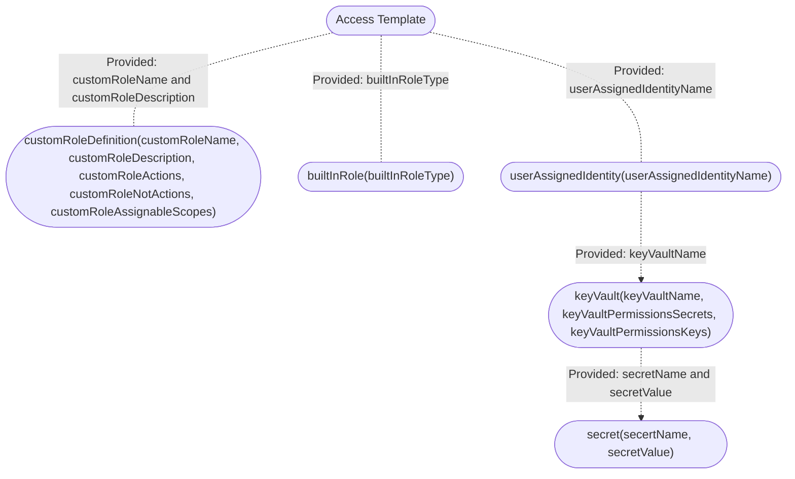

# Deploying Access Template

## Contents

- [Deploying Access Template](#deploying-access-template)
  - [Contents](#contents)
  - [Introduction](#introduction)
  - [Prerequisites](#prerequisites)
  - [Important Configuration Notes](#important-configuration-notes)
  - [Resources Provisioning](#resources-provisioning)
    - [Template Input Parameters](#template-input-parameters)
    - [Template Outputs](#template-outputs)
  - [Resource Tree](#resource-tree)
  - [Getting Help](#getting-help)
    - [Filing Issues](#filing-issues)
  - [Copyright](#copyright)
  - [License](#license)
    - [Apache V2.0](#apache-v20)
    - [Contributor License Agreement](#contributor-license-agreement)

## Introduction

This solution uses an ARM template to launch a stack for provisioning Access related items. This template can be deployed as a standalone; however the main intention is to use as a module for provisioning Access related resources:

  - Built-in Role Definition
  - Custom Role Definition
  - Managed Identity
  - Key Vault
  - Secrets

## Prerequisites

  - None. This template does not require provisioning of additional resources.

## Important Configuration Notes

  - This template provisions resources based on conditions. See [Resources Provisioning](#resources-provisioning) for more details on each resource's minimal requirements.
  - A sample template, 'sample_linked.json', is included in the project. Use this example to see how to add a template as a linked template into your templated solution.
 
## Resources Provisioning

  * [Managed Identity](https://docs.microsoft.com/en-us/azure/active-directory/managed-identities-azure-resources/)
    - Requires providing `userAssignedIdentityName` parameter.
    - Used as dependency for provisioning KeyVault and Secrets.
  * [KeyVault](https://docs.microsoft.com/en-us/azure/key-vault/general/basic-concepts)
    - Dependent on Azure Managed Identity.
    - Allows to specify KeyVault Name; otherwise will construct.
  * Secrets
    - Secret which will be stored in Azure KeyVault.
    - Requires providing `secretName` and `secretValue`.
  * [Azure Built-in Roles](https://docs.microsoft.com/en-us/azure/role-based-access-control/built-in-roles):
    - Enabled role types:
      * Reader
      * Contributor
      * Owner
      * User Access Administrator
  * Custom Role Definition
    - Allows to create custom role definition.
    - Requires providing `customRoleName` and `customRoleDescription` parameters for successful provisioning.
    - Takes a few additional parameters (i.e. `customRoleAssignScopes`, `customRoleActions`, and `customRoleNotActions`) intended for customizing rule defintion.

### Template Input Parameters

| Parameter | Required | Description |
| --- | --- | --- |
| builtInRoleType | Yes | Specifies built-in role type name. Allowed values are 'Owner', 'Contributor', 'UserAccessAdministrator'.|
| customRoleName| No | Provides value for custom role definiton which will be created by the template. |
| customRoleDescription | No | Description for custom role. |
| customRoleActions | No | List of actions permitted by Role. For example: Microsoft.Resources/subscriptions/resourceGroups/read |
| customRoleNotActions | No | List of not actions permitted by Role; example: Microsoft.Resources/subscriptions/resourceGroups/delete |
| customRoleAssignableScopes | No | List of scopes applied to Role. |
| keyVaultName | No | Key Vault name. |
| userAssignedIdentityName | No | User Assigned Identity name. |
| secretName | No | Enter the secret name. |
| secretValue | No | Enter the secret value. |

### Template Outputs

| Name | Description | Required Resource | Type |
| --- | --- | --- | --- |
| builtInRoleId | Built-in role resource ID | None | string |
| userAssignedIdentityName | User assigned identity name | User Assigned Identity | string |
| customRoleDefinitionId | Custom role definition resource ID | Custom Role Definition | string |
| keyVaultName | Key Vault name | Key Vault | string |
| secretName | Secret name | Secret | string |

## Resource Tree 

Resource Creation Flow Chart

## Getting Help

The example templates in this directory are intended to provide reference deployments of F5 BIG-IP Virtual Editions. Due to the heavy customization requirements of external cloud resources and BIG-IP configurations in these solutions, F5 does not provide technical support for deploying, customizing, or troubleshooting the templates themselves. However, the various underlying products and components used (for example: F5 BIG-IP Virtual Edition, Automation Toolchain extensions, and Cloud Failover Extension (CFE)) in the solutions located here are F5-supported and capable of being deployed with other orchestration tools. Read more about [Support Policies](https://www.f5.com/company/policies/support-policies). 

### Filing Issues

If you find an issue, we would love to hear about it.

- Use the **Issues** link on the GitHub menu bar in this repository for items such as enhancement or feature requests and non-urgent bug fixes. Tell us as much as you can about what you found and how you found it.

## Copyright

Copyright 2014-2020 F5 Networks Inc.

## License

### Apache V2.0

Licensed under the Apache License, Version 2.0 (the "License"); you may not use
this file except in compliance with the License. You may obtain a copy of the
License [here](http://www.apache.org/licenses/LICENSE-2.0).

Unless required by applicable law or agreed to in writing, software
distributed under the License is distributed on an "AS IS" BASIS,
WITHOUT WARRANTIES OR CONDITIONS OF ANY KIND, either express or implied.
See the License for the specific language governing permissions and limitations
under the License.

### Contributor License Agreement

Individuals or business entities who contribute to this project must have
completed and submitted the F5 Contributor License Agreement.
