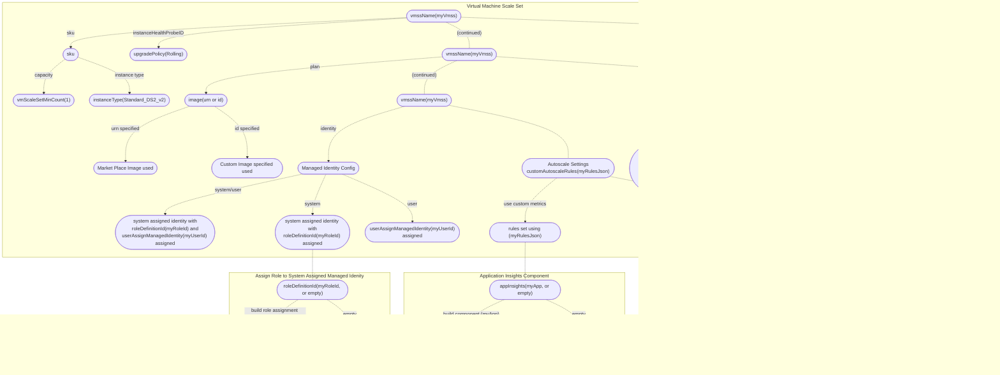

# Deploying BIG-IP Template

[](https://f5cloudsolutions.herokuapp.com)
[](https://github.com/f5networks/f5-azure-arm-templates/releases)
[](https://github.com/f5networks/f5-azure-arm-templates/issues)

## Contents

- [Deploying BIG-IP Template](#deploying-big-ip-template)
  - [Contents](#contents)
  - [Introduction](#introduction)
  - [Prerequisites](#prerequisites)
  - [Important Configuration Notes](#important-configuration-notes)
    - [Template Input Parameters](#template-input-parameters)
    - [Template Outputs](#template-outputs)
  - [Example Configurations](#example-configurations)
  - [Resource Tree](#resource-tree)
  - [Getting Help](#getting-help)
    - [Filing Issues](#filing-issues)
  - [Copyright](#copyright)
  - [License](#license)
    - [Apache V2.0](#apache-v20)
    - [Contributor License Agreement](#contributor-license-agreement)

## Introduction

This ARM template creates a BIG-IP Virtual Machine Scale Set (VMSS), configures autoscale settings, creates an optional application insight component, and optionally associates specified role definition with system assigned managed identity. Link this template to create BIG-IP VMSS required for F5 deployments.

## Prerequisites

 - F5-bigip-runtime-init configuration file required. See https://cdn.f5.com/product/cloudsolutions/f5-bigip-runtime-init/v0.9.0/dist/f5-bigip-runtime-init-0.9.0-1.gz.run for more details on F5-bigip-runtime-init SDK. See example userData.yaml in the repository.
 - Declarative Onboaring (DO) declaration: See example autoscale_do_payg.json or autoscale_do_bigiq.json in the repository.
 - AS3 declaration: See example autoscale_a3.json in the repository.
 - Telemetry Streaming (TS) declaration if using custom metrics. See example autoscale_ts.json in the repository.
 
## Important Configuration Notes

 - A sample template, 'sample_linked.json', has been included in this project. Use this example to see how to add bigip.json as a linked template into your templated solution.
 - Rolling upgrades: This template configures a rolling upgrade policy to upgrade the VMSS instances in batches when the autoscale model changes.  By default, when the deployment is healthy, twenty percent of the instances will be upgraded in each batch, with a pause of zero seconds (Azure default) between batches. F5 recommends modifying this policy to suit your environment. Any change to the value of the runtimeConfig input parameter will trigger a rolling upgrade of instances.
- Reimaging not recommended: When using BIG-IQ to license BIG-IP images, F5 recommends against using the Reimage feature of the Azure VM Scale Set. In this situation, you should redeploy the template while specifying an updated runtimeConfig parameter value. If you are not using an upgrade policy, to upgrade VMSS instances, you should delete each instance in the scale set so that each will be recreated using the updated autoscale model.
- New vs existing Azure App Insights: When specifying a value for the appInsights input parameter, a new Azure App Insights resource is created. If you are also specifying autoscale rules that use custom F5 metrics in the customAutoscaleRules input parameter **and** reference the new Azure App Insights resource name specified in appInsights, the template will create an Azure deploymentScript resource to pre-populate common custom metrics. This resource is only available in regions that support the Azure Container Service; therefore, the App Insights and deploymentScript resources will be created in the West US 2 region.
- Troubleshooting: The log location for f5-bigip-runtime-init onboarding is ``/var/log/cloud/bigIpRuntimeInit.log``. By default, the log level is set to info; however, you can set a custom log level by exporting the F5_BIGIP_RUNTIME_INIT_LOG_LEVEL environment variable before invoking f5-bigip-runtime-init in commandToExecute: 
```export F5_BIGIP_RUNTIME_INIT_LOG_LEVEL=silly && bash ', variables('runtimeConfigPackage'), ' azure 2>&1```


### Template Input Parameters

| Parameter | Required | Description |
| --- | --- | --- |
| adminUsername | Yes | Enter a valid BIG-IP username. This creates the specified username on the BIG-IP with admin role. |
| appInsights | No | Valid values: empty value, an acceptable application insight component name. Creates application insight component with specified name. |
| cpuMetricName | Sometimes | Valid values include valid metric name. See [this documentation](https://docs.microsoft.com/en-us/azure/azure-monitor/platform/metrics-supported) for supported values. A value of 'Default' creates metric using Azure instance metrics. This is required when customAutoscaleRules parameter is not used. |
| customAutoscaleRules | No | Leave default to create Azure native CPU and throughput metric triggers. Enter an array of appropriate json to use custom triggers. See [this documentation](https://docs.microsoft.com/en-us/azure/templates/microsoft.insights/autoscalesettings) for valid json. **Note: when using custom triggers, parameters used to collect metric thresholds are not used.** |
| customEmail | No | Enter an array of email addresses to be notified when scale up or scale down occurs. For example: ['myemail@email.com','myemail2@email.com']. |
| dnsLabel | Yes | Unique DNS Name for the Public IP address used to access the Virtual Machine and postfix resource names. |
| image | Yes |  There are two acceptable formats: Enter the URN of the image to use in Azure marketplace, or enter the ID of the custom image. An example URN value: 'f5-networks:f5-big-ip-byol:f5-big-ltm-2slot-byol:15.1.002000'. You can find the URNs of F5 marketplace images in the README for this template or by running the command: ``az vm image list --output yaml --publisher f5-networks --all``. See [this documentation](https://clouddocs.f5.com/cloud/public/v1/azure/Azure_download.html) for information on creating a custom BIG-IP image. |
| inboundMgmtNatPoolID | No | NAT pool ID used for the BIG-IP management GUI connections. Leave as default if you do not want to use natpools or are using public IP. |
| inboundSshNatPoolID | No | NAT pool ID used for SSH connections to BIG-IP. Leave as default if you do not want to use natpools or are using public IP. |
| instanceHealthProbeID | Yes | Enter the resource ID of the probe that you wish to use to determine instance health when performing a rolling upgrade of scale set instances. Use the default value if you are using a manual upgrade policy. Note: The probe must be associated with a load balancing rule. |
| instanceType | Yes | Enter a valid instance type. |
| loadBalancerBackendAddressPoolsArray | Yes | Enter an array of pools where BIG-IP instances are to be added. |
| nsgID | No | Enter security group ID to use. Use default if you do not wish to apply an NSG policy. |
| provisionPublicIP | No | Enter public IP json configuration to attach public IP to instances. See [this documentation](https://docs.microsoft.com/en-us/azure/templates/microsoft.compute/2019-07-01/virtualmachinescalesets) for supported values. Leave default if using natpool, or not using public IPs on instances. |
| roleDefinitionId | No | Enter a role definition ID you want to add to system managed identity. Leave default if system managed identity is not used. |
| runtimeConfig | Yes | Url to bigip-runtime-init configuration file or json string to use for configuration file. |
| scaleInCpuThreshold | Sometimes | The percentage of CPU utilization that should trigger a scale in event. Required when customAutoscaleRules parameter not used. |
| scaleInThroughputThreshold | Sometimes | The amount of throughput (**bytes**) that should trigger a scale in event. Note: The default value is equal to 10 MB. This is required when the customAutoscaleRules parameter is not used. |
| scaleInTimeWindow | Sometimes | The time window required to trigger a scale in event. This is used to determine the amount of time needed for a threshold to be breached, as well as to prevent excessive scaling events (flapping). **Note:** Allowed values are 1-60 (minutes). This is required when the customAutoscaleRules parameter is not used. |
| scaleOutCpuThreshold | Sometimes | The percentage of CPU utilization that should trigger a scale out event. This is required when the customAutoscaleRules parameter is not used. |
| scaleOutThroughputThreshold | Sometimes | The amount of throughput (**bytes**) that should trigger a scale out event. Note: The default value is equal to 20 MB. This is required when the customAutoscaleRules parameter is not used. |
| scaleOutTimeWindow | Sometimes | The time window required to trigger a scale out event. This is used to determine the amount of time needed for a threshold to be breached, as well as to prevent excessive scaling events (flapping). **Note:** Allowed values are 1-60 (minutes). This is required when customAutoscaleRules parameter not used. |
| sshKey | Yes | Supply the SSH public key you want to use to connect to the BIG-IP. |
| subnetId | Yes | Enter subnet ID to use. |
| tagValues | No | Default key/value resource tags will be added to the resources in this deployment, if you would like the values to be unique, adjust them as needed for each key. |
| throughputMetricName | Sometimes | Valid classic compute metric, default is for aggregate interface traffic. [this documentation(https://docs.microsoft.com/en-us/azure/azure-monitor/platform/metrics-supported) for supported values. This is required when the customAutoscaleRules parameter is not used. |
| useAvailabilityZones | Yes | This deployment can deploy resources into Azure Availability Zones (if the region supports it). If that is not desired, the input should be set 'No'. If the region does not support availability zones, the input should be set to 'No'.  |
| userAssignManagedIdentity | No | Enter user assigned management identity Id to be associated to vmss. Leave default if not used. |
| vmScaleSetMaxCount | Yes | The maximum number of BIG-IP VEs that can be deployed into the VM Scale Set. |
| vmScaleSetMinCount | Yes | The minimum (and default) number of BIG-IP VEs that will be deployed into the VM Scale Set. |
| vmssName| Yes | Name to use for Virtual Machine Scale Set. |

### Template Outputs

| Name | Description | Required Resource | Type |
| --- | --- | --- | --- |
| appInsightsComponentID | Application Insights resource ID | Application Insights | string |
| appInsightsInstrumentationKey | Application Insights Instrumentation Key | Application Insights | string |
| roleAssignmentID | Role Assignment resource ID | Role Definition | string |
| autoscaleSettingsID | Autoscale Settings resource ID | Virtual Machine Scale Set | string |
| vmssID | Virtual Machine Scale Set resource ID | Virtual Machine Scale Set | string |


## Example Configurations

**f5-bigip-runtime-init json example**
- See \<Add URL to f5-bigip-runtime-init readme.md\> for additional examples.
- Note all quotes are escaped as parameter type expected is string.
Example on one line:   
```json
{\"runtime_parameters\":[{\"name\":\"HOST_NAME\",\"type\":\"metadata\",\"metadataProvider\":{\"environment\":\"azure\",\"type\":\"compute\",\"field\":\"name\"}}],\"pre_onboard_enabled\":[],\"post_onboard_enabled\":[{\"name\":\"sleep 300\",\"type\":\"inline\",\"commands\":[\"sleep 300\"]}],\"extension_packages\":{\"install_operations\":[{\"extensionType\":\"do\",\"extensionVersion\":\"1.13.0\",\"extensionHash\":\"e7c9acb0ddfc9e9949c48b9a8de686c365764f28347aacf194a6de7e3ed183be\"},{\"extensionType\":\"as3\",\"extensionVersion\":\"3.20.0\",\"extensionHash\":\"ba2db6e1c57d2ce6f0ca20876c820555ffc38dd0a714952b4266c4daf959d987\"},{\"extensionType\":\"ts\",\"extensionVersion\":\"1.12.0\",\"extensionHash\":\"d52ad1ca23df1d9c81a9e3641fc25b593dd0c0a17cc3a90316067ae78e41a990\"}]},\"extension_services\":{\"service_operations\":[{\"extensionType\":\"do\",\"type\":\"url\",\"value\":\"https://cdn.f5.com/product/cloudsolutions/declarations/template2-0/autoscale-waf/autoscale_do_payg.json\"},{\"extensionType\":\"as3\",\"type\":\"url\",\"value\":\"https://cdn.f5.com/product/cloudsolutions/declarations/template2-0/autoscale-waf/autoscale_as3.json\"},{\"extensionType\":\"ts\",\"type\":\"url\",\"value\":\"https://cdn.f5.com/product/cloudsolutions/declarations/template2-0/autoscale-waf/autoscale_ts.json\"}]}}
```
- Same example expanded:

```json
{
  \"extension_packages\": {
    \"install_operations\": [
      {
        \"extensionHash\": \"e7c9acb0ddfc9e9949c48b9a8de686c365764f28347aacf194a6de7e3ed183be\",
        \"extensionType\": \"do\",
        \"extensionVersion\": \"1.13.0\"
      },
      {
        \"extensionHash\": \"ba2db6e1c57d2ce6f0ca20876c820555ffc38dd0a714952b4266c4daf959d987\",
        \"extensionType\": \"as3\",
        \"extensionVersion\": \"3.20.0\"
      },
      {
        \"extensionHash\": \"d52ad1ca23df1d9c81a9e3641fc25b593dd0c0a17cc3a90316067ae78e41a990\",
        \"extensionType\": \"ts\",
        \"extensionVersion\": \"1.12.0\"
      }
    ]
  },
  \"extension_services\": {
    \"service_operations\": [
      {
        \"extensionType\": \"do\",
        \"type\": \"url\",
        \"value\": \"https://cdn.f5.com/product/cloudsolutions/declarations/template2-0/autoscale-waf/autoscale_do_payg.json\"
      },
      {
        \"extensionType\": \"as3\",
        \"type\": \"url\",
        \"value\": \"https://cdn.f5.com/product/cloudsolutions/declarations/template2-0/autoscale-waf/autoscale_as3.json\"
      },
      {
        \"extensionType\": \"ts\",
        \"type\": \"url\",
        \"value\": \"https://cdn.f5.com/product/cloudsolutions/declarations/template2-0/autoscale-waf/autoscale_ts.json\"
      }
    ]
  },
  \"post_onboard_enabled\": [
    {
      \"commands\": [
        \"sleep 300\"
      ],
      \"name\": \"sleep 300\",
      \"type\": \"inline\"
    }
  ],
  \"pre_onboard_enabled\": [],
  \"runtime_parameters\": [
    {
      \"metadataProvider\": {
        \"environment\": \"azure\",
        \"field\": \"name\",
        \"type\": \"compute\"
      },
      \"name\": \"HOST_NAME\",
      \"type\": \"metadata\"
    }
  ]
}
```
**customAutoscaleRules parameter json example**
 - See https://docs.microsoft.com/en-us/azure/templates/microsoft.insights/autoscalesettings for valid json.
 - Replace "\<APP INSIGHTS\>" with appropriate insight ID.
 - Example on one line:
```json
[{"metricTrigger":{"metricName":"customMetrics\/F5_system_cpu","metricNamespace":"","metricResourceUri":"<APP INSIGHTS>","operator":"GreaterThan","statistic":"Average","threshold":"80","timeAggregation":"Average","timeGrain":"PT1M","timeWindow":"PT10M"},"scaleAction":{"cooldown":"PT1M","direction":"Increase","type":"ChangeCount","value":"1"}},{"metricTrigger":{"metricName":"customMetrics\/F5_system_cpu","metricNamespace":"","metricResourceUri":"<APP INSIGHTS>","operator":"LessThan","statistic":"Average","threshold":"20","timeAggregation":"Average","timeGrain":"PT1M","timeWindow":"PT10M"},"scaleAction":{"cooldown":"PT1M","direction":"Decrease","type":"ChangeCount","value":"1"}},{"metricTrigger":{"metricName":"customMetrics\/F5_system_networkInterfaces_1.0_counters.bitsIn","metricNamespace":"","metricResourceUri":"<APP INSIGHTS>","operator":"GreaterThan","statistic":"Average","threshold":"20000000","timeAggregation":"Average","timeGrain":"PT1M","timeWindow":"PT10M"},"scaleAction":{"cooldown":"PT1M","direction":"Increase","type":"ChangeCount","value":"1"}},{"metricTrigger":{"metricName":"customMetrics\/F5_system_networkInterfaces_1.0_counters.bitsIn","metricNamespace":"","metricResourceUri":"<APP INSIGHTS>","operator":"LessThan","statistic":"Average","threshold":"10000000","timeAggregation":"Average","timeGrain":"PT1M","timeWindow":"PT10M"},"scaleAction":{"cooldown":"PT1M","direction":"Decrease","type":"ChangeCount","value":"1"}}]
```
- Same example expanded:

``` json
[
    {
        "metricTrigger": {
            "metricName": "customMetrics/F5_system_cpu",
            "metricNamespace": "",
            "metricResourceUri": "<APP INSIGHTS>",
            "operator": "GreaterThan",
            "statistic": "Average",
            "threshold": "80",
            "timeAggregation": "Average",
            "timeGrain": "PT1M",
            "timeWindow": "PT10M"
        },
        "scaleAction": {
            "cooldown": "PT1M",
            "direction": "Increase",
            "type": "ChangeCount",
            "value": "1"
        }
    },
    {
        "metricTrigger": {
            "metricName": "customMetrics/F5_system_cpu",
            "metricNamespace": "",
            "metricResourceUri": "<APP INSIGHTS>",
            "operator": "LessThan",
            "statistic": "Average",
            "threshold": "20",
            "timeAggregation": "Average",
            "timeGrain": "PT1M",
            "timeWindow": "PT10M"
        },
        "scaleAction": {
            "cooldown": "PT1M",
            "direction": "Decrease",
            "type": "ChangeCount",
            "value": "1"
        }
    },
    {
        "metricTrigger": {
            "metricName": "customMetrics/F5_system_networkInterfaces_1.0_counters.bitsIn",
            "metricNamespace": "",
            "metricResourceUri": "<APP INSIGHTS>",
            "operator": "GreaterThan",
            "statistic": "Average",
            "threshold": "20000000",
            "timeAggregation": "Average",
            "timeGrain": "PT1M",
            "timeWindow": "PT10M"
        },
        "scaleAction": {
            "cooldown": "PT1M",
            "direction": "Increase",
            "type": "ChangeCount",
            "value": "1"
        }
    },
    {
        "metricTrigger": {
            "metricName": "customMetrics/F5_system_networkInterfaces_1.0_counters.bitsIn",
            "metricNamespace": "",
            "metricResourceUri": "<APP INSIGHTS>",
            "operator": "LessThan",
            "statistic": "Average",
            "threshold": "10000000",
            "timeAggregation": "Average",
            "timeGrain": "PT1M",
            "timeWindow": "PT10M"
        },
        "scaleAction": {
            "cooldown": "PT1M",
            "direction": "Decrease",
            "type": "ChangeCount",
            "value": "1"
        }
    }
]
```

**provisionPublicIP json example**
- One line example:
```json
{ "name": "publicIp01", "properties": { "idleTimeoutInMinutes": 15 } }
```
- Same example expanded:
```json
{
    "name": "publicIp01",
    "properties": {
        "idleTimeoutInMinutes": 15
    }
}
```

**Declarative Onboarding Declaration Example**
- See https://clouddocs.f5.com/products/extensions/f5-declarative-onboarding/latest/ for more information.
- Onboarding declaration that supports payg onboarding.
- Note HOST_NAME has been defined in the example runtimeConfig. This is required to dynamically set each BIG-IP instance host name based on instance name set by Azure.

```json
{
    "Common": {
        "class": "Tenant",
        "dbvars": {
            "class": "DbVariables",
            "provision.extramb": 500,
            "restjavad.useextramb": true
        },
        "myDns": {
            "class": "DNS",
            "nameServers": [
                "8.8.8.8"
            ]
        },
        "myNtp": {
            "class": "NTP",
            "servers": [
                "0.pool.ntp.org"
            ],
            "timezone": "UTC"
        },
        "myProvisioning": {
            "asm": "nominal",
            "class": "Provision",
            "ltm": "nominal"
        },
        "mySystem": {
            "autoPhonehome": false,
            "class": "System",
            "hostname": "{{ HOST_NAME }}"
        }
    },
    "async": true,
    "class": "Device",
    "label": "my BIG-IP declaration for declarative onboarding",
    "schemaVersion": "1.0.0"
}
```

**Telemetry Streaming Declaration Example**
- See https://clouddocs.f5.com/products/extensions/f5-telemetry-streaming/latest/ for more information.
- TS declaration which supports example customAutoscaleRules noted above.
- Modify filter to match correct application insight name.

```json
{
    "Azure_Consumer": {
        "appInsightsResourceName": "dd-app-*",
        "class": "Telemetry_Consumer",
        "maxBatchIntervalMs": 5000,
        "maxBatchSize": 250,
        "trace": true,
        "type": "Azure_Application_Insights",
        "useManagedIdentity": true
    },
    "Bigip_Poller": {
        "actions": [
            {
                "includeData": {},
                "locations": {
                    "system": {
                        "cpu": true,
                        "networkInterfaces": {
                            "1.0": {
                                "counters.bitsIn": true
                            }
                        }
                    }
                }
            }
        ],
        "class": "Telemetry_System_Poller",
        "interval": 60
    },
    "class": "Telemetry"
}
```

**Application Services 3 (AS3) Declaration Example**
- See https://clouddocs.f5.com/products/extensions/f5-appsvcs-extension/latest/ for more information.
- AS3 declaration which supports WAF deployments.

```json
{
    "action": "deploy",
    "class": "AS3",
    "declaration": {
        "Sample_http_01": {
            "A1": {
                "My_ASM_Policy": {
                    "class": "WAF_Policy",
                    "ignoreChanges": true,
                    "url": "https://raw.githubusercontent.com/f5devcentral/f5-asm-policy-templates/master/generic_ready_template/Rapid_Depolyment_Policy_13_1.xml"
                },
                "class": "Application",
                "serviceMain": {
                    "class": "Service_HTTP",
                    "policyWAF": {
                        "use": "My_ASM_Policy"
                    },
                    "pool": "webPool",
                    "virtualAddresses": [
                        "0.0.0.0"
                    ],
                    "virtualPort": 80
                },
                "template": "http",
                "webPool": {
                    "class": "Pool",
                    "members": [
                        {
                            "serverAddresses": [
                                "10.0.0.2"
                            ],
                            "servicePort": 80
                        }
                    ],
                    "monitors": [
                        "http"
                    ]
                }
            },
            "class": "Tenant"
        },
        "class": "ADC",
        "label": "Sample 1",
        "remark": "HTTP with custom persistence",
        "schemaVersion": "3.0.0"
    },
    "persist": true
}
```
## Resource Tree

Resource Creation Flow Chart
<br>
<br>
<br>

<br>
<br>
<br>

## Getting Help

The example templates in this directory are intended to provide reference deployments of F5 BIG-IP Virtual Editions. Due to the heavy customization requirements of external cloud resources and BIG-IP configurations in these solutions, F5 does not provide technical support for deploying, customizing, or troubleshooting the templates themselves. However, the various underlying products and components used (for example: F5 BIG-IP Virtual Edition, Automation Toolchain extensions, and Cloud Failover Extension (CFE)) in the solutions located here are F5-supported and capable of being deployed with other orchestration tools. Read more about [Support Policies](https://www.f5.com/company/policies/support-policies). 

### Filing Issues

If you find an issue, we would love to hear about it.

- Use the **Issues** link on the GitHub menu bar in this repository for items such as enhancement or feature requests and non-urgent bug fixes. Tell us as much as you can about what you found and how you found it.


## Copyright

Copyright 2014-2020 F5 Networks Inc.

## License

### Apache V2.0

Licensed under the Apache License, Version 2.0 (the "License"); you may not use
this file except in compliance with the License. You may obtain a copy of the
License [here](http://www.apache.org/licenses/LICENSE-2.0).

Unless required by applicable law or agreed to in writing, software
distributed under the License is distributed on an "AS IS" BASIS,
WITHOUT WARRANTIES OR CONDITIONS OF ANY KIND, either express or implied.
See the License for the specific language governing permissions and limitations
under the License.

### Contributor License Agreement

Individuals or business entities who contribute to this project must have
completed and submitted the F5 Contributor License Agreement.
