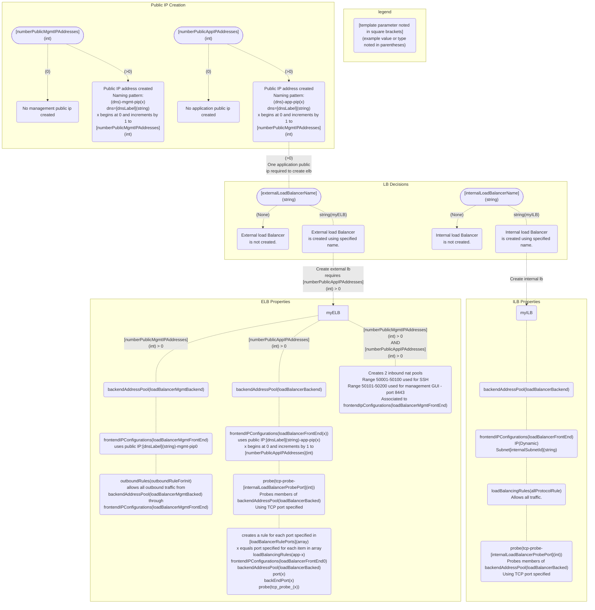

# Deploying Dag/Ingress Template

## Contents

- [Deploying Dag/Ingress Template](#deploying-dagingress-template)
  - [Contents](#contents)
  - [Introduction](#introduction)
  - [Prerequisites](#prerequisites)
  - [Important Configuration Notes](#important-configuration-notes)
    - [Template Input Parameters](#template-input-parameters)
    - [Template Outputs](#template-outputs)
  - [Resource Tree](#resource-tree)
  - [Getting Help](#getting-help)
    - [Filing Issues](#filing-issues)
  - [Copyright](#copyright)
  - [License](#license)
    - [Apache V2.0](#apache-v20)
    - [Contributor License Agreement](#contributor-license-agreement)

## Introduction

This template creates various cloud resources to get traffic to BIG-IP solutions, including; Public IPs (for accessing management and dataplane/VIP addresses), load balancers (for example, a standard sku external load balancer and/or a standard SKU internal load balancer) to distribute or disaggregate traffic, etc.

## Prerequisites

 - Existing subnet required for internal load balancer creation.
 
## Important Configuration Notes

 - A sample template, 'sample_linked.json', has been included in this project. Use this example to see how to add a template as a linked template into your templated solution.

### Template Input Parameters

| Parameter | Required | Description |
| --- | --- | --- |
| numberPublicMgmtIPAddresses | Yes | Enter the number of public mgmt IP addresses to create. |
| numberPublicAppIPAddresses | Yes | Enter the number of public IP addresses to create. At least one is required to build ELB. |
| dnsLabel | Yes | Unique DNS Name for the Public IP address used to access the Virtual Machine. |
| externalLoadBalancerName | Yes | Valid values include 'None', or an external load balancer name. A value of 'None' will not create an external load balancer. Specifying a name creates an external load balancer with the name specified. |
| loadBalancerRulePorts | Yes | Valid values include valid TCP ports. Enter an array of ports that your applications use. For example: '[80,443,445]' |
| internalLoadBalancerName | Yes | Valid values include 'None', or an internal load balancer name. A value of 'None' will not create an internal load balancer. Specifying a name creates an internal load balancer with the name specified. |
| internalSubnetId | Yes | Enter the subnet ID to use for frontend internal load balancer configuration. If you specify 'None' for provision internal load balancer, this setting has no effect. |
| internalLoadBalancerProbePort | Yes | Specify a TCP port for the internal load balancer to monitor. If you specify 'None' for provision internal load balancer, this setting has no effect. |
| tagValues| Yes | List of tags to add to created resources. |

### Template Outputs

| Name | Description | Required Resource | Type |
| --- | --- | --- | --- |
| appIpIds | Application Public IP Address resource IDs | Application Public IP Address | array |
| appIps | Application Public IP Addresses | Application Public IP Address | array |
| externalBackEndLoadBalancerID | Application Back End Address Pool resource ID | External Load Balancer | string |
| externalBackEndMgmtLoadBalancerID | Management Back End Address Pool resource ID | External Load Balancer | string |
| externalFrontEndLoadBalancerID | Application Front End resource IDs | External Load Balancer | array |
| externalFrontEndMgmtLoadBalancerID | Management Front End resource ID | External Load Balancer | string |
| externalLoadBalancer | External Load Balancer resource ID | External Load Balancer | string |
| externalLoadBalancerProbesID | External Load Balancer Probe resource IDs | External Load Balancer | array |
| externalLoadBalancerRulesID | External Load Balancing Rules resource IDs | External Load Balancer | array |
| inboundMgmtNatPool | Management NAT Pool resource ID | Management Public IP Address | string |
| inboundSshNatPool | SSH NAT Pool resource ID | Management Public IP Address | string |
| internalBackEndLoadBalancerID | Internal Back End Address Pool resource ID | Internal Load Balancer | string |
| internalFrontEndLoadBalancerIP | Internal Front End resource ID | Internal Load Balancer | string |
| internalLoadBalancerProbeID | Internal Load Balancer Probe ID | Internal Load Balancer | string |
| internalLoadBalancer | Internal Load Balancer resource ID | Internal Load Balancer | string |
| mgmtIpIds | Management Public IP Address resource IDs | Management Public IP Address | array |
| mgmtIps | Management Public IP Addresses | Management Public IP Address | array |

## Resource Tree 

Resource Creation Flow Chart
 
 
 

 
 
 

## Getting Help

The example templates in this directory are intended to provide reference deployments of F5 BIG-IP Virtual Editions. Due to the heavy customization requirements of external cloud resources and BIG-IP configurations in these solutions, F5 does not provide technical support for deploying, customizing, or troubleshooting the templates themselves. However, the various underlying products and components used (for example: F5 BIG-IP Virtual Edition, Automation Toolchain extensions, and Cloud Failover Extension (CFE)) in the solutions located here are F5-supported and capable of being deployed with other orchestration tools. Read more about [Support Policies](https://www.f5.com/company/policies/support-policies). 

### Filing Issues

If you find an issue, we would love to hear about it.

- Use the **Issues** link on the GitHub menu bar in this repository for items such as enhancement or feature requests and non-urgent bug fixes. Tell us as much as you can about what you found and how you found it.

## Copyright

Copyright 2014-2020 F5 Networks Inc.

## License

### Apache V2.0

Licensed under the Apache License, Version 2.0 (the "License"); you may not use
this file except in compliance with the License. You may obtain a copy of the
License [here](http://www.apache.org/licenses/LICENSE-2.0).

Unless required by applicable law or agreed to in writing, software
distributed under the License is distributed on an "AS IS" BASIS,
WITHOUT WARRANTIES OR CONDITIONS OF ANY KIND, either express or implied.
See the License for the specific language governing permissions and limitations
under the License.

### Contributor License Agreement

Individuals or business entities who contribute to this project must have
completed and submitted the F5 Contributor License Agreement.
