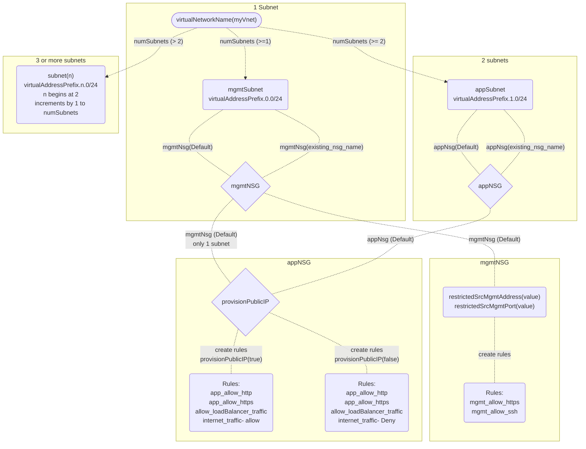

# Deploying Network Template

## Contents

- [Deploying Network Template](#deploying-network-template)
  - [Contents](#contents)
  - [Introduction](#introduction)
  - [Prerequisites](#prerequisites)
  - [Important Configuration Notes](#important-configuration-notes)
    - [Template Input Parameters](#template-input-parameters)
    - [Template Outputs](#template-outputs)
  - [Resource Tree](#resource-tree)
  - [Getting Help](#getting-help)
    - [Filing Issues](#filing-issues)
  - [Copyright](#copyright)
  - [License](#license)
    - [Apache V2.0](#apache-v20)
    - [Contributor License Agreement](#contributor-license-agreement)

## Introduction

This ARM template creates virtual network, subnets, and security groups required to support F5 solutions. Link this template to create networks, security groups, and subnets required for F5 deployments.

## Prerequisites

 - None
 
## Important Configuration Notes

 - A sample template, 'sample_linked.json', has been included in this project. Use this example to see how to add network.json as a linked template into your templated solution.

### Template Input Parameters

| Parameter | Required | Description |
| --- | --- | --- |
| mgmtNsg | Yes | Valid values: 'Default', 'None', existing_nsg_name. 'Default' creates a network security group named 'mgmtNSG' and applies SG to mgmtSubnet. 'None', does not create a management security group, or apply group to mgmtSubnet. Supplying an existing security group name will apply SG to 'mgmtSubnet'. |
| appNsg | Yes | Valid values: 'Default', 'None', existing_nsg_name. 'Default' creates a network security group named 'appNSG' and applies SG to appSubnet. 'None', does not create a management security group, or apply group to appSubnet. Supplying an existing security group name will apply SG to 'appSubnet'. |
| restrictedSrcMgmtAddress | Yes | Address range allowed to access BIG-IP management. Used to construct rules for mgmtNSG security group. |
| restrictedSrcMgmtPort | Yes | F5 admin portal port used to access BIG-IP management. Used to construct rules for mgmtNSG security group. |
| provisionPublicIP | Yes | Used to construct appNsg. 'false' creates a rule to block internet traffic. 'true', creates a rule to allow internet traffic.  |
| virtualNetworkName| Yes | Name used to create virtual network. |
| vnetAddressPrefix | Yes | Enter the start of the CIDR block used when creating the Vnet and subnets.  You MUST type just the first two octets of the /16 virtual network that will be created, for example '10.0', '10.100', 192.168'." |
| numSubnets| Yes | Number of subnets to create. Value of >=1 creates subnet named mgmtSubnet. Value >=2 creates 2 subnets named mgmtSubnet and appSubnet. Value > 2 creates mgmtSubnet, appSubnet, and subnet(n) where n starts at 2 and continues to *supplied value*-2. Subnet values are constructed using vnetAddressPrefix.*n*.0/24 where *n=0* for mgmtSubnet, *n=1* for appSubnet, and *n* increments by one for each additional subnet created. |
| tagValues| Yes | List of tags to add to created resources. |

### Template Outputs

| Name | Description | Required Resource | Type |
| --- | --- | --- | --- |
| appNSG | Application Network Security Group resource ID | Application Network Security Group | string |
| appSubnet | Application Subnet resource ID | Application Subnet | string |
| mgmtNSG | Management Network Security Group resource ID | Management Network Security Group | string |
| mgmtSubnet | Management Subnet resource ID | Management Subnet | string |
| subnets | Application Subnets resource IDs | Application Subnets | array |
| virtualNetwork | Virtual Network resource ID | Virtual Network | string |

## Resource Tree

Resource Creation Flow Chart
 
 
 

 
 
 

## Getting Help

The example templates in this directory are intended to provide reference deployments of F5 BIG-IP Virtual Editions. Due to the heavy customization requirements of external cloud resources and BIG-IP configurations in these solutions, F5 does not provide technical support for deploying, customizing, or troubleshooting the templates themselves. However, the various underlying products and components used (for example: F5 BIG-IP Virtual Edition, Automation Toolchain extensions, and Cloud Failover Extension (CFE)) in the solutions located here are F5-supported and capable of being deployed with other orchestration tools. Read more about [Support Policies](https://www.f5.com/company/policies/support-policies). 

### Filing Issues

If you find an issue, we would love to hear about it.

- Use the **Issues** link on the GitHub menu bar in this repository for items such as enhancement or feature requests and non-urgent bug fixes. Tell us as much as you can about what you found and how you found it.

## Copyright

Copyright 2014-2020 F5 Networks Inc.

## License

### Apache V2.0

Licensed under the Apache License, Version 2.0 (the "License"); you may not use
this file except in compliance with the License. You may obtain a copy of the
License [here](http://www.apache.org/licenses/LICENSE-2.0).

Unless required by applicable law or agreed to in writing, software
distributed under the License is distributed on an "AS IS" BASIS,
WITHOUT WARRANTIES OR CONDITIONS OF ANY KIND, either express or implied.
See the License for the specific language governing permissions and limitations
under the License.

### Contributor License Agreement

Individuals or business entities who contribute to this project must have
completed and submitted the F5 Contributor License Agreement.
