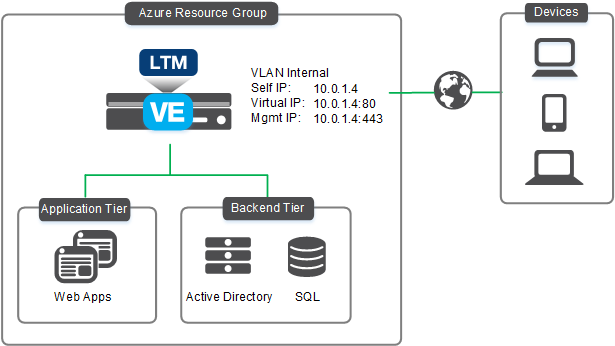

# Deploying LTM-provisioned BIG-IP VE(s) in an Azure VM Scale Set with auto scaling enabled

[](https://f5cloudsolutions.herokuapp.com)

## Introduction

This solution uses an ARM template to launch the deployment of F5 BIG-IP VE(s) in a Microsoft Azure VM Scale Set that is configured for auto scaling. Traffic flows from the Azure LB to the BIG-IP VE(cluster) and then to the application servers. The BIG-IP(s) are configured in single-nic mode.

See the **[Configuration Example](#config)** section for a configuration diagram and description for this solution, as well as an important note about optionally changing the BIG-IP Management port.

## Security
This ARM template downloads helper code to configure the BIG-IP system. If your organization is security conscious and you want to verify the integrity of the template, you can open the template and ensure the following lines are present. See [Security Detail](#securitydetail) for the exact code.
In the *variables* section:
  - In the *verifyHash* variable: search for **script-signature** and then a hashed signature.
  - In the *installCloudLibs* variable: ensure this includes **tmsh run cli script verifyHash /config/cloud/f5-cloud-libs.tar.gz**.

Additionally, F5 provides checksums for all of our supported templates. For instructions and the checksums to compare against, see https://devcentral.f5.com/codeshare/checksums-for-f5-supported-cft-and-arm-templates-on-github-1014.

## Supported instance types and hypervisors
  - For a list of supported Azure instance types for this solutions, see the **Azure instances for BIG-IP VE** section of https://support.f5.com/kb/en-us/products/big-ip_ltm/manuals/product/bigip-ve-setup-msft-azure-12-1-0/1.html#guid-71265d82-3a1a-43d2-bae5-892c184cc59b

  - For a list versions of the BIG-IP Virtual Edition (VE) and F5 licenses that are supported on specific hypervisors and Microsoft Azure, see https://support.f5.com/kb/en-us/products/big-ip_ltm/manuals/product/ve-supported-hypervisor-matrix.html.

### Help
We encourage you to use our [Slack channel](https://f5cloudsolutions.herokuapp.com) for discussion and assistance on F5 ARM templates.  This channel is typically monitored Monday-Friday 9-5 PST by F5 employees who will offer best-effort support.<br>
While this template has been created by F5 Networks, it is in the experimental directory and therefore has not completed full testing and is subject to change.  F5 Networks does not offer technical support for templates in the experimental directory. For supported templates, see the templates in the **supported** directory.


## Installation

You have three options for deploying this template:
  - Using the Azure deploy button
  - Using [PowerShell](#powershell)
  - Using [CLI Tools](#cli)

### <a name="azure"></a>Azure deploy button

Use this button to deploy the template:

<a href="https://portal.azure.com/#create/Microsoft.Template/uri/https%3A%2F%2Fraw.githubusercontent.com%2FF5Networks%2Ff5-azure-arm-templates%2Fmaster%2Fexperimental%2Fautoscale%2Fltm%2Fazuredeploy.json" target="_blank">
    
</a>

### Template parameters

| Parameter | Required | Description |
| --- | --- | --- |
| vmScaleSetMinCount | x | The minimum(and default) number of BIG-IP VEs that will be deployed into the VM Scale Set. |
| vmScaleSetMaxCount | x | The number of maximum BIG-IP VEs that can be deployed into the VM Scale Set. |
| scaleOutThroughput | x | The percentange of 'Network Out' Throughput to scale out on.  This will be factored as a percentage of the F5 PAYG image bandwidth(Mbps) size chosen. |
| scaleInThroughput | x | The percentange of 'Network Out' Throughput to scale in on.  This will be factored as a percentage of the F5 PAYG image bandwidth(Mbps) size chosen. |
| scaleTimeWindow | x | The time window required to trigger a scale event(up and down), this is used to determine the amount of time needed for a threshold to be breached as well as to prevent flapping. |
| adminUsername | x | A user name to login to the BIG-IPs.  The default value is "azureuser". |
| adminPassword | x | A strong password for the BIG-IPs. Remember this password; you will need it later. |
| dnsLabel | x | Unique DNS Name for the public IP address used to access the BIG-IPs for management. |
| instanceType | x | The desired Azure Virtual Machine instance size. |
| imageName | x | The desired F5 image to deploy. |
| bigIpVersion | x | F5 BIG-IP Version to use. |
| licenseKey1 | | The license token from the F5 licensing server. This license will be used for the first F5 BIG-IP. |
| licensedBandwidth | | PAYG licensed bandwidth(Mbps) image to deploy. |
| tenantId | | Your Azure service principal application tenant ID |
| clientId | | Your Azure service principal application client(application) ID. |
| servicePrincipalSecret | | Your Azure service principal application secret. |
| restrictedSrcAddress | x | Restricts management access to a specific network or address. Enter a IP address or address range in CIDR notation, or asterisk for all sources. |
| tagValues | x | Additional key-value pair tags to be added to each Azure resource. |

### <a name="powershell"></a>PowerShell Script Example

```powershell
    ## Script parameters being asked for below match to parameters in the azuredeploy.json file, otherwise pointing to the ##
    ## azuredeploy.parameters.json file for values to use.  Some options below are mandatory, some(such as region) can     ##
    ## be supplied inline when running this script but if they aren't then the default will be used as specificed below.   ##
    ## Example Command: .\Deploy_via_PS.ps1 -licenseType PAYG -licensedBandwidth 200m -vmScaleSetMinCount 2 -vmScaleSetMaxCount 4 -scaleOutThroughput 90 -scaleInThroughput 10 -scaleTimeWindow 10 -adminUsername azureuser -adminPassword <value> -dnsLabel <value> -instanceType Standard_D2_v2 -imageName Good -bigIpVersion 13.0.000 -tenantId <value> -clientId <value> -servicePrincipalSecret <value> -restrictedSrcAddress "*"-resourceGroupName <value>

    param(

    [Parameter(Mandatory=$True)]
    [string]
    $licenseType,

    [string]
    $licensedBandwidth = $(if($licenseType -eq "PAYG") { Read-Host -prompt "licensedBandwidth"}),

    [string]
    $licenseKey1 = $(if($licenseType -eq "BYOL") { Read-Host -prompt "licenseKey1"}),

    [Parameter(Mandatory=$True)]
    [string]
    $vmScaleSetMinCount,

    [Parameter(Mandatory=$True)]
    [string]
    $vmScaleSetMaxCount,

    [Parameter(Mandatory=$True)]
    [string]
    $scaleOutThroughput,

    [Parameter(Mandatory=$True)]
    [string]
    $scaleInThroughput,

    [Parameter(Mandatory=$True)]
    [string]
    $scaleTimeWindow,

    [Parameter(Mandatory=$True)]
    [string]
    $adminUsername,

    [Parameter(Mandatory=$True)]
    [string]
    $adminPassword,

    [Parameter(Mandatory=$True)]
    [string]
    $dnsLabel,

    [Parameter(Mandatory=$True)]
    [string]
    $instanceType,

    [Parameter(Mandatory=$True)]
    [string]
    $imageName,

    [Parameter(Mandatory=$True)]
    [string]
    $bigIpVersion,

    [Parameter(Mandatory=$True)]
    [string]
    $tenantId,

    [Parameter(Mandatory=$True)]
    [string]
    $clientId,

    [Parameter(Mandatory=$True)]
    [string]
    $servicePrincipalSecret,

    [string]
    $restrictedSrcAddress = "*",

    [Parameter(Mandatory=$True)]
    [string]
    $resourceGroupName,

    [string]
    $region = "West US",

    [string]
    $templateFilePath = "azuredeploy.json",

    [string]
    $parametersFilePath = "azuredeploy.parameters.json"
    )

    Write-Host "Disclaimer: Scripting to Deploy F5 Solution templates into Cloud Environments are provided as examples. They will be treated as best effort for issues that occur, feedback is encouraged." -foregroundcolor green
    Start-Sleep -s 3

    # Connect to Azure, right now it is only interactive login
    try {
        Write-Host "Checking if already logged in!"
        Get-AzureRmSubscription | Out-Null
        Write-Host "Already logged in, continuing..."
        }
        Catch {
        Write-Host "Not logged in, please login..."
        Login-AzureRmAccount
        }

    # Create Resource Group for ARM Deployment
    New-AzureRmResourceGroup -Name $resourceGroupName -Location "$region"

    # Create Arm Deployment
    $pwd = ConvertTo-SecureString -String $adminPassword -AsPlainText -Force
    $sps = ConvertTo-SecureString -String $servicePrincipalSecret -AsPlainText -Force
    $deployment = New-AzureRmResourceGroupDeployment -Name $resourceGroupName -ResourceGroupName $resourceGroupName -TemplateFile $templateFilePath -TemplateParameterFile $parametersFilePath -Verbose -vmScaleSetMinCount "$vmScaleSetMinCount" -vmScaleSetMaxCount "$vmScaleSetMaxCount" -scaleOutThroughput "$scaleOutThroughput" -scaleInThroughput "$scaleInThroughput" -scaleTimeWindow "$scaleTimeWindow" -adminUsername "$adminUsername" -adminPassword $pwd -dnsLabel "$dnsLabel" -instanceType "$instanceType" -imageName "$imageName" -bigIpVersion "$bigIpVersion" -tenantId "$tenantId" -clientId "$clientId" -servicePrincipalSecret $sps -restrictedSrcAddress "$restrictedSrcAddress"  -licensedBandwidth "$licensedBandwidth"

    # Print Output of Deployment to Console
    $deployment

```

=======

### <a name="cli"></a>Azure CLI(1.0) Script Example

```bash
    #!/bin/bash

    ## Bash Script to deploy an F5 ARM template into Azure, using azure cli 1.0 ##
    ## Example Command: ./deploy_via_bash.sh --licenseType PAYG --licensedBandwidth 200m --vmScaleSetMinCount 2 --vmScaleSetMaxCount 4 --scaleOutThroughput 90 --scaleInThroughput 10 --scaleTimeWindow 10 --adminUsername azureuser --adminPassword <value> --dnsLabel <value> --instanceType Standard_D2_v2 --imageName Good --bigIpVersion 13.0.000 --tenantId <value> --clientId <value> --servicePrincipalSecret <value> --restrictedSrcAddress "*" --resourceGroupName <value> --azureLoginUser <value> --azureLoginPassword <value>

    # Assign Script Paramters and Define Variables
    # Specify static items, change these as needed or make them parameters
    region="westus"
    restrictedSrcAddress="*"
    tagValues='{"application":"APP","environment":"ENV","group":"GROUP","owner":"OWNER","cost":"COST"}'

    ARGS=`getopt -o a:b:c:d:e:f:g:h:i:j:k:l:m:n:o:p:q:r:s:t:u: --long resourceGroupName:,azureLoginUser:,azureLoginPassword:,licenseType:,licensedBandwidth:,licenseKey1:,vmScaleSetMinCount:,vmScaleSetMaxCount:,scaleOutThroughput:,scaleInThroughput:,scaleTimeWindow:,adminUsername:,adminPassword:,dnsLabel:,instanceType:,imageName:,bigIpVersion:,tenantId:,clientId:,servicePrincipalSecret:,restrictedSrcAddress: -n $0 -- "$@"`
    eval set -- "$ARGS"

    # Parse the command line arguments, primarily checking full params as short params are just placeholders
    while true; do
        case "$1" in
            -a|--resourceGroupName)
                resourceGroupName=$2
                shift 2;;
            -b|--azureLoginUser)
                azureLoginUser=$2
                shift 2;;
            -c|--azureLoginPassword)
                azureLoginPassword=$2
                shift 2;;
            -d|--licenseType)
                licenseType=$2
                shift 2;;
            -e|--licensedBandwidth)
                licensedBandwidth=$2
                shift 2;;
            -f|--licenseKey1)
                licenseKey1=$2
                shift 2;;
            -g|--vmScaleSetMinCount)
                vmScaleSetMinCount=$2
                shift 2;;
            -h|--vmScaleSetMaxCount)
                vmScaleSetMaxCount=$2
                shift 2;;
            -i|--scaleOutThroughput)
                scaleOutThroughput=$2
                shift 2;;
            -j|--scaleInThroughput)
                scaleInThroughput=$2
                shift 2;;
            -k|--scaleTimeWindow)
                scaleTimeWindow=$2
                shift 2;;
            -l|--adminUsername)
                adminUsername=$2
                shift 2;;
            -m|--adminPassword)
                adminPassword=$2
                shift 2;;
            -n|--dnsLabel)
                dnsLabel=$2
                shift 2;;
            -o|--instanceType)
                instanceType=$2
                shift 2;;
            -p|--imageName)
                imageName=$2
                shift 2;;
            -q|--bigIpVersion)
                bigIpVersion=$2
                shift 2;;
            -r|--tenantId)
                tenantId=$2
                shift 2;;
            -s|--clientId)
                clientId=$2
                shift 2;;
            -t|--servicePrincipalSecret)
                servicePrincipalSecret=$2
                shift 2;;
            -u|--restrictedSrcAddress)
                restrictedSrcAddress=$2
                shift 2;;
            --)
                shift
                break;;
        esac
    done

    #If a required paramater is not passed, the script will prompt for it below
    required_variables="vmScaleSetMinCount vmScaleSetMaxCount scaleOutThroughput scaleInThroughput scaleTimeWindow adminUsername adminPassword dnsLabel instanceType imageName bigIpVersion tenantId clientId servicePrincipalSecret resourceGroupName licenseType "
    for variable in $required_variables
            do
            if [ -v ${!variable} ] ; then
                    read -p "Please enter value for $variable:" $variable
            fi
    done

    # Prompt for licensed bandwidth if not supplied and PAYG is selected
    if [ $licenseType == "PAYG" ]; then
        if [ -v $licensedBandwidth ] ; then
                read -p "Please enter value for licensedBandwidth:" licensedBandwidth
        fi
        template_file="./azuredeploy.json"
        parameter_file="./azuredeploy.parameters.json"
    fi

    echo "Disclaimer: Scripting to Deploy F5 Solution templates into Cloud Environments are provided as examples. They will be treated as best effort for issues that occur, feedback is encouraged."
    sleep 3

    # Login to Azure, for simplicity in this example using username and password supplied as script arguments --azureLoginUser and --azureLoginPassword
    # Perform Check to see if already logged in
    azure account show > /dev/null 2>&1
    if [[ $? != 0 ]] ; then
            azure login -u $azureLoginUser -p $azureLoginPassword
    fi

    # Switch to ARM mode
    azure config mode arm

    # Create ARM Group
    azure group create -n $resourceGroupName -l $region

    # Deploy ARM Template, right now cannot specify parameter file AND parameters inline via Azure CLI,
    # such as can been done with Powershell...oh well!
    azure group deployment create -f $template_file -g $resourceGroupName -n $resourceGroupName -p "{\"vmScaleSetMinCount\":{\"value\":$vmScaleSetMinCount},\"vmScaleSetMaxCount\":{\"value\":$vmScaleSetMaxCount},\"scaleOutThroughput\":{\"value\":$scaleOutThroughput},\"scaleInThroughput\":{\"value\":$scaleInThroughput},\"scaleTimeWindow\":{\"value\":$scaleTimeWindow},\"adminUsername\":{\"value\":\"$adminUsername\"},\"adminPassword\":{\"value\":\"$adminPassword\"},\"dnsLabel\":{\"value\":\"$dnsLabel\"},\"instanceType\":{\"value\":\"$instanceType\"},\"imageName\":{\"value\":\"$imageName\"},\"bigIpVersion\":{\"value\":\"$bigIpVersion\"},\"tenantId\":{\"value\":\"$tenantId\"},\"clientId\":{\"value\":\"$clientId\"},\"servicePrincipalSecret\":{\"value\":\"$servicePrincipalSecret\"},\"restrictedSrcAddress\":{\"value\":\"$restrictedSrcAddress\"},\"tagValues\":{\"value\":$tagValues},\"licensedBandwidth\":{\"value\":\"$licensedBandwidth\"}}"

```

## Configuration Example <a name="config">

The following is a simple configuration diagram for this Azure VM Scale Set auto scale deployment. In this scenario, all access to the BIG-IP VE appliance is through an Azure Load Balancer.  The Azure Load Balancer processes both management and data plane traffic into the BIG-IP's which then distribute the traffic to web/application servers according to normal F5 patterns.



### Post-Deployment Azure Configuration
This solution deploys an ARM template that fully configures BIG-IP(s) and handles clustering(DSC) and Azure creation of objects needed for management of those BIG-IP's.  However, once deployed the assumption is configuration will be performed on the BIG-IP(s) to create virtual servers, pools, etc... to be used for processing application traffic.  Since at deployment time that information is unknown ensure the below is done for each unique service to allow traffic to reach the BIG-IP(s) in the VM Scale Set.

Post-deployment items(example application on port 443)
1) Add a "Health Probe" to the ALB(Azure Load Balancer) for port 443, you can choose tcp or http depending on your needs.  - This will query each BIG-IP at that port to determine if it is available for traffic.
2) Add a "Load Balancing Rule" to the ALB where the port is 443 and the backend port is also 443(assuming you are using same port on the BIG-IP), make sure the backend pool is selected(there should only be one backend pool which was created and will be managed by the VM Scale set)
3) Add an "Inbound Security Rule" to the Network Security Group(NSG) for port 443 as the NSG is added to the subnet where the BIG-IP(s) live - You could optionally just remove the NSG from the subnet as the VM Scale Set is fronted by the ALB.

### Service Principal Authentication
This solution requires read-only access to the VM Scale Set information to determine how the BIG-IP cluster should be configured as a result of the dynamics of new VBIG-IP's being scaled up/down.  The most efficient and security-conscious way to handle this is to utilize Azure service principal authentication for all the reasons service prinicpals are utilized instead of a user account.  Below provides information/links on the options for configuring a service principal within Azure if this is the first time it is needed in a subscription.

_Ensure that however the creation of the service principal occurs to verify it only has read access and limit it as much as possible prior to this template being deployed and used by the VM scale set within the resource group selected(new or existing)._

The end result should be posession of a client(application) ID, tenant ID and service principal secret that can login to the same subscription this template will be deployed into.  Ensuring this is fully functioning prior to deploying this ARM template will save on some troubleshooting post-deployment if the service principal is in fact not fully configured.

#### 1. Azure Portal

Follow the steps outlined in the [Azure Portal documentation](https://azure.microsoft.com/en-us/documentation/articles/resource-group-create-service-principal-portal/) to generate the service principal.

#### 2. Azure CLI

This method can be used with either the [Azure CLI v2.0 (Python)](https://github.com/Azure/azure-cli) or the [Azure Cross-Platform CLI (npm module)](https://github.com/Azure/azure-xplat-cli).

_Using the Python Azure CLI v2.0 - requires just one step_
```shell
$ az ad sp create-for-rbac
```

_Using the Node.js cross-platform CLI - requires additional steps for setting up_
https://docs.microsoft.com/en-us/azure/azure-resource-manager/resource-group-authenticate-service-principal-cli

#### 3. Azure PowerShell
Follow the steps outlined in the [Azure Powershell documentation](https://docs.microsoft.com/en-us/azure/azure-resource-manager/resource-group-authenticate-service-principal) to generate the service principal.


### Additional Optional Configuration Items
Here are some post-deployment options that are entirely optional but are useful to add based on your needs, examples below for your enjoyment!

#### Configure Scale Event Notifications
You can add notifications when scale up/down events happen in the form of either email or webhooks, below shows an example of adding an email address that will receive an email from Azure whenever a scale up/down events occurs.

Browse to  the [Azure Resource Explorer](https://resources.azure.com), log in and navigate down to the created auto scale settings(Subscriptions -> Resource Groups -> "resource group deployed into" -> Providers -> Microsoft.Insights -> Autoscalesettings -> autoscaleconfig).  From here select "Edit"(Need to select Read/Write at the top of the screen) and replace the current notifications json key with the below, just update the emails to be used below.  Select PUT and notifications will now be sent to the email addresses listed.

```json
    "notifications": [
      {
        "operation": "Scale",
        "email": {
          "sendToSubscriptionAdministrator": false,
          "sendToSubscriptionCoAdministrators": false,
          "customEmails": [
            "email@f5.com"
          ]
        },
        "webhooks": null
      }
    ]
```

### Changing the BIG-IP Configuration Utility (GUI) port
The Management port shown in the example diagram is **443**, however you can alternatively use **8443** in your configuration if you need to use port 443 for application traffic.  To change the Management port, see [Changing the Configuration utility port](https://support.f5.com/kb/en-us/products/big-ip_ltm/manuals/product/bigip-ve-setup-msft-azure-12-0-0/2.html#GUID-3E6920CD-A8CD-456C-AC40-33469DA6922E) for instructions.
***Important***: The default port provisioned is dependent on 1) what BIG-IP version you choose to deploy as well as 2) how many nics are configured on that BIG-IP.  v13.0.000 and above in a single-nic configuration utilizes port 8443, all older BIG-IP versions, as well as newer(then v13.0.000) versions with multiple interfaces will default to 443 on the MGMT interface.
***Important***: If you perform the procedure to change the port, you must check the Azure Network Security Group associated with the interface on the BIG-IP that was deployed and adjust the ports accordingly.


## Documentation

The ***BIG-IP Virtual Edition and Microsoft Azure: Setup*** guide (https://support.f5.com/kb/en-us/products/big-ip_ltm/manuals/product/bigip-ve-setup-msft-azure-12-1-0.html) decribes how to create the configuration manually without using the ARM template.

## Deploying Custom Configuration to an Azure Virtual Machine

This sample code uses the CustomScript extension resource to configure the f5.ip_forwarding iApp on BIG-IP VE in Azure Resource Manager.

The CustomScript extension resource name must reference the Azure virtual machine name and must have a dependency on that virtual machine. You can use only one CustomScript extension resource per virtual machine; however, you can combine multiple semicolon-delimited commands in a single extension resource definition.

Warning: F5 does not support the template if you change anything other than the CustomScript extension resource.

```
{
     "type": "Microsoft.Compute/virtualMachines/extensions",
     "name": "[concat(variables('virtualMachineName'),'/start')]",
     "apiVersion": "2016-03-30",
     "location": "[resourceGroup().location] "
     "dependsOn": [
          "[concat('Microsoft.Compute/virtualMachines/',variables('virtualMachineName'))]"
     ],
     "properties": {
          "publisher": "Microsoft.Azure.Extensions",
          "type": "CustomScript",
          "typeHandlerVersion": "2.0",
          "settings": {
          },
          "protectedSettings": {
               "commandToExecute": "[concat('tmsh create sys application service my_deployment { device-group none template f5.ip_forwarding traffic-group none variables replace-all-with { basic__addr { value 0.0.0.0 } basic__forward_all { value No } basic__mask { value 0.0.0.0 } basic__port { value 0 } basic__vlan_listening { value default } options__advanced { value no }options__display_help { value hide } } }')]"
          }
     }
}
```


## Security Details <a name="securitydetail"></a>
This section has the code snippet for each the lines you should ensure are present in your template file if you want to verify the integrity of the helper code in the template.

Note the hashed script-signature may be different in your template.<br>


```json
"variables": {
    "apiVersion": "2015-06-15",
    "location": "[resourceGroup().location]",
    "singleQuote": "'",
    "f5CloudLibsTag": "release-2.0.0",
    "expectedHash": "8bb8ca730dce21dff6ec129a84bdb1689d703dc2b0227adcbd16757d5eeddd767fbe7d8d54cc147521ff2232bd42eebe78259069594d159eceb86a88ea137b73",
    "verifyHash": "[concat(variables('singleQuote'), 'cli script /Common/verifyHash {\nproc script::run {} {\n        if {[catch {\n            set file_path [lindex $tmsh::argv 1]\n            set expected_hash ', variables('expectedHash'), '\n            set computed_hash [lindex [exec /usr/bin/openssl dgst -r -sha512 $file_path] 0]\n            if { $expected_hash eq $computed_hash } {\n                exit 0\n            }\n            tmsh::log err {Hash does not match}\n            exit 1\n        }]} {\n            tmsh::log err {Unexpected error in verifyHash}\n            exit 1\n        }\n    }\n    script-signature fc3P5jEvm5pd4qgKzkpOFr9bNGzZFjo9pK0diwqe/LgXwpLlNbpuqoFG6kMSRnzlpL54nrnVKREf6EsBwFoz6WbfDMD3QYZ4k3zkY7aiLzOdOcJh2wECZM5z1Yve/9Vjhmpp4zXo4varPVUkHBYzzr8FPQiR6E7Nv5xOJM2ocUv7E6/2nRfJs42J70bWmGL2ZEmk0xd6gt4tRdksU3LOXhsipuEZbPxJGOPMUZL7o5xNqzU3PvnqZrLFk37bOYMTrZxte51jP/gr3+TIsWNfQEX47nxUcSGN2HYY2Fu+aHDZtdnkYgn5WogQdUAjVVBXYlB38JpX1PFHt1AMrtSIFg==\n}', variables('singleQuote'))]",
    "installCloudLibs": "[concat(variables('singleQuote'), '#!/bin/bash\necho about to execute\nchecks=0\nwhile [ $checks -lt 120 ]; do echo checking mcpd\n/usr/bin/tmsh -a show sys mcp-state field-fmt | grep -q running\nif [ $? == 0 ]; then\necho mcpd ready\nbreak\nfi\necho mcpd not ready yet\nlet checks=checks+1\nsleep 1\ndone\necho loading verifyHash script\n/usr/bin/tmsh load sys config merge file /config/verifyHash\nif [ $? != 0 ]; then\necho cannot validate signature of /config/verifyHash\nexit\nfi\necho loaded verifyHash\necho verifying f5-cloud-libs.targ.gz\n/usr/bin/tmsh run cli script verifyHash /config/cloud/f5-cloud-libs.tar.gz\nif [ $? != 0 ]; then\necho f5-cloud-libs.tar.gz is not valid\nexit\nfi\necho verified f5-cloud-libs.tar.gz\necho expanding f5-cloud-libs.tar.gz\ntar xvfz /config/cloud/f5-cloud-libs.tar.gz -C /config/cloud\ntouch /config/cloud/cloudLibsReady', variables('singleQuote'))]",
```


## Filing Issues
If you find an issue, we would love to hear about it.
You have a choice when it comes to filing issues:
  - Use the **Issues** link on the GitHub menu bar in this repository for items such as enhancement or feature requests and non-urgent bug fixes. Tell us as much as you can about what you found and how you found it.
  - Contact F5 Technical support via your typical method for more time sensitive changes and other issues requiring immediate support.


## Copyright

Copyright 2014-2017 F5 Networks Inc.


## License


Apache V2.0
~~~~~~~~~~~
Licensed under the Apache License, Version 2.0 (the "License"); you may not use
this file except in compliance with the License. You may obtain a copy of the
License at

http://www.apache.org/licenses/LICENSE-2.0

Unless required by applicable law or agreed to in writing, software
distributed under the License is distributed on an "AS IS" BASIS,
WITHOUT WARRANTIES OR CONDITIONS OF ANY KIND, either express or implied.
See the License for the specific language governing permissions and limitations
under the License.

Contributor License Agreement
~~~~~~~~~~~~~~~~~~~~~~~~~~~~~
Individuals or business entities who contribute to this project must have
completed and submitted the `F5 Contributor License Agreement`