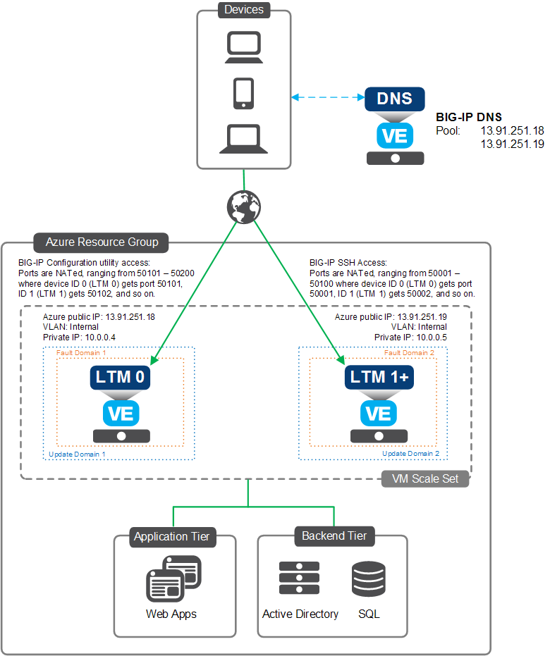

# Deploying the BIG-IP VE in Azure - AutoScale BIG-IP LTM - VM Scale Set (Frontend via DNS)

[](https://f5cloudsolutions.herokuapp.com)
[](https://github.com/f5networks/f5-azure-arm-templates/releases)
[](https://github.com/f5networks/f5-azure-arm-templates/issues)

## Contents

- [Introduction](#introduction)
- [Prerequisites](#prerequisites)
- [Important Configuration Notes](#important-configuration-notes)
- [Security](#security)
- [Getting Help](#help)
- [Installation](#installation)
- [Configuration Example](#configuration-example)
- [Service Discovery](#service-discovery)

## Introduction

This solution uses an ARM template to launch the deployment of F5 BIG-IP Local Traffic Manager (LTM) Virtual Edition (VE) instances in a Microsoft Azure VM Scale Set that is configured for auto scaling. By virtue of a DNS request made by the client to the DNS provider, traffic will flow to the current BIG-IP VE (cluster) members directly which will then process traffic to the application servers, which allows you to deploy without using an Azure Load Balancer (ALB). The BIG-IP VE(s) are configured in single-NIC mode. Auto scaling means that as certain thresholds are reached, the number of BIG-IP VE instances automatically increases or decreases accordingly. 

The BIG-IP VE has the [Local Traffic Manager (LTM)](https://f5.com/products/big-ip/local-traffic-manager-ltm) module enabled to provide advanced traffic management functionality. This means you can also configure the BIG-IP VE to enable F5's L4/L7 security features, access control, and intelligent traffic management.

You have the option of using a [BIG-IQ device](https://f5.com/products/big-iq-centralized-management) to license BIG-IP VEs using BYOL licenses in this auto scale deployment. This template uses BIGIP **public** management address when license is requested via BIGIQ. 

For information on getting started using F5's ARM templates on GitHub, see [Microsoft Azure: Solutions 101](http://clouddocs.f5.com/cloud/public/v1/azure/Azure_solutions101.html).

**Networking Stack Type:** This template deploys into an existing networking stack; so the networking infrastructure MUST be available prior to deploying. See the [Template Parameters Section](#template-parameters) for required networking objects.

## Prerequisites

- **Important**: When you configure the admin password for the BIG-IP VE in the template, you cannot use the character **#**.  Additionally, there are a number of other special characters that you should avoid using for F5 product user accounts.  See [K2873](https://support.f5.com/csp/article/K2873) for details.
- This template requires a service principal.  See the [Service Principal Setup section](#service-principal-authentication) for details, including required permissions.
- This solution uses calls to the Azure REST API to read and update Azure resources such as storage accounts, network interfaces, and route tables.  For the solution to function correctly, you must ensure that the BIG-IP(s) can connect to the Azure REST API on port 443.
- This solution uses calls to the Azure REST API to read and update Azure resources, this has specifically been tested in Azure Commercial Cloud.  Additional cloud environments such as Azure Government, Azure Germany and Azure China cloud have not yet been tested.
- This solution uses a DNS provider instead of an Azure load Balancer for distribution of traffic.  The DNS provider **must** already exist prior to deployment. Currently ***only BIG-IP DNS is supported***.
- You must have a [BIG-IQ device](https://f5.com/products/big-iq-centralized-management) with a pool of BIG-IP BYOL licenses to use this template (see the PAYG and BYOL templates for other options). This solution supports the two most recent versions of BIG-IQ (see the [Version Matrix](https://github.com/F5Networks/f5-azure-arm-templates/blob/master/azure-bigip-version-matrix.md) for specific versions), and your BIG-IQ system must have at least 2 NICs.

## Important configuration notes

> **_CRITICAL:_**  As of Release 6.1.0.0, BIG-IP version 12.1 is no longer supported. If you require BIG-IP version 12.1, you can use a previously released ARM template.  To find a previously released template, from the **Branch** drop-down, click the **Tags** tab, and then select a tag of **v6.0.4.0** or earlier.

- All F5 ARM templates include Application Services 3 Extension (AS3) v3.5.1 (LTS version) on the BIG-IP VE.  As of release 4.1.2, all supported templates give the option of including the URL of an AS3 declaration, which you can use to specify the BIG-IP configuration you want on your newly created BIG-IP VE(s).  In templates such as autoscale, where an F5-recommended configuration is deployed by default, specifying an AS3 declaration URL will override the default configuration with your declaration.   See the [AS3 documentation](https://clouddocs.f5.com/products/extensions/f5-appsvcs-extension/3.5.1/) for details on how to use AS3.   
- There are new options for BIG-IP license bundles, including Per App VE LTM, Advanced WAF, and Per App VE Advanced WAF. See the [the version matrix](https://github.com/F5Networks/f5-azure-arm-templates/blob/master/azure-bigip-version-matrix.md) for details and applicable templates.
- You have the option of using a password or SSH public key for authentication.  If you choose to use an SSH public key and want access to the BIG-IP web-based Configuration utility, you must first SSH into the BIG-IP VE using the SSH key you provided in the template.  You can then create a user account with admin-level permissions on the BIG-IP VE to allow access if necessary.
- See the important note about [optionally changing the BIG-IP Management port](#changing-the-big-ip-configuration-utility-gui-port).
- This template supports service discovery.  See the [Service Discovery section](#service-discovery) for details.
- F5 has created an iApp for configuring logging for BIG-IP modules to be sent to a specific set of cloud analytics solutions.  See [Logging iApp](#logging-iapp).
- This template can send non-identifiable statistical information to F5 Networks to help us improve our templates.  See [Sending statistical information to F5](#sending-statistical-information-to-f5).
- This template can be used to create the BIG-IP(s) using a local VHD or Microsoft.Compute image, please see the **customImage** parameter description for more details.
- In order to pass traffic from your clients to the servers, after launching the template, you must create virtual server(s) on the BIG-IP VE.  See [Creating a virtual server](#creating-virtual-servers-on-the-big-ip-ve).
- F5 has created a matrix that contains all of the tagged releases of the F5 ARM templates for Microsoft Azure and the corresponding BIG-IP versions, license types and throughput levels available for a specific tagged release. See [azure-bigip-version-matrix](https://github.com/F5Networks/f5-azure-arm-templates/blob/master/azure-bigip-version-matrix.md).
- F5 ARM templates now capture all deployment logs to the BIG-IP VE in **/var/log/cloud/azure**.  Depending on which template you are using, this includes deployment logs (stdout/stderr), f5-cloud-libs execution logs, recurring solution logs (failover, metrics, and so on), and more.
- Supported F5 ARM templates do not reconfigure existing Azure resources, such as network security groups.  Depending on your configuration, you may need to configure these resources to allow the BIG-IP VE(s) to receive traffic for your application.  Similarly, templates that deploy Azure load balancer(s) do not configure load balancing rules or probes on those resources to forward external traffic to the BIG-IP(s).  You must create these resources after the deployment has succeeded.
- See the **[Configuration Example](#configuration-example)** section for a configuration diagram and description for this solution.
- This template includes a master election feature, which ensures that if the existing master BIG-IP VE is unavailable, a new master is selected from the BIG-IP VEs in the cluster.
- This template has some optional post-deployment configuration.  See the [Post-Deployment Configuration section](#post-deployment-configuration) for details.
- After deploying the template, if you make manual changes to the BIG-IP configuration, you should visit [this section](#backup-big-ip-configuration-for-cluster-recovery).
- The templates now support BIG-IQ licensing using an [ELA](https://www.f5.com/pdf/licensing/big-ip-virtual-edition-enterprise-licensing-agreement-overview.pdf)/subscription pool, which enables self-licensing of BIG-IP virtual editions (VEs).
- **NEW:**  Beginning with release 5.3.0.0, the BIG-IP image names have changed (previous options were Good, Better, and Best).  Now you choose a BIG-IP VE image based on whether you need [LTM](https://www.f5.com/products/big-ip-services/local-traffic-manager) only (name starts with **LTM**) or All modules (image name starts with **All**) available (including [WAF](https://www.f5.com/products/security/advanced-waf), [AFM](https://www.f5.com/products/security/advanced-firewall-manager), etc.), and if you need 1 or 2 boot locations.  Use 2 boot locations if you expect to upgrade the BIG-IP VE in the future. If you do not need room to upgrade (if you intend to create a new instance when a new version of BIG-IP VE is released), use an image with 1 boot location.  See this [Matrix](https://clouddocs.f5.com/cloud/public/v1/matrix.html#microsoft-azure) for recommended Azure instance types. See the Supported BIG-IP Versions table for the available options for different BIG-IP versions.
- Previous tagged releases can be used to reference functionality that has been changed or removed.
- All templates now deploy Standard SKU Azure Public IP Addresses.
- All templates deploy Azure Virtual Machines and Virtual Machine Scale Sets into Availability Zones in supported regions; Availability Sets are still created in unsupported regions. Virtual Machine Scale Sets are distributed across zones 1, 2, and 3; failover Virtual Machines across zones 1 and 2. Standalone Virtual Machines are placed in zone 1 by default; however, you may select zone 1, 2, or 3 using the new zoneChoice parameter.
- The autoscale LTM and failover-lb NIC templates create a default port 443 load balancing rule and probe at deployment time; this rule is necessary to download required cloud libraries to BIG-IP and may be deleted or modified following a successful deployment.

## Security

This ARM template downloads helper code to configure the BIG-IP system. If you want to verify the integrity of the template, you can open the template and ensure the following lines are present. See [Security Detail](#security-details) for the exact code.
In the *variables* section:

- In the *verifyHash* variable: **script-signature** and then a hashed signature.
- In the *installCloudLibs* variable: **tmsh load sys config merge file /config/verifyHash**.
- In the *installCloudLibs* variable: ensure this includes **tmsh run cli script verifyHash /config/cloud/f5-cloud-libs.tar.gz**.

Additionally, F5 provides checksums for all of our supported templates. For instructions and the checksums to compare against, see [checksums-for-f5-supported-cft-and-arm-templates-on-github](https://devcentral.f5.com/codeshare/checksums-for-f5-supported-cft-and-arm-templates-on-github-1014).

## Supported BIG-IP versions

The following is a map that shows the available options for the template parameter **bigIpVersion** as it corresponds to the BIG-IP version itself. Only the latest version of BIG-IP VE is posted in the Azure Marketplace. For older versions, see downloads.f5.com.

| Azure BIG-IP Image Version | BIG-IP Version | Important: Boot location options note |
| --- | --- | --- |
| 15.0.100000 | 15.0.1 Build 0.0.1 | Both One and Two Boot Location options are available |
| 14.1.200000 | 14.1.2 Build 0.0.1 | Both One and Two Boot Location options are available |
| latest | This will select the latest BIG-IP version available | Only Two Boot Location options exist. Even if you select a One Boot Location in the template, Two Boot Locations are created |

## Supported instance types and hypervisors

- For a list of supported Azure instance types for this solution, see the [Azure instances for BIG-IP VE](http://clouddocs.f5.com/cloud/public/v1/azure/Azure_singleNIC.html#azure-instances-for-big-ip-ve).

- For a list of versions of the BIG-IP Virtual Edition (VE) and F5 licenses that are supported on specific hypervisors and Microsoft Azure, see [supported-hypervisor-matrix](https://support.f5.com/kb/en-us/products/big-ip_ltm/manuals/product/ve-supported-hypervisor-matrix.html).

## Help

Because this template has been created and fully tested by F5 Networks, it is fully supported by F5. This means you can get assistance if necessary from [F5 Technical Support](https://support.f5.com/csp/article/K40701984).

### Community Help

We encourage you to use our [Slack channel](https://f5cloudsolutions.herokuapp.com) for discussion and assistance on F5 ARM templates. There are F5 employees who are members of this community who typically monitor the channel Monday-Friday 9-5 PST and will offer best-effort assistance. This slack channel community support should **not** be considered a substitute for F5 Technical Support for supported templates. See the [Slack Channel Statement](https://github.com/F5Networks/f5-azure-arm-templates/blob/master/slack-channel-statement.md) for guidelines on using this channel.

## Installation

You have three options for deploying this solution:

- Using the Azure deploy buttons
- Using [PowerShell](#powershell-script-example)
- Using [CLI Tools](#azure-cli-10-script-example)

### Azure deploy buttons

Use the appropriate button below to deploy:

- **BIGIQ**: This allows you to launch the template using an existing BIG-IQ device with a pool of licenses to license the BIG-IP VE(s).

  [](https://portal.azure.com/#create/Microsoft.Template/uri/https%3A%2F%2Fraw.githubusercontent.com%2FF5Networks%2Ff5-azure-arm-templates%2Fv7.2.0.0%2Fsupported%2Fautoscale%2Fltm%2Fvia-dns%2F1nic%2Fexisting-stack%2Fbigiq%2Fazuredeploy.json)

### Template parameters

| Parameter | Required | Description |
| --- | --- | --- |
| adminUsername | Yes | User name for the Virtual Machine. |
| authenticationType | Yes | Type of authentication to use on the Virtual Machine, password based authentication or key based authentication. |
| adminPasswordOrKey | Yes | Password or SSH public key to login to the Virtual Machine. Note: There are a number of special characters that you should avoid using for F5 product user accounts.  See [K2873](https://support.f5.com/csp/article/K2873) for details. Note: If using key-based authentication, this should be the public key as a string, typically starting with **---- BEGIN SSH2 PUBLIC KEY ----** and ending with **---- END SSH2 PUBLIC KEY ----**. |
| dnsLabel | Yes | Unique DNS Name for the Public IP address used to access the Virtual Machine. |
| instanceType | Yes | Instance size of the Virtual Machine. |
| imageName | Yes | F5 SKU (image) you want to deploy. Note: The disk size of the VM will be determined based on the option you select.  **Important**: If intending to provision multiple modules, ensure the appropriate value is selected, such as ****AllTwoBootLocations or AllOneBootLocation****. |
| bigIqAddress | Yes | The IP address (or hostname) for the BIG-IQ to be used when licensing the BIG-IP.  Note: The BIG-IP will make a REST call to the BIG-IQ (already existing) to let it know a BIG-IP needs to be licensed. It will then license the BIG-IP using the provided BIG-IQ credentials and license pool. |
| bigIqUsername | Yes | The BIG-IQ username to use during BIG-IP licensing via BIG-IQ. |
| bigIqPassword | Yes | The BIG-IQ password to use during BIG-IP licensing via BIG-IQ. |
| bigIqLicensePoolName | Yes | The BIG-IQ license pool to use during BIG-IP licensing via BIG-IQ. |
| bigIqLicenseSkuKeyword1 | Yes | The BIG-IQ license filter (based on SKU keyword) you want to use for licensing the BIG-IPs from the BIG-IQ, for example **F5-BIG-MSP-LTM-25M**, **F5-BIG-MSP-BR-200M**, **F5-BIG-MSP-BT-1G** or **F5-BIG-MSP-ASM-1G**. ***Important***: This is only required when licensing with an ELA/subscription (utility) pool on the BIG-IQ, if not using this pool type leave the default of **OPTIONAL**. |
| bigIqLicenseUnitOfMeasure | Yes | The BIG-IQ license unit of measure to use during BIG-IP licensing via BIG-IQ, for example **yearly**, **monthly**, **daily** or **hourly**. ***Important***: This is only required when licensing with an ELA/subscription (utility) pool on the BIG-IQ, if not using this pool type leave the default of **OPTIONAL**. |
| bigIpVersion | Yes | F5 BIG-IP version you want to use. |
| bigIpModules | Yes | Comma separated list of modules and levels to provision, for example, ltm:nominal,asm:nominal |
| vnetName | Yes | The name of the existing virtual network to which you want to connect the BIG-IP VEs. |
| vnetResourceGroupName | Yes | The name of the resource group that contains the Virtual Network where the BIG-IP VE will be placed. |
| mgmtSubnetName | Yes | Name of the existing mgmt subnet - with external access to the Internet. **Important**: The subnet you provide for the mgmt NIC **must** be unique. |
| declarationUrl | Yes | URL for the AS3 (https://clouddocs.f5.com/products/extensions/f5-appsvcs-extension/3.5.1/) declaration JSON file to be deployed. Leave as **NOT_SPECIFIED** to deploy without a service configuration. |
| ntpServer | Yes | Leave the default NTP server the BIG-IP uses, or replace the default NTP server with the one you want to use. |
| timeZone | Yes | If you would like to change the time zone the BIG-IP uses, enter the time zone you want to use. This is based on the tz database found in /usr/share/zoneinfo (see the full list [here](https://github.com/F5Networks/f5-azure-arm-templates/blob/master/azure-timezone-list.md)). Example values: UTC, US/Pacific, US/Eastern, Europe/London or Asia/Singapore. |
| customImage | Yes | If you would like to deploy using a local BIG-IP image, provide either the full URL to the VHD in Azure storage **or** the full resource ID to an existing Microsoft.Compute image resource.  **Note**: Unless specifically required, leave the default of **OPTIONAL**. |
| restrictedSrcAddress | Yes | This field restricts management access to a specific network or address. Enter an IP address or address range in CIDR notation, or asterisk for all sources |
| tagValues | Yes | Default key/value resource tags will be added to the resources in this deployment, if you would like the values to be unique adjust them as needed for each key. |
| allowUsageAnalytics | Yes | This deployment can send anonymous statistics to F5 to help us determine how to improve our solutions. If you select **No** statistics are not sent. |
| vmScaleSetMinCount | Yes | The minimum (and default) number of BIG-IP VEs that will be deployed into the VM Scale Set. |
| vmScaleSetMaxCount | Yes | The maximum number of BIG-IP VEs that can be deployed into the VM Scale Set. |
| appInsights | Yes | Enter the name of your existing Application Insights environment that will be used to receive custom BIG-IP metrics you can use for Scale Set rules and device visibility. If the Application Insights environment is in a different Resource Group than this deployment, specify it as **app_insights_name;app_insights_rg**).  If you do not have an Application Insights environment, leave the default (CREATE_NEW) and the template will create one. Note: By default, the new Application Insights environment will be created in **East US**, if necessary you can specify a different region as **CREATE_NEW:app_insights_region**). |
| scaleOutCpuThreshold | Yes | The percentage of CPU utilization that should trigger a scale out event. |
| scaleInCpuThreshold | Yes | The percentage of CPU utilization that should trigger a scale in event. |
| scaleOutThroughputThreshold | Yes | The amount of throughput (**bytes**) that should trigger a scale out event. Note: The default value is equal to 20 MB |
| scaleInThroughputThreshold | Yes | The amount of throughput (**bytes**) that should trigger a scale in event. Note: The default value is equal to 10 MB |
| scaleOutTimeWindow | Yes | The time window required to trigger a scale out event. This is used to determine the amount of time needed for a threshold to be breached, as well as to prevent excessive scaling events (flapping). **Note:** Allowed values are 1-60 (minutes). |
| scaleInTimeWindow | Yes | The time window required to trigger a scale in event. This is used to determine the amount of time needed for a threshold to be breached, as well as to prevent excessive scaling events (flapping). **Note:** Allowed values are 1-60 (minutes). |
| notificationEmail | Yes | If you want email notifications on scale events, specify an email address, otherwise leave the parameter as **OPTIONAL**. Note: You can specify multiple emails by separating them with a semi-colon, such as *email@domain.com;email2@domain.com*. |
| useAvailabilityZones | Yes | This deployment can deploy resources into Azure Availability Zones (if the region supports it).  If that is not desired the input should be set 'No'. |
| autoscaleTimeout | Yes | The timeout value after which autoscale script execution will terminated |
| provisionPublicIP | Yes | Enabling management public IP(s) allows for direct public access to each BIG-IP VE that is created. |
| dnsMemberIpType | Yes | The IP type to add as the record when updating the DNS provider. |
| dnsMemberPort | Yes | The port for the DNS member to use for monitoring the members status. |
| dnsProviderHost | Yes | The management IP address (or hostname) for the DNS provider to use when updating DNS. |
| dnsProviderPort | Yes | The management port for the DNS provider to use when updating DNS. |
| dnsProviderUser | Yes | The management username for the DNS provider to use when updating DNS. |
| dnsProviderPassword | Yes | The management password for the DNS provider to use when updating DNS. |
| dnsProviderPool | Yes | The GSLB pool on the BIG-IP DNS system to populate. |
| dnsProviderDataCenter | Yes | The GSLB datacenter on the BIG-IP DNS system to use when creating GSLB server(s). Note: If the datacenter provided does not exist the template will create one with the value given. |
| tenantId | Yes | Your Azure service principal application tenant ID. |
| clientId | Yes | Your Azure service principal application client ID. |
| servicePrincipalSecret | Yes | Your Azure service principal application secret. |

### Programmatic deployments

As an alternative to deploying through the Azure Portal (GUI) each solution provides example scripts to deploy the ARM template.  The example commands can be found below along with the name of the script file, which exists in the current directory.

#### PowerShell Script Example

```powershell
## Example Command: .\Deploy_via_PS.ps1 -adminUsername azureuser -authenticationType password -adminPasswordOrKey <value> -dnsLabel <value> -instanceType Standard_DS2_v2 -imageName AllTwoBootLocations -bigIqAddress <value> -bigIqUsername <value> -bigIqPassword <value> -bigIqLicensePoolName <value> -bigIqLicenseSkuKeyword1 OPTIONAL -bigIqLicenseUnitOfMeasure OPTIONAL -bigIpVersion 15.0.100000 -bigIpModules ltm:nominal -vnetName <value> -vnetResourceGroupName <value> -mgmtSubnetName <value> -declarationUrl NOT_SPECIFIED -ntpServer 0.pool.ntp.org -timeZone UTC -customImage OPTIONAL -allowUsageAnalytics Yes -vmScaleSetMinCount 2 -vmScaleSetMaxCount 4 -appInsights CREATE_NEW -scaleOutCpuThreshold 80 -scaleInCpuThreshold 20 -scaleOutThroughputThreshold 20000000 -scaleInThroughputThreshold 10000000 -scaleOutTimeWindow 10 -scaleInTimeWindow 10 -notificationEmail OPTIONAL -useAvailabilityZones Yes -autoscaleTimeout 10 -provisionPublicIP Yes -dnsMemberIpType private -dnsMemberPort 80 -dnsProviderHost <value> -dnsProviderPort 443 -dnsProviderUser <value> -dnsProviderPassword <value> -dnsProviderPool autoscale_pool -dnsProviderDataCenter azure_datacenter -tenantId <value> -clientId <value> -servicePrincipalSecret <value> -resourceGroupName <value>
```

=======

#### Azure CLI (1.0) Script Example

```bash
## Example Command: ./deploy_via_bash.sh --adminUsername azureuser --authenticationType password --adminPasswordOrKey <value> --dnsLabel <value> --instanceType Standard_DS2_v2 --imageName AllTwoBootLocations --bigIqAddress <value> --bigIqUsername <value> --bigIqPassword <value> --bigIqLicensePoolName <value> --bigIqLicenseSkuKeyword1 OPTIONAL --bigIqLicenseUnitOfMeasure OPTIONAL --bigIpVersion 15.0.100000 --bigIpModules ltm:nominal --vnetName <value> --vnetResourceGroupName <value> --mgmtSubnetName <value> --declarationUrl NOT_SPECIFIED --ntpServer 0.pool.ntp.org --timeZone UTC --customImage OPTIONAL --allowUsageAnalytics Yes --vmScaleSetMinCount 2 --vmScaleSetMaxCount 4 --appInsights CREATE_NEW --scaleOutCpuThreshold 80 --scaleInCpuThreshold 20 --scaleOutThroughputThreshold 20000000 --scaleInThroughputThreshold 10000000 --scaleOutTimeWindow 10 --scaleInTimeWindow 10 --notificationEmail OPTIONAL --useAvailabilityZones Yes --autoscaleTimeout 10 --provisionPublicIP Yes --dnsMemberIpType private --dnsMemberPort 80 --dnsProviderHost <value> --dnsProviderPort 443 --dnsProviderUser <value> --dnsProviderPassword <value> --dnsProviderPool autoscale_pool --dnsProviderDataCenter azure_datacenter --tenantId <value> --clientId <value> --servicePrincipalSecret <value> --resourceGroupName <value> --azureLoginUser <value> --azureLoginPassword <value>
```


## Configuration Example

The following is an example configuration diagram for this solution deployment. In this scenario, all access to the BIG-IP VE appliance is through an Azure Load Balancer. The Azure Load Balancer processes both management and data plane traffic into the BIG-IP VEs, which then distribute the traffic to web/application servers according to normal F5 patterns.




## Post-Deployment Configuration

This solution deploys an ARM template that fully configures BIG-IP VE(s) and handles clustering (DSC) and Azure creation of objects needed for management of those BIG-IP VEs.  However, once deployed the assumption is configuration will be performed on the BIG-IP VE(s) to create virtual servers, pools, and other objects used for processing application traffic.  An example of the steps required to add an application are listed [here](#post-deployment-application-configuration).

### Backup BIG-IP configuration for cluster recovery

The template now automatically saves a BIG-IP back up UCS file (into the **backup** container of the storage account ending in **data000** (it is a Blob container)) every night at 12am, and saves 7 days of back up UCS files.  If you make manual changes to the configuration, we recommend immediately making a backup of your BIG-IP configuration manually and storing the resulting UCS file in the backup container to ensure the master election process functions properly.  Note: If it is necessary to recover from this UCS backup, the system picks the backup file with the latest timestamp.

To manually save the BIG-IP configuration to a UCS file:

1. Backup your BIG-IP configuration (ideally the cluster primary) by creating a [UCS](https://support.f5.com/csp/article/K13132) archive.  Use the following syntax to save the backup UCS file:
    - From the CLI command: ```# tmsh save /sys ucs /var/tmp/original.ucs```
    - From the Configuration utility: **System > Archives > Create**
2. Upload the UCS into the **backup** container of the storage account ending in **data000** (it is a Blob container).

### Post-deployment application configuration

Note: Steps are for an example application on port 443 when behind an ALB (Azure Load Balancer)

1. Add a "Health Probe" to the ALB for port 443, you can choose TCP or HTTP depending on your needs.  This queries each BIG-IP at that port to determine if it is available for traffic.
2. Add a "Load Balancing Rule" to the ALB where the port is 443 and the backend port is also 443 (assuming you are using same port on the BIG-IP), make sure the backend pool is selected (there should only be one backend pool which was created and is managed by the VM Scale set)
3. Add an "Inbound Security Rule" to the Network Security Group (NSG) for port 443 as the NSG is added to the subnet where the BIG-IP VE(s) are deployed - You could optionally just remove the NSG from the subnet as the VM Scale Set is fronted by the ALB.

### Additional Optional Configuration Items

Here are some post-deployment options that are entirely optional but could be useful based on your needs.

#### BIG-IP Lifecycle Management

As new BIG-IP versions are released, existing VM scale sets can be upgraded to use those new images. In an existing implementation, we assume you have created different types of BIG-IP configuration objects (such as virtual servers, pools, and monitors), and you want to retain this BIG-IP configuration after an upgrade. This section describes the process of upgrading and retaining the configuration.

When this ARM template was initially deployed, a storage account was created in the same Resource Group as the VM scale set. This account name ends with **data000*** (the name of storage accounts have to be globally unique, so the prefix is a unique string). In this storage account, the template created a container named **backup**.  We use this backup container to hold backup [UCS](https://support.f5.com/csp/article/K13132) configuration files. Once the UCS is present in the container, you update the scale set "model" to use the newer BIG-IP version. Once the scale set is updated, you upgrade the BIG-IP VE(s). As a part of this upgrade, the provisioning checks the backup container for a UCS file and if one exists, it uploads the configuration (if more than one exists, it uses the latest).

#### To upgrade the BIG-IP VE Image

1. Ensure the configuration is backed up as outlined [here](#backup-big-ip-configuration-for-cluster-recovery)
2. Update the VM Scale Set Model to the new BIG-IP version
    - From PowerShell: Use the PowerShell script in the **scripts** folder in this directory
    - Using the Azure redeploy functionality: From the Resource Group where the ARM template was initially deployed, click the successful deployment and then select to redeploy the template. If necessary, re-select all the same variables, and **only change** the BIG-IP version to the latest.
3. Upgrade the Instances
    1. In Azure, navigate to the VM Scale Set instances pane and verify the *Latest model* does not say **Yes** (it should have a caution sign instead of the word Yes)
    2. Select either all instances at once or each instance one at a time (starting with instance ID 0 and working up).
    3. Click the **Upgrade** action button.

#### Configure Scale Event Notifications

**Note:** Email addresses for notification can now be specified within the solution and will be applied automatically, they can also be configured manually via the VM Scale Set configuration options available within the Azure Portal.

You can add notifications when scale up/down events happen, either in the form of email or webhooks. The following shows an example of adding an email address via the Azure Resources Explorer that receives an email from Azure whenever a scale up/down event occurs.

Log in to the [Azure Resource Explorer](https://resources.azure.com) and then navigate to the Auto Scale settings (**Subscriptions > Resource Groups >** *resource group where deployed* **> Providers > Microsoft.Insights > Autoscalesettings > autoscaleconfig**).  At the top of the screen click Read/Write, and then from the Auto Scale settings, click **Edit**.  Replace the current **notifications** json key with the example below, making sure to update the email address(es). Select PUT and notifications will be sent to the email addresses listed.

```json
    "notifications": [
      {
        "operation": "Scale",
        "email": {
          "sendToSubscriptionAdministrator": false,
          "sendToSubscriptionCoAdministrators": false,
          "customEmails": [
            "email@f5.com"
          ]
        },
        "webhooks": null
      }
    ]
```


## Documentation

For more information on F5 solutions for Azure, including manual configuration procedures for some deployment scenarios, see the Azure section of [Public Cloud Docs](http://clouddocs.f5.com/cloud/public/v1/).

### Service Discovery

Once you launch your BIG-IP instance using the ARM template, you can use the Service Discovery iApp template on the BIG-IP VE to automatically update pool members based on auto-scaled cloud application hosts.  In the iApp template, you enter information about your cloud environment, including the tag key and tag value for the pool members you want to include, and then the BIG-IP VE programmatically discovers (or removes) members using those tags.  See our [Service Discovery video](https://www.youtube.com/watch?v=ig_pQ_tqvsI) to see this feature in action.

#### Tagging

In Microsoft Azure, you have three options for tagging objects that the Service Discovery iApp uses. Note that you select public or private IP addresses within the iApp.

- *Tag a VM resource*<br> The BIG-IP VE will discover the primary public or private IP addresses for the primary NIC configured for the tagged VM.

- *Tag a NIC resource*<br> The BIG-IP VE will discover the primary public or private IP addresses for the tagged NIC.  Use this option if you want to use the secondary NIC of a VM in the pool.

- *Tag a Virtual Machine Scale Set resource*<br> The BIG-IP VE will discover the primary private IP address for the primary NIC configured for each Scale Set instance.  Note you must select Private IP addresses in the iApp template if you are tagging a Scale Set.

The iApp first looks for NIC resources with the tags you specify.  If it finds NICs with the proper tags, it does not look for VM resources. If it does not find NIC resources, it looks for VM resources with the proper tags. In either case, it then looks for Scale Set resources with the proper tags.

**Important**: Make sure the tags and IP addresses you use are unique. You should not tag multiple Azure nodes with the same key/tag combination if those nodes use the same IP address.

To launch the template:

1. From the BIG-IP VE web-based Configuration utility, on the Main tab, click **iApps > Application Services > Create**.
2. In the **Name** field, give the template a unique name.
3. From the **Template** list, select **f5.service_discovery**.  The template opens.
4. Complete the template with information from your environment.  For assistance, from the Do you want to see inline help? question, select Yes, show inline help.
5. When you are done, click the **Finished** button.

### Service Principal Authentication

This solution requires access to the Azure API to correctly configure both the BIG-IP VE(s) as well as the Azure resources managed by the solution.  The most efficient and security-conscious way to handle this is to utilize Azure service principal authentication, for all the typical security reasons.  The following information describes the initial configuration of an Azure service principal application for use with this solution.

_However you decide to create the the service principal application, prior to deploying this template you must verify that it has the minimum required access based on the solution requirements._

**Minimum Required Access:** The service principal account must have read permissions to the following objects and it is *recommended* to apply the built-in **Reader** role to the account being used. If applying a custom role, it must have at least *read* permissions to the following resources:

- Microsoft.Compute/*
- Microsoft.Network/*
- Microsoft.Storage/*

**NOTE:** Service principal information is stored locally in the **/config/cloud/.azCredentials** file.  If for any reason you need to update the service principal information, you must manually edit the .azCredentials file on all BIG-IP systems.

#### 1. Azure Portal

Follow the steps outlined in the [Azure Portal documentation](https://azure.microsoft.com/en-us/documentation/articles/resource-group-create-service-principal-portal/) to generate the service principal.

#### 2. Azure CLI

This method can be used with either the [Azure CLI v2.0 (Python)](https://github.com/Azure/azure-cli) or the [Azure Cross-Platform CLI (npm module)](https://github.com/Azure/azure-xplat-cli).

##### Using the Python Azure CLI v2.0 - requires just one step

```shell
az ad sp create-for-rbac
```

##### Using the Node.js cross-platform CLI - requires additional steps for setting up

[Link](https://docs.microsoft.com/en-us/azure/azure-resource-manager/resource-group-authenticate-service-principal-cli)

#### 3. Azure PowerShell

Follow the steps outlined in the [Azure Powershell documentation](https://docs.microsoft.com/en-us/azure/azure-resource-manager/resource-group-authenticate-service-principal) to generate the service principal.

After creating the service principal application in the same subscription where the template will be deployed, you should be in possession of the client ID (sometimes called the application ID), tenant ID, and service principal secret required in the template parameters.  Ensuring this is correctly configured prior to deploying this ARM template will reduce post-deployment troubleshooting.
## Creating virtual servers on the BIG-IP VE

In order to pass traffic from your clients to the servers through the BIG-IP system, you must create a virtual server on the BIG-IP VE. To create a BIG-IP virtual server you need to know the private IP address of the IP configuration(s) for each BIG-IP VE network interface created by the template. If you need additional virtual servers for your applications/servers, you can add more secondary IP configurations on the Azure network interface, and corresponding virtual servers on the BIG-IP system. See [virtual-network-multiple-ip-addresses-portal](https://docs.microsoft.com/en-us/azure/virtual-network/virtual-network-multiple-ip-addresses-portal) for information on multiple IP addresses.

### To create virtual servers on the BIG-IP system

1. Once your BIG-IP VE has launched, open the BIG-IP VE Configuration utility.
2. On the Main tab, click **Local Traffic > Virtual Servers** and then click the **Create** button.
3. In the **Name** field, give the Virtual Server a unique name.
4. In the **Destination/Mask** field, type the Azure secondary private IP address. **Note**: *For 1 NIC BIG-IP VEs, the virtual server configuration uses a wildcard destination address (example: 0.0.0.0/0) and should use different ports (if behind an ALB) or hostnames to differentiate services.*
5. In the **Service Port** field, type the appropriate port.
6. Configure the rest of the virtual server as appropriate.
7. If you used the Service Discovery iApp template: In the Resources section, from the **Default Pool** list, select the name of the pool created by the iApp.
8. Click the **Finished** button.
9. Repeat as necessary.

### Deploying Custom Configuration to the BIG-IP (Azure Virtual Machine)

Once the solution has been deployed there may be a need to perform some additional configuration of the BIG-IP.  This can be accomplished via traditional methods such as via the GUI, logging into the CLI or using the REST API.  However, depending on the requirements it might be preferred to perform this custom configuration as a part of the initial deployment of the solution.  This can be accomplished in the below manner.

Within the Azure Resource Manager (ARM) template there is a variable called **customConfig**, this contains text similar to "### START (INPUT) CUSTOM CONFIGURATION", that can be replaced with custom shell scripting to perform additional configuration of the BIG-IP.  An example of what it would look like to configure the f5.ip_forwarding iApp is included below.

Warning: F5 does not support the template if you change anything other than the **customConfig** ARM template variable.

```json
"variables": {
    "customConfig": "### START (INPUT) CUSTOM CONFIGURATION HERE\ntmsh create sys application service my_deployment { device-group none template f5.ip_forwarding traffic-group none variables replace-all-with { basic__addr { value 0.0.0.0 } basic__forward_all { value No } basic__mask { value 0.0.0.0 } basic__port { value 0 } basic__vlan_listening { value default } options__advanced { value no }options__display_help { value hide } } }"
}
```

### Changing the BIG-IP Configuration utility (GUI) port

Depending on the deployment requirements, the default management port for the BIG-IP may need to be changed. To change the Management port, see [Changing the Configuration utility port](https://clouddocs.f5.com/cloud/public/v1/azure/Azure_singleNIC.html#azureconfigport) for instructions.

***Important***: The default port provisioned is dependent on 1) which BIG-IP version you choose to deploy as well as 2) how many interfaces (NICs) are configured on that BIG-IP. BIG-IP v13.x and later in a single-NIC configuration uses port 8443. All prior BIG-IP versions default to 443 on the MGMT interface.

***Important***: If you perform the procedure to change the port, you must check the Azure Network Security Group associated with the interface on the BIG-IP that was deployed and adjust the ports accordingly.

### Logging iApp

F5 has created an iApp for configuring logging for BIG-IP modules to be sent to a specific set of cloud analytics solutions. The iApp creates logging profiles which can be attached to the appropriate objects (virtual servers, APM policy, and so on) which results in logs being sent to the selected cloud analytics solution, Azure in this case.

We recommend you watch the [Viewing ASM Data in Azure Analytics video](https://www.youtube.com/watch?v=X3B_TOG5ZpA&feature=youtu.be) that shows this iApp in action, everything from downloading and importing the iApp, to configuring it, to a demo of an attack on an application and the resulting ASM violation log that is sent to ASM Analytics.

**Important**: Be aware that this may (depending on the level of logging required) affect performance of the BIG-IP as a result of the processing to construct and send the log messages over HTTP to the cloud analytics solution.
It is also important to note this cloud logging iApp template is a *different solution and iApp template* than the F5 Analytics iApp template described [here](https://f5.com/solutions/deployment-guides/analytics-big-ip-v114-v1212-ltm-apm-aam-asm-afm).

Use the following guidance using the iApp template (the iApp now is present on the BIG-IP VE image as a part of the templates).

1. Log on to the BIG-IP VE Configuration utility.
2. On the Main tab, from the **iApp** menu, click **Application Services > Applications > Create**.
3. From the **Template** list, select f5.cloud_logger.v1.0.0.tmpl (or later version if applicable).

For assistance running the iApp template, once you open the iApp, from the *Do you want to see inline help?* question, select **Yes, show inline help**.

### Sending statistical information to F5

All of the F5 templates now have an option to send anonymous statistical data to F5 Networks to help us improve future templates.
None of the information we collect is personally identifiable, and only includes:

- Customer ID: this is a hash of the customer ID, not the actual ID
- Deployment ID: hash of stack ID
- F5 template name
- F5 template version
- Cloud Name
- Azure region
- BIG-IP version
- F5 license type
- F5 Cloud libs version
- F5 script name

This information is critical to the future improvements of templates, but should you decide to select **No**, information will not be sent to F5.

## Security Details

This section has the code snippet for each the lines you should ensure are present in your template file if you want to verify the integrity of the helper code in the template.

Note the hashed script-signature may be different in your template.

```json
"variables": {
    "apiVersion": "2015-06-15",
    "location": "[resourceGroup().location]",
    "singleQuote": "'",
    "f5CloudLibsTag": "release-2.0.0",
    "verifyHash": "[concat(variables('singleQuote'), 'cli script /Common/verifyHash {\nproc script::run {} {\n        if {[catch {\n            set hashes(f5-cloud-libs.tar.gz) db8cb32226babb7557c05884987fb4542498cfc90b0117fcc5ec9de203caab18f1e12ec09161151696872f12ca342f2fa2259dd9dfd76906621b65345c76b5b2\n            set hashes(f5-cloud-libs-aws.tar.gz) 076c969cbfff12efacce0879820262b7787c98645f1105667cc4927d4acfe2466ed64c777b6d35957f6df7ae266937dde42fef4c8b1f870020a366f7f910ffb5\n            set hashes(f5-cloud-libs-azure.tar.gz) 9037203b1af31288ba6993204a2abf3bd660f62e7dfb2d5825909dd69133ce5b4f5c725afabd7d2acaa693669c878daa04a6375314d985ba07c8a36dccc61c5a\n            set hashes(f5-cloud-libs-gce.tar.gz) 1677835e69967fd9882ead03cbdd24b426627133b8db9e41f6de5a26fef99c2d7b695978ac189f00f61c0737e6dbb638d42dea43a867ef4c01d9507d0ee1fb2f\n            set hashes(f5-cloud-libs-openstack.tar.gz) 5c83fe6a93a6fceb5a2e8437b5ed8cc9faf4c1621bfc9e6a0779f6c2137b45eab8ae0e7ed745c8cf821b9371245ca29749ca0b7e5663949d77496b8728f4b0f9\n            set hashes(f5-cloud-libs-consul.tar.gz) a32aab397073df92cbbba5067e5823e9b5fafca862a258b60b6b40aa0975c3989d1e110f706177b2ffbe4dde65305a260a5856594ce7ad4ef0c47b694ae4a513\n            set hashes(asm-policy-linux.tar.gz) 63b5c2a51ca09c43bd89af3773bbab87c71a6e7f6ad9410b229b4e0a1c483d46f1a9fff39d9944041b02ee9260724027414de592e99f4c2475415323e18a72e0\n            set hashes(f5.http.v1.2.0rc4.tmpl) 47c19a83ebfc7bd1e9e9c35f3424945ef8694aa437eedd17b6a387788d4db1396fefe445199b497064d76967b0d50238154190ca0bd73941298fc257df4dc034\n            set hashes(f5.http.v1.2.0rc6.tmpl) 811b14bffaab5ed0365f0106bb5ce5e4ec22385655ea3ac04de2a39bd9944f51e3714619dae7ca43662c956b5212228858f0592672a2579d4a87769186e2cbfe\n            set hashes(f5.http.v1.2.0rc7.tmpl) 21f413342e9a7a281a0f0e1301e745aa86af21a697d2e6fdc21dd279734936631e92f34bf1c2d2504c201f56ccd75c5c13baa2fe7653213689ec3c9e27dff77d\n            set hashes(f5.aws_advanced_ha.v1.3.0rc1.tmpl) 9e55149c010c1d395abdae3c3d2cb83ec13d31ed39424695e88680cf3ed5a013d626b326711d3d40ef2df46b72d414b4cb8e4f445ea0738dcbd25c4c843ac39d\n            set hashes(f5.aws_advanced_ha.v1.4.0rc1.tmpl) de068455257412a949f1eadccaee8506347e04fd69bfb645001b76f200127668e4a06be2bbb94e10fefc215cfc3665b07945e6d733cbe1a4fa1b88e881590396\n            set hashes(f5.aws_advanced_ha.v1.4.0rc2.tmpl) 6ab0bffc426df7d31913f9a474b1a07860435e366b07d77b32064acfb2952c1f207beaed77013a15e44d80d74f3253e7cf9fbbe12a90ec7128de6facd097d68f\n            set hashes(f5.aws_advanced_ha.v1.4.0rc3.tmpl) 2f2339b4bc3a23c9cfd42aae2a6de39ba0658366f25985de2ea53410a745f0f18eedc491b20f4a8dba8db48970096e2efdca7b8efffa1a83a78e5aadf218b134\n            set hashes(f5.aws_advanced_ha.v1.4.0rc4.tmpl) 2418ac8b1f1884c5c096cbac6a94d4059aaaf05927a6a4508fd1f25b8cc6077498839fbdda8176d2cf2d274a27e6a1dae2a1e3a0a9991bc65fc74fc0d02ce963\n            set hashes(f5.aws_advanced_ha.v1.4.0rc5.tmpl) 5e582187ae1a6323e095d41eddd41151d6bd38eb83c634410d4527a3d0e246a8fc62685ab0849de2ade62b0275f51264d2deaccbc16b773417f847a4a1ea9bc4\n            set hashes(asm-policy.tar.gz) 2d39ec60d006d05d8a1567a1d8aae722419e8b062ad77d6d9a31652971e5e67bc4043d81671ba2a8b12dd229ea46d205144f75374ed4cae58cefa8f9ab6533e6\n            set hashes(deploy_waf.sh) 1a3a3c6274ab08a7dc2cb73aedc8d2b2a23cd9e0eb06a2e1534b3632f250f1d897056f219d5b35d3eed1207026e89989f754840fd92969c515ae4d829214fb74\n            set hashes(f5.policy_creator.tmpl) 06539e08d115efafe55aa507ecb4e443e83bdb1f5825a9514954ef6ca56d240ed00c7b5d67bd8f67b815ee9dd46451984701d058c89dae2434c89715d375a620\n            set hashes(f5.service_discovery.tmpl) 4811a95372d1dbdbb4f62f8bcc48d4bc919fa492cda012c81e3a2fe63d7966cc36ba8677ed049a814a930473234f300d3f8bced2b0db63176d52ac99640ce81b\n            set hashes(f5.cloud_logger.v1.0.0.tmpl) 64a0ed3b5e32a037ba4e71d460385fe8b5e1aecc27dc0e8514b511863952e419a89f4a2a43326abb543bba9bc34376afa114ceda950d2c3bd08dab735ff5ad20\n            set hashes(f5-appsvcs-3.5.1-5.noarch.rpm) ba71c6e1c52d0c7077cdb25a58709b8fb7c37b34418a8338bbf67668339676d208c1a4fef4e5470c152aac84020b4ccb8074ce387de24be339711256c0fa78c8\n\n            set file_path [lindex $tmsh::argv 1]\n            set file_name [file tail $file_path]\n\n            if {![info exists hashes($file_name)]} {\n                tmsh::log err \"No hash found for $file_name\"\n                exit 1\n            }\n\n            set expected_hash $hashes($file_name)\n            set computed_hash [lindex [exec /usr/bin/openssl dgst -r -sha512 $file_path] 0]\n            if { $expected_hash eq $computed_hash } {\n                exit 0\n            }\n            tmsh::log err \"Hash does not match for $file_path\"\n            exit 1\n        }]} {\n            tmsh::log err {Unexpected error in verifyHash}\n            exit 1\n        }\n    }\n    script-signature U6njo2bmHHJ86qS/a1+7+QFIIOV9VJzaRnoVoOsB9KjHkWiWYChAT+QQWtyAFgMSG9il8Ol4pShWlIJVc5ldJMp37K3K+CDYBjeNVai4FQQvekjsurl+L1CFrwd6drMYSxbjSxGWCHcZlkZFrskaSej6xzo+scB4aeD7z3M2om7Iov8nq4x3S9tTgNHFI9XnLGGh0pe+I5CamnB/fvrHYStYcdnI36BLynggB6O8/hYocXfmGKjY5Td9gA+ziq6OQHoxtzjzguyeptHa8WsCB66gxg7TIOLDK9DfoSpQbIKyNs+BNL91Q6RqygfQdUrrAYrtN2RYtKkmK8XRs77Vlg==\n    signing-key /Common/f5-irule\n}', variables('singleQuote'))]",
    "installCloudLibs": "[concat(variables('singleQuote'), '#!/bin/bash\necho about to execute\nchecks=0\nwhile [ $checks -lt 120 ]; do echo checking mcpd\n/usr/bin/tmsh -a show sys mcp-state field-fmt | grep -q running\nif [ $? == 0 ]; then\necho mcpd ready\nbreak\nfi\necho mcpd not ready yet\nlet checks=checks+1\nsleep 1\ndone\necho loading verifyHash script\n/usr/bin/tmsh load sys config merge file /config/verifyHash\nif [ $? != 0 ]; then\necho cannot validate signature of /config/verifyHash\nexit 1\nfi\necho loaded verifyHash\n\nconfig_loc=\"/config/cloud/\"\nhashed_file_list=\"${config_loc}f5-cloud-libs.tar.gz f5-appsvcs-3.5.1-5.noarch.rpm f5.service_discovery.tmpl f5.cloud_logger.v1.0.0.tmpl ${config_loc}f5-cloud-libs-azure.tar.gz\"\nfor file in $hashed_file_list; do\necho \"verifying $file\"\n/usr/bin/tmsh run cli script verifyHash $file\nif [ $? != 0 ]; then\necho \"$file is not valid\"\nexit 1\nfi\necho \"verified $file\"\ndone\necho \"expanding $hashed_file_list\"\ntar xfz /config/cloud/f5-cloud-libs.tar.gz --warning=no-unknown-keyword -C /config/cloud/azure/node_modules/@f5devcentral\ntar xfz /config/cloud/f5-cloud-libs-azure.tar.gz --warning=no-unknown-keyword -C /config/cloud/azure/node_modules/@f5devcentral\ntouch /config/cloud/cloudLibsReady', variables('singleQuote'))]",
```

## Filing Issues

If you find an issue, we would love to hear about it.
You have a choice when it comes to filing issues:

- Use the **Issues** link on the GitHub menu bar in this repository for items such as enhancement or feature requests and non-urgent bug fixes. Tell us as much as you can about what you found and how you found it.
- Contact us at [solutionsfeedback@f5.com](mailto:solutionsfeedback@f5.com?subject=GitHub%20Feedback) for general feedback or enhancement requests.
- Use our [Slack channel](https://f5cloudsolutions.herokuapp.com) for discussion and assistance on F5 cloud templates.  There are F5 employees who are members of this community who typically monitor the channel Monday-Friday 9-5 PST and will offer best-effort assistance.
- For templates in the **supported** directory, contact F5 Technical support via your typical method for more time sensitive changes and other issues requiring immediate support.

## Copyright

Copyright 2014-2019 F5 Networks Inc.

## License

### Apache V2.0

Licensed under the Apache License, Version 2.0 (the "License"); you may not use
this file except in compliance with the License. You may obtain a copy of the
License [here](http://www.apache.org/licenses/LICENSE-2.0).

Unless required by applicable law or agreed to in writing, software
distributed under the License is distributed on an "AS IS" BASIS,
WITHOUT WARRANTIES OR CONDITIONS OF ANY KIND, either express or implied.
See the License for the specific language governing permissions and limitations
under the License.

### Contributor License Agreement

Individuals or business entities who contribute to this project must have
completed and submitted the F5 Contributor License Agreement.