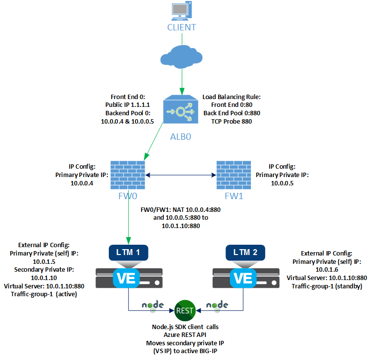
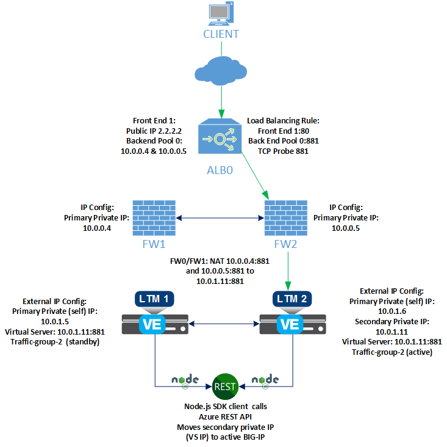

# Alternate Deployment Topologies - cluster (failover-api)

This page contains some alternate deployment topology diagrams for the F5 Cluster Failover-API ARM template which can assist in your deployment planning.

## Contents

- [failover alternate topology 1](#alternate-topology-1)
- [failover alternate topology 2](#alternate-topology-2)

### Alternate topology 1

In this example, a Node.js failover script moves the Azure IP configuration for an application to the active BIG-IP VE for traffic-group-1 via the Azure REST API.

An external Azure load balancer forwards application traffic from the Internet to host destination virtual servers on BIG-IP VE.

---

### Alternate toplogy 2

In this example, a Node.js failover script moves the Azure IP configuration for a second application to the active BIG-IP VE for traffic-group-2 via the Azure REST API.

An external Azure load balancer forwards application traffic from the Internet to host destination virtual servers on BIG-IP VE.

---