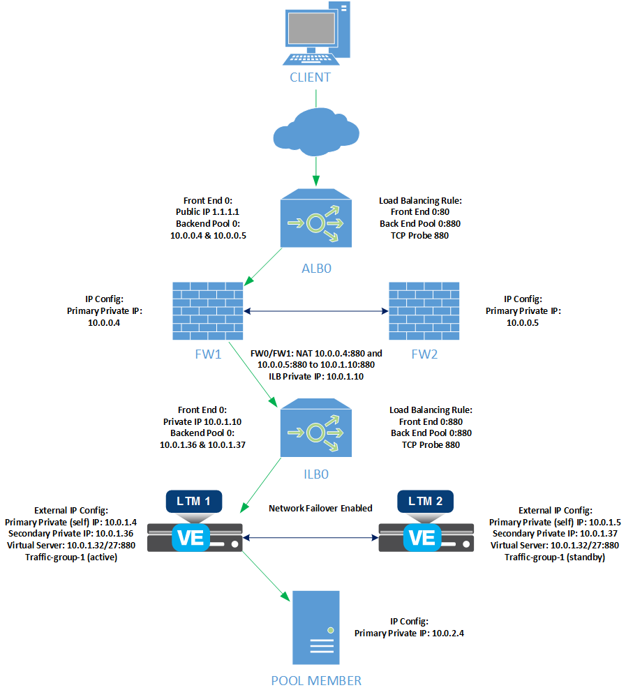
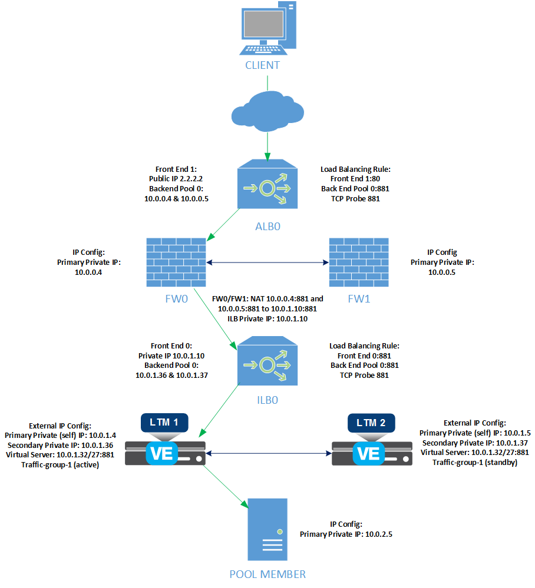
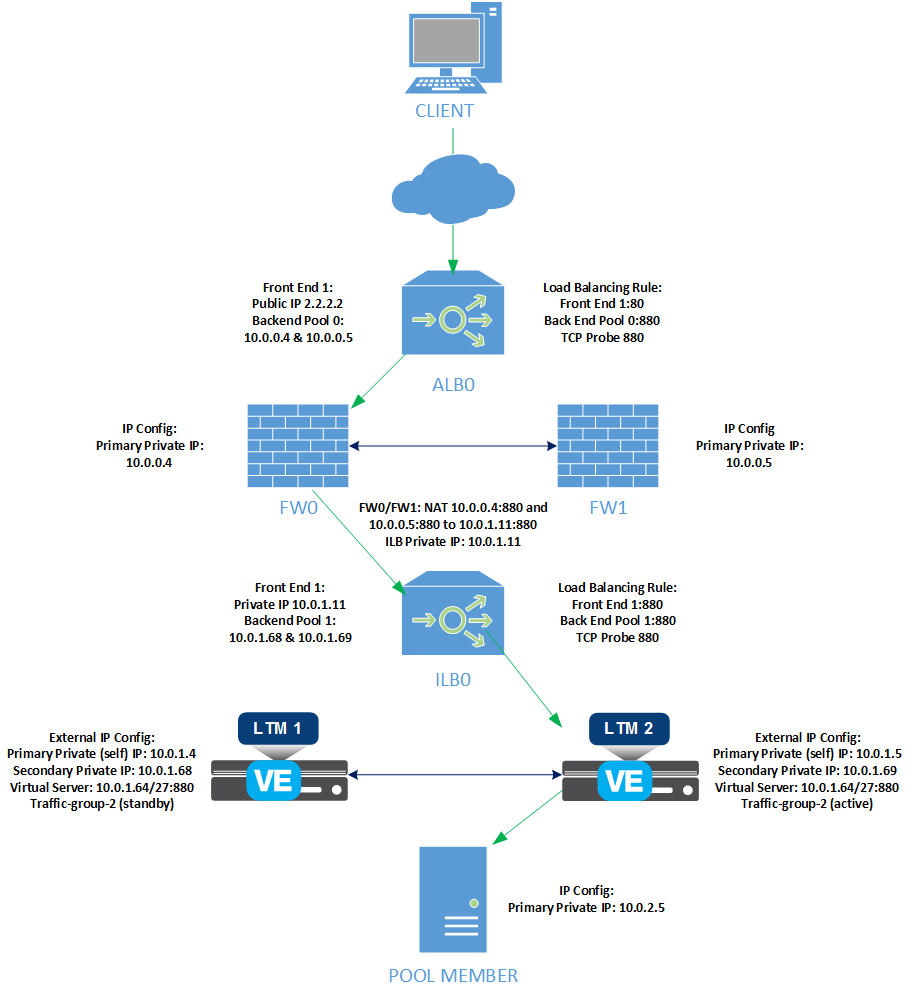
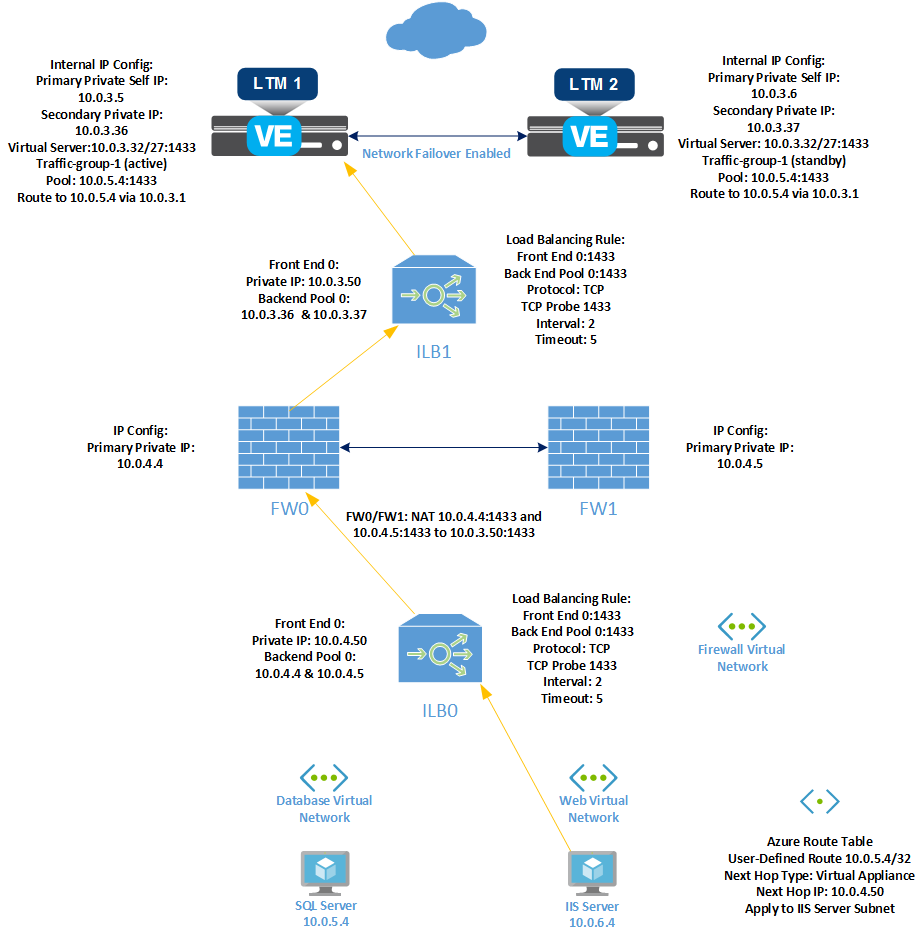
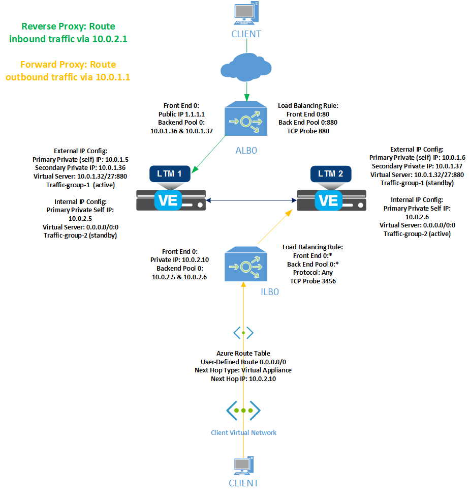

# Alternate Deployment Topologies - cluster (failover-lb)

This page contains some alternate deployment topology diagrams for the F5 cluster failover-lb 3 NIC ARM template which can assist in your deployment planning using the F5 Cluster 3 NIC ARM template.

## Contents

- [Load balancing application traffic via redundant firewalls](#big-ip-ve-ha-pair-load-balancing-application-traffic-via-redundant-firewalls) 
- [Load balancing a second application via redundant firewalls and scaled on destination port](#big-ip-ve-ha-pair-load-balancing-a-second-application-via-redundant-firewalls-and-scaled-on-destination-port)
- [Load balancing a second application scaled on destination address](#big-ip-ve-ha-pair-load-balancing-a-second-application-scaled-on-destination-address)
- [Load balancing East-West application traffic via redundant firewalls](#big-ip-ve-ha-pair-load-balancing-east-west-application-traffic-via-redundant-firewalls)
- [Load balancing reverse/forward proxy traffic via firewalls using an all-protocol Azure load balancer for forward proxy](#big-ip-ve-ha-pair-load-balancing-reverse-forward-proxy-traffic-via-firewalls-using-an-all-protocol-azure-load-balancer-for-forward-proxy)

## BIG-IP VE HA pair load balancing application traffic via redundant firewalls

In this example, we show an HA pair of BIG-IP VEs load balancing application traffic received from a redundant pair of firewalls. Traffic is forwarded to an Azure Internal Load Balancer with a backend pool whose members’ private IP addresses match the destination address and port of a BIG-IP network virtual server configured on *traffic-group-1*.

---

## BIG-IP VE HA pair load balancing a second application via redundant firewalls and scaled on destination port

In this example, traffic for a second application is forwarded to an Azure Internal Load Balancer with a backend pool whose members’ private IP addresses match the destination address and port of a BIG-IP network virtual server configured on *traffic-group-1*. The network virtual server’s destination address is the same as in the first example, while the destination port is unique. Because the virtual servers in examples #1 and #2 share a destination address, they must be created in the same traffic group.

---

## BIG-IP VE HA pair load balancing a second application scaled on destination address

In this example, traffic for a second application is forwarded to an Azure Internal Load Balancer with a second backend pool whose members’ private IP addresses match the destination address and port of a BIG-IP network virtual server configured on *traffic-group-2*. The network virtual server’s destination address is different from example #1. For scaling purposes, the destination address can be a segment of the existing Azure subnet address space.

---

## BIG-IP VE HA pair load balancing East-West application traffic via redundant firewalls

In this example, traffic between internal networks is load balanced first through redundant pair of firewalls and then an HA pair of BIG-IP VEs, with internal Azure load balancers deployed between each pair of devices.

After deployment, for this scenario you must perform the following post-deployment steps:

- BIG-IP: Configure Failover Unicast Address and Primary Local Mirror Address on each device (the self IP on internal VLAN)
- BIG-IP: Create routes to internal subnets
- Delete the ALB created by the template
- Add secondary IP configurations to internal BIG-IP NICs
- Create and configure ILB1
- Create and configure ILB0 (optional)
- Create UDR (optional)
- BIG-IP: Create Virtual Server in traffic-group-1

---

## BIG-IP VE HA pair load balancing reverse/forward proxy traffic via firewalls using an all-protocol Azure load balancer for forward proxy

In this example, reverse proxy traffic is load balanced between an HA pair of BIG-IP VEs using a per-protocol external Azure load balancer, while forward proxy traffic is load balanced between the same HA pair using an internal Azure load balancer configured with an all-protocol load balancing rule.

