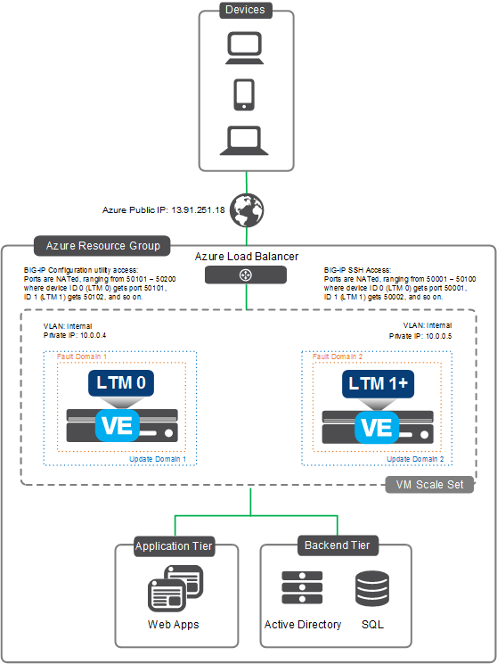

# Deploying the BIG-IP VE from the Azure Marketplace - Autoscale BIG-IP LTM - VM Scale Set

[](https://f5cloudsolutions.herokuapp.com)
[](https://github.com/f5networks/f5-azure-arm-templates/releases)
[](https://github.com/f5networks/f5-azure-arm-templates/issues)

**Contents**
 - [Introduction](#introduction)
 - [Prerequisites](#prerequisites-and-configuration-notes)
 - [Getting Help](#help)
 - [Launching the Solution Template](#launching-the-solution-template)
 - [Configuration Example](#configuration-example)
 - [Post Deployment Configuration](#post-deployment-configuration)
   - [Service Discovery](#service-discovery)
   - [Service Principal Authentication](#service-principal-authentication)

## Introduction

This Azure Marketplace solution uses a solution template to launch the deployment of F5 BIG-IP LTM (Local Traffic Manager) Virtual Edition (VE) instances in a Microsoft Azure VM Scale Set that is configured for autoscaling. Traffic flows from the Azure load balancer to the BIG-IP VE (cluster) and then to the application servers. The BIG-IP VE(s) are configured in single-NIC mode. As traffic increases or decreases, the number of BIG-IP VE instances automatically increases or decreases accordingly.  Scaling thresholds are currently based on *network out* throughput. This solution is for BIG-IP LTM only, and can be deployed into a new or existing networking stack.

## Prerequisites and configuration notes
  - **Important**: When you configure the admin password for the BIG-IP VE in the template, you cannot use the character **#**.  Additionally, there are a number of other special characters that you should avoid using for F5 product user accounts.  See https://support.f5.com/csp/article/K2873 for details.
  - This template supports [Service Discovery](#service-discovery).
  - This template requires service principal.  See the [Service Principal Setup section](#service-principal-authentication) for details.
  - This template has some optional post-deployment configuration.  See the [Post-Deployment Configuration section](#post-deployment-configuration) for details.
  - For this solution, only Azure instances that include premium storage are supported.


## Supported BIG-IP versions
The following is a map that shows the available options for the template parameter **bigIpVersion** as it corresponds to the BIG-IP version itself. Only the latest version of BIG-IP VE is posted in the Azure Marketplace. For older versions, see downloads.f5.com.

| Azure BIG-IP Image Version | BIG-IP Version |
| --- | --- |
| 13.0.0300 | 13.0.0 HF3 Build 3.0.1679 |
| 12.1.2200 | 12.1.2 HF2 Build 2.0.276 |


## Supported instance types and hypervisors
  - This solution supports the following Azure instance types: Standard_DS2, Standard_DS3, Standard_DS4, Standard_DS11, Standard_DS12, Standard_DS13, Standard_DS14, Standard_DS2_v2, Standard_DS3_v2, Standard_DS4_v2, Standard_DS5_v2, Standard_DS11_v2, Standard_DS12_v2, Standard_DS13_v2, Standard_DS14_v2, Standard_DS15_v2, Standard_F2S, Standard_F4S, Standard_F8S.

  - For a list versions of the BIG-IP Virtual Edition (VE) and F5 licenses that are supported on specific hypervisors and Microsoft Azure, see https://support.f5.com/kb/en-us/products/big-ip_ltm/manuals/product/ve-supported-hypervisor-matrix.html.

### Help
Because this solution has been created and fully tested by F5 Networks, it is fully supported by F5. This means you can get assistance if necessary from [F5 Technical Support](https://support.f5.com/csp/article/K40701984).

We encourage you to use our [Slack channel](https://f5cloudsolutions.herokuapp.com) for discussion and assistance on F5 ARM templates.  This channel is typically monitored Monday-Friday 9-5 PST by F5 employees who will offer best-effort support.


## Launching the Solution Template
This Readme file describes launching the auto scale BIG-IP WAF solution template from the Azure Marketplace. From the Azure Marketplace, click the Add (+) button and then search for **F5 autoscale**.  From the search results, click **F5 BIG-IP VE LTM AutoScale Solution** and then click the **Create** button.


### Solution Template Fields
The following table lists the information gathered by the solution template.  Note that fields in the template with an asterisk are required.  Some fields are validated as you type; if you see a red exclamation point, click it to get information on how to correct your entry.

| Section | Field | Description |
| --- | --- | --- |
| **Basics** | Subscription | Ensure the proper subscription is selected. |
| | Resource Group | You can select an existing Azure Resource Group, or have the solution create a new one. If you select a new group, type a name in the field. |
| | Location | Select the Azure location in which you want to deploy this solution. |
| **Infrastructure Settings** | Deployment Name | A unique name for this implementation. |
| | BIG-IP Version | Choose whether you want to use BIG-IP v13 or v12.1.2 |
| | BIG-IP Image Name | Because this solution uses ASM, Best is the only option. |
| | Minimum Number of BIG-IP VEs | The minimum (and default) number of BIG-IP VEs that are deployed into the VM Scale Set. We recommend at least 2. |
| | Licensed Bandwidth | The amount of licensed bandwidth (Mbps) you want to allocate for each WAF. |
| | F5 LTM Username | LTM administrative username for the Azure virtual machine(s). |
| | F5 LTM Password | LTM administrative password for the Azure virtual machine(s). |
| | Confirm Password | Retype the password. |
| | Virtual Machine Size | The size of the Azure virtual machine you want to provision for each cluster node. |
| | Use Managed disks | You can enable managed disks to have Azure automatically manage the availability of disks to provide data redundancy and fault tolerance, without creating and managing storage accounts on your own. |
| | Public IP Address | The public IP address to communicate with the Azure Virtual Machine Scale Set from outside the virtual network. |
| | Domain Name Label | The label used to construct the DNS record of the Azure Public IP. This record must be unique within the Azure region. |
| | Virtual Network | Create a new virtual network, or select an existing network from the same Azure region as the deployment resource group. |
| | Subnets | If you are creating a new virtual network, configure the name and address space for the new subnet.  If you select an existing virtual network, specify an existing subnet in that network. Only subnets meeting the minimum requirements for this solution are displayed. |
| | Restricted source network or address | This field restricts management access to a specific network or address. Enter an IP address or address range in CIDR notation, or asterisk for all sources. |
| | NTP Server | You can use the default NTP server the BIG-IP uses, or replace the default NTP server as applicable. |
| | Time Zone | You can use the default timezone (UTC) or change it as applicable.  This should be in the format of the Olson timezone string from /usr/share/zoneinfo, such as UTC, US/Central or Europe/London. |
| **Autoscale Settings** | VM Scale Set Maximum Count | The maximum number of BIG-IP VEs that can be deployed into the VM Scale Set (2-8). |
| | VM Scale Set Scale Out Throughput | The percentage of *Network Out* throughput that triggers a Scale Out event. This is factored as a percentage of the F5 PAYG image bandwidth (Mbps) size you chose). |
| | VM Scale Set Scale In Throughput | The percentage of *Network Out* throughput that triggers a Scale In event. This is factored as a percentage of the F5 PAYG image bandwidth (Mbps) size you chose). |
| | VM Scale Set Time Window | The time window required to trigger a scale event (in and out). This is used to determine the amount of time needed for a threshold to be breached, as well as to prevent excessive scaling events (flapping). |
| | Tenant ID | Your Azure service principal application tenant ID. |
| | Client ID | Your Azure service principal application client ID. |
| | Secret | Your Azure service principal application secret. |
| |  Email for Scale Event Notifications | If you would like email notifications on scale events you can specify an email address. Note: You can specify multiple emails by separating them with a semi-colon such as 'email@domain.com;email2@domain.com'. |


## Configuration Example 

The following is an example configuration diagram for this solution deployment. In this scenario, all access to the BIG-IP VE appliance is through an Azure Load Balancer. The Azure Load Balancer processes both management and data plane traffic into the BIG-IP VEs, which then distribute the traffic to web/application servers according to normal F5 patterns.



## Post-Deployment Configuration
If you need to add more applications to this deployment, see https://github.com/F5Networks/f5-azure-arm-templates/tree/master/experimental/reference/scripts.

### Additional Optional Configuration Items
Here are some post-deployment options that are entirely optional but could be useful based on your needs.

#### BIG-IP Lifecycle Management
As new BIG-IP versions are released, existing VM scale sets can be upgraded to use those new images. In an existing implementation, we assume you have created different types of BIG-IP configuration objects (such as virtual servers, pools, and monitors), and you want to retain this BIG-IP configuration after an upgrade. This section describes the process of upgrading and retaining the configuration.

When this ARM template was initially deployed, a storage account was created in the same Resource Group as the VM scale set. This account name ends with **data000*** (the name of storage accounts have to be globally unique, so the prefix is a unique string). In this storage account, the template created a container named **backup**.  We use this backup container to hold backup [UCS](https://support.f5.com/csp/article/K13132) configuration files. Once the UCS is present in the container, you update the scale set "model" to use the newer BIG-IP version. Once the scale set is updated, you upgrade the BIG-IP VE(s). As a part of this upgrade, the provisioning checks the backup container for a UCS file and if one exists, it uploads the configuration (if more than one exists, it uses the latest).

**To upgrade the BIG-IP VE Image**
  1. Save a UCS backup file of the current BIG-IP configuration (cluster or standalone)
     - From the CLI command: ```# tmsh save /sys ucs /var/tmp/original.ucs```
     - From the Configuration utility: **System > Archives > Create**
  2. Upload the UCS into the **backup** container of the storage account ending in **data000** (it is a Blob container)
  3. Update the VM Scale Set Model to the new BIG-IP version
     - From PowerShell: Use the PowerShell script in the **scripts** folder in this directory
     - Using the Azure redeploy functionality: From the Resource Group where the ARM template was initially deployed, click the successful deployment and then select to redeploy the template. If necessary, re-select all the same variables, and **only change** the BIG-IP version to the latest.
  4. Upgrade the Instances
     1. In Azure, navigate to the VM Scale Set instances pane and verify the *Latest model* does not say **Yes** (it should have a caution sign instead of the word Yes)
     2. Select either all instances at once or each instance one at a time (starting with instance ID 0 and working up).
     3. Click the **Upgrade** action button.


### Service Discovery
Once you launch your BIG-IP instance using the solution template, you can use the Service Discovery iApp template on the BIG-IP VE to automatically update pool members based on auto-scaled cloud application hosts.  In the iApp template, you enter information about your cloud environment, including the tag key and tag value for the pool members you want to include, and then the BIG-IP VE programmatically discovers (or removes) members using those tags.

#### Tagging
In Microsoft Azure, you have three options for tagging objects that the Service Discovery iApp uses. Note that you select public or private IP addresses within the iApp.
  - *Tag a VM resource*<br>
The BIG-IP VE will discover the primary public or private IP addresses for the primary NIC configured for the tagged VM.
  - *Tag a NIC resource*<br>
The BIG-IP VE will discover the primary public or private IP addresses for the tagged NIC.  Use this option if you want to use the secondary NIC of a VM in the pool.
  - *Tag a Virtual Machine Scale Set resource*<br>
The BIG-IP VE will discover the primary private IP address for the primary NIC configured for each Scale Set instance.  Note you must select Private IP addresses in the iApp template if you are tagging a Scale Set.

The iApp first looks for NIC resources with the tags you specify.  If it finds NICs with the proper tags, it does not look for VM resources. If it does not find NIC resources, it looks for VM resources with the proper tags. In either case, it then looks for Scale Set resources with the proper tags.

**Important**: Make sure the tags and IP addresses you use are unique. You should not tag multiple Azure nodes with the same key/tag combination if those nodes use the same IP address.

To launch the template:
  1.	From the BIG-IP VE web-based Configuration utility, on the Main tab, click **iApps > Application Services > Create**.
  2.	In the **Name** field, give the template a unique name.
  3.	From the **Template** list, select **f5.service_discovery**.  The template opens.
  4.	Complete the template with information from your environment.  For assistance, from the Do you want to see inline help? question, select Yes, show inline help.
  5.	When you are done, click the **Finished** button.

### Service Principal Authentication
This solution requires access to the Azure API to determine how the BIG-IP VEs should be configured.  The most efficient and security-conscious way to handle this is to utilize Azure service principal authentication, for all the typical security reasons.  The following provides information/links on the options for configuring a service principal within Azure if this is the first time it is needed in a subscription.

_Ensure that however the creation of the service principal occurs to verify it only has minimum required access based on the solutions need(read vs read/write) prior to this template being deployed and used by the solution within the resource group selected(new or existing)._

**Minimum Required Access:** **Read** access is required, it can be limited to the resource group used by this solution.

The end result should be possession of a client(application) ID, tenant ID and service principal secret that can login to the same subscription this template will be deployed into.  Ensuring this is fully functioning prior to deploying this ARM template will save on some troubleshooting post-deployment if the service principal is in fact not fully configured.

#### 1. Azure Portal

Follow the steps outlined in the [Azure Portal documentation](https://azure.microsoft.com/en-us/documentation/articles/resource-group-create-service-principal-portal/) to generate the service principal.

#### 2. Azure CLI

This method can be used with either the [Azure CLI v2.0 (Python)](https://github.com/Azure/azure-cli) or the [Azure Cross-Platform CLI (npm module)](https://github.com/Azure/azure-xplat-cli).

_Using the Python Azure CLI v2.0 - requires just one step_
```shell
$ az ad sp create-for-rbac
```

_Using the Node.js cross-platform CLI - requires additional steps for setting up_
https://docs.microsoft.com/en-us/azure/azure-resource-manager/resource-group-authenticate-service-principal-cli

#### 3. Azure PowerShell
Follow the steps outlined in the [Azure Powershell documentation](https://docs.microsoft.com/en-us/azure/azure-resource-manager/resource-group-authenticate-service-principal) to generate the service principal.


## Filing Issues
If you find an issue, we would love to hear about it.
You have a choice when it comes to filing issues:
  - Use the **Issues** link on the GitHub menu bar in this repository for items such as enhancement or feature requests and non-urgent bug fixes. Tell us as much as you can about what you found and how you found it.
  - Contact F5 Technical support via your typical method for more time sensitive changes and other issues requiring immediate support.


## Copyright

Copyright2014-2019 F5 Networks Inc.


## License


Apache V2.0
~~~~~~~~~~~
Licensed under the Apache License, Version 2.0 (the "License"); you may not use
this file except in compliance with the License. You may obtain a copy of the
License at

http://www.apache.org/licenses/LICENSE-2.0

Unless required by applicable law or agreed to in writing, software
distributed under the License is distributed on an "AS IS" BASIS,
WITHOUT WARRANTIES OR CONDITIONS OF ANY KIND, either express or implied.
See the License for the specific language governing permissions and limitations
under the License.

Contributor License Agreement
~~~~~~~~~~~~~~~~~~~~~~~~~~~~~
Individuals or business entities who contribute to this project must have
completed and submitted the F5 Contributor License Agreement.


