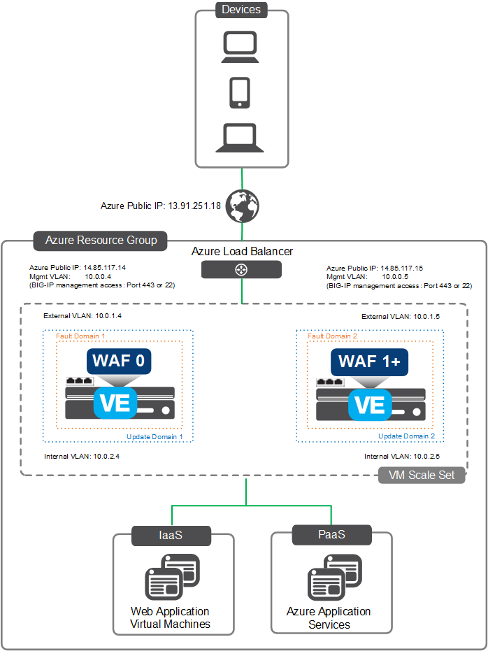

# Deploying the BIG-IP VE from the Azure Marketplace or Azure Security Center - BIG-IP WAF (LTM + ASM)

**Contents**
 - [Introduction](#introduction)
 - [Prerequisites](#prerequisites-and-configuration-notes)
 - [Getting Help](#help)
 - [Launching the Solution Template](#launching-the-waf-solution)
 - [Finalize the WAF ](#finalize-the-waf)
 - [Automatically update signatures](#automatically-update-signatures)
 - [Troubleshooting the F5 WAF](#troubleshooting-the-f5-waf)
   

## Introduction
You can secure your web applications by creating a web application firewall (WAF) that uses the Local Traffic Manager (LTM) and Application Security Manager (ASM) modules. In Azure, the BIG-IP VE instances are configured as a WAF for you, complete with traffic monitoring in Azure. The F5 WAF solution has more than 2600 signatures at its disposal to identify and block unwanted traffic.

When you secure your applications by using an F5 WAF, the BIG-IP VE instances are all in Active status (not Active-Standby), and are used as a single WAF, for redundancy and scalability, rather than failover. If one WAF goes down, Azure will keep load balancing to the other.

This WAF deployment is *semi-automatic*. In an *automatic* deployment, the solution template discovers your application and configures ports, IP addresses, and protocols automatically. A *semi-automatic* deployment is more flexible: you can configure the networking for your application, and because of this, Platform as a Service (PaaS) is supported.

When you secure your applications by using an F5 WAF, the BIG-IP VE instances are all in Active status (not Active-Standby), and are used as a single WAF, for redundancy and scalability, rather than failover. If one WAF goes down, Azure will keep load balancing to the other.

See the [configuration example](#configuration-example) for a visual representation of this solution.

## Prerequisites and configuration notes
  - **Important**: When you configure the admin password for the BIG-IP VE in the template, you cannot use the character **#**.  Additionally, there are a number of other special characters that you should avoid using for F5 product user accounts.  See https://support.f5.com/csp/article/K2873 for details.
  - For this solution, if you choose to use Managed Disks, only Azure instances that include premium storage are available.
  - See [Security Blocking Levels](#security-blocking-levels) for a description of your options when configuring the WAF. 

### F5 WAF instance types and pricing tiers

When you secure web applications with an F5 WAF, you must choose an Azure instance type.

The following instances are recommended minimums; you can choose bigger instances if you want.

| Cores | BIG-IP VE Throughput (hourly only) |  Minimum Azure instance |
| ---  | --- | --- |
| 2 |  25 Mbps |  Standard_A5, Standard_D11 |
| 4 |  200 Mbps | Standard_D3, Standard_DS3_v2 |
| 8 |  1 Gbps  |  Standard_DS4, Standard_DS4_v2 |

For all the available Azure instance types allowed by the solution template, see the [complete list of azure instance sizes](#complete-list-of-azure-instance-sizes).

### Help
Because this solution has been created and fully tested by F5 Networks, it is fully supported by F5. This means you can get assistance if necessary from [F5 Technical Support](https://support.f5.com/csp/article/K40701984).

We encourage you to use our [Slack channel](https://f5cloudsolutions.herokuapp.com) for discussion and assistance on F5 ARM templates.  This channel is typically monitored Monday-Friday 9-5 PST by F5 employees who will offer best-effort support.

## Launching the F5 WAF solution
You have two options for deploying the F5 WAF solution template: from the [Azure Security Center](#launching-the-waf-from-the-azure-security-center) or the [Azure Marketplace](#launching-the-waf-from-the-azure-marketplace).  In either scenario, Web applications can be hosted on Azure virtual machines (IaaS) or the Azure App Service (PaaS).
Refer to the following table for guidance. 

| Azure Environment | F5 License | Deploy From | Notes |
| --- | --- | --- | --- |
| App Service Environment | BYOL | Azure Security Center (ASC)| |
| App Service Plan | BYOL | Azure Marketplace | No logging will show in ASC |
| IaaS (virtual machine) | BYOL |  Azure Security Center (ASC) | |
| App Service Environment | Hourly |  Azure Marketplace | No logging will show in ASC |
| App Service Plan | Hourly | Azure Marketplace | No logging will show in ASC |
| IaaS (virtual machine)   | Hourly  | Azure Marketplace | No logging will show in ASC | 

### Launching the WAF from the Azure Security Center 

Before you create a WAF, you need a web application hosted in Azure, with a public IP address and ports 80 and/or 443 open. When the application is hosted in Azure, messages sent from the BIG-IP VE firewall will be displayed in Azure Security Center.

**To create the F5 WAF from the Azure Security Center**

1. Log in to the Azure portal, portal.azure.com.
2. In the left pane, click **Browse > Security Center**.
3. Click the **Recommendations** widget.
4. From the list of recommendations, select **Add a web application firewall**.
5. From the list of applications, click the web application you want to secure.
6. On the Add a Web Application Firewall blade, click **Create New** and then click **F5 Networks**.
7. On the Choose package blade, click **F5 Networks Semi-automatically provisioned**.
8. At the bottom of the F5 WAF Solution blade, click **Create**.
9. Continue with [Configure the F5 WAF solution template](#configure-the-f5-waf-solution-template).

### Launching the WAF from the Azure Marketplace

Before you create a WAF, you need a web application hosted in Azure, with a public IP address and ports 80 and/or 443 open.

**To create the F5 WAF from the Azure Marketplace** 

1. Log in to the Microsoft Azure Portal at https://portal.azure.com.
2. On the Dashboard, select **Marketplace**.
3. In the **Filter** field, type **F5 WAF Solution** and press Enter.
4. Click the name of the solution.
5. At the bottom of the F5 WAF Solution blade, click **Create**.
6. Continue with [Configure the F5 WAF solution template](#configure-the-f5-waf-solution-template). 

## Configure the F5 WAF solution template
Use the following table for guidance on configuring the F5 WAF from either the Azure Marketplace or the Azure Security Center.

| Blade | Option | Description | 
| --- | --- | ---|
| ***Basic*** | Subscription | Ensure the proper subscription is selected. |
| | Resource Group | You can select an existing Azure Resource Group, or have the solution create a new one. If you select a new group, type a name in the field. |
| | Location | Select the Azure location in which you want to deploy this solution. |
| ***Infrastructure Settings*** | Deployment Name | A unique name that you have not used for previous deployments. |
| | BIG-IP Version | The version of BIG-IP VE you want to use (13.0.021 or 12.1.24). |
| | F5 WAF Username | The username you will use to access BIG-IP VE. |
| | F5 WAF Password | Use a strong password. You will need this if you want to connect to BIG-IP VE. |
| | Confirm Password | Retype the password. | 
| | Virtual machine size | The size of the Azure virtual machine you want to provision for each node in the cluster. Only sizes that use premium storage are available. 
| | Number of WAFs | Choose the number of WAFs you want to deploy (1-4). |
| | License Token | BYOL ONLY: The license key from F5. There are as many license fields as number of WAFs you selected. |
| | Licensed Bandwidth| PAYG ONLY: Throughput is limited to the threshold you choose. |
| | Use managed disks | You can enable managed disks to have Azure automatically manage the availability of disks to provide data redundancy and fault tolerance, without creating and managing storage accounts on your own. | 
| | Storage Account | If you are **not** using managed disks, you must select an existing storage account, or use the template to create a new one. | 
| | Public IP address | Select a new or existing public IP address to communicate with the Azure Virtual Machine from outside the virtual network. |
| | Domain name label | The BIG-IP will be accessible by a name like F5WAF.westus.cloudapp.azure.com. The label you enter will be the first part of the name. Must be unique within the Azure Region.|
| | Virtual network |  Select a new or existing virtual network. |
| | Subnets | If you are creating a new virtual network, configure the name and address space for the internal, internal, and management subnets. If you select an existing virtual network, specify existing subnets in that network. Only subnets meeting the minimum requirements for this solution are displayed.  In either case, ensure that there are available IP addresses to be used for the BIG-IP VE instances. |
| | Restricted source network or address | The IP address or range of addresses that can access the BIG-IP Configuration utility. |
| ***Application Settings*** | Application Protocol | The protocol used to connect to your application (HTTP and HTTPS, HTTP, HTTPS, SSL Offload). |
| | Application Address | The public IP address or fully qualified domain name for the application this WAF will protect. |
| | Application Port | The port your application listens on for unencrypted traffic. This field is not required when deploying HTTP only. |
| | Application Secure Port | The port your application listens on for encrypted traffic. |
| | Application Type | The type of application (such as IIS or Apache) that most closely matches the one you want to secure. The template uses this selection to establish a base security policy for the initial deployment, all applications behind the WAF will use signatures specific to this application type. If the exact application type you are using is not listed, choose something similar, or choose Generic. |
| | Security Blocking Level | The level of traffic you want to flag as insecure. All applications behind the WAF will use this level. The higher the level, the more traffic that is blocked. The lower the level, the more chances that insecure traffic will make it through to your application. See the [Security blocking levels](#security-blocking-levels) for more information. |
| | SSL Certificate Upload | The SSL certificate and key (in .pfx format) corresponding to the application's public virtual server. |
| | Certificate Passphrase | The passphrase for the SSL certificate. |
| | Application Platform | If the application is on an Azure virtual machine, choose IaaS. If your application is on an Azure App Service Environment or App Service Plan, choose PaaS. |
| | Application Service FQDN | For PaaS, the fully qualified domain name that clients will use to access the Azure App Service. |

When you have completed the template, review the ***Summary*** blade, and then on the ***Buy*** blade, click **Purchase**.

***Important:*** The WAF is created behind an Azure load balancer. This deployment may take up to 45 minutes to complete. However, traffic is not yet going to the application servers. You must first finalize the setup.

## Finalize the WAF

Update your DNS records to point to the WAF public IP address.

Then, you can finalize the WAF by allowing traffic from the WAF to access your application servers and the Azure Load Balancer in front of your applications. You must also deny traffic from the internet.  If you launched the WAF from the Security Center, you receive a recommendation to finalize the WAF.  If you launch from the Marketplace, you do not see the recommendation, but still must finalize the WAF using the following guidance.

1. In the Azure portal, open the Network Security Group associated with your application.
2. Click the **Inbound security rules** label.
3. Note the priority number for each existing rule. You are going to create at least three new rules for each application, and they must be higher priority (lower numbers) than the existing rules.

Note: The lowest number you can use is 100. If 100, 101, and 102 are already in use, you must re-create existing rules and assign a higher number to each, so that these numbers are available.

4. On the **Inbound security rules** blade, click Add.
5. Allow the WAF to access the application server.

| Option | Description |
| --- | --- |
| Name | A unique, descriptive name for the rule, for example allow_http_waf_appsrv0. |
| Priority | A unique priority that is lower than any other security rule. |
| Source | Choose CIDR block. |
| Source IP address range	 | The public IP address(es) of the BIG-IP VE management interface(s).  The public IPs of the management interfaces end with **-mgmt-pip0** through **-mgmt-pip3**. |
| Service	| The service on the application server, for example HTTP or HTTPS. |
| Protocol | Choose TCP. |
| Port range | The TCP port on which your application server listens for traffic, for example, 80. |
| Action | Choose Allow. |

8. Click **OK**.

9. Allow the WAF to access the Azure Load Balancer in front of your application servers.

| Option | Description | 
| --- | --- |
| Name | A unique, descriptive name for the rule, for example allow_http_alb_appsrv0. |
| Priority | A unique priority that is just above the previous rule. |
| Source | Choose Service Tag. |
| Source service tag | Choose AzureLoadBalancer. |
| Service | The service on the application server, for example HTTP or HTTPS. |
| Protocol | Choose TCP. |
| Port range | The TCP port on which your application server listens for traffic, for example, 80. |
| Action | Choose Allow. |
  
10. Click **OK**.
11. Deny internet traffic from getting to the application server.

| Option | Description |
| --- | --- |
| Name | A unique, descriptive name for the rule, for example deny_http. |
| Priority | A unique priority that is just above the previous rule.|
| Source  |  Choose Tag.|
| Source tag | Choose Internet.|
| Service | Choose Custom.|
| Protocol | Choose Any. |
| Port range | The TCP port on which your application server listens for traffic, for example, 80. |
| Action | Choose Deny. |

12. Click **OK**.

Repeat these steps for each application server in the deployment.

You should no longer be able to access the application from the internet. Instead, you should be able to access the application by using the public IP address of the Azure Load Balancer for the WAF.

## Automatically update signatures

You must update settings in BIG-IP VE to ensure that the latest signatures are used for the WAF.

1. In the Azure portal, in the left pane, click **Browse > Resource groups**.
2. Click the name of your resource group and then in the SETTINGS area, click **Deployments**.
3. Click the original deployment.
4. In the Outputs section, copy the GUI-URL.
5. Open a web browser window and paste the text.
   The BIG-IP Configuration utility opens.

6. Log in to the BIG-IP Configuration utility with the username **azureuser** and the password you specified when you created the WAF.
7. On the Main tab, click Security > Security Updates > Application Security.
8. For the Update Mode setting, click **Scheduled**.
9. Select the update interval and click **Save Settings**.

Signatures are now updated at the interval you specified.

## View violations and status messages from the WAF
You can view more detailed information about traffic being monitored by the WAF, and if necessary, block or unblock it.

Note: If you deployed the WAF from the Azure Marketplace, violations and status messages do not appear in Azure Security Center.

1. In the Azure portal, in the left pane, click Browse > Security Center.
2. In the Detection area, click the Security alerts chart.
   The chart displays flagged traffic from all vendors.

3. Filter the list by clicking the Filter icon at the top of the page.
4. To see details, click the traffic you're interested in.
5. On the blade that opens, click the row to show more details.
6. On the blade that opens, copy the Remediation Steps- Extra Information text.
7. Click the Management URL link and log in with the username azureuser and the password you specified when you created the WAF.

8. In the browser address bar, remove /xui from the address and paste the remediation steps information, for example:

   https://example.com:8443/dms/policy/win_open_proxy_request.php?id=&support_id=4854296639235424357

   The BIG-IP Configuration utility displays the details of the message.

9. To stop blocking the traffic that's displayed, in the Accept Status area, click the Accept this Request button.

## Deploying Additional Applications to the WAF
If you want to deploy additional applications to the F5 WAF after launching this solutions, see https://github.com/F5Networks/f5-azure-arm-templates/tree/master/experimental/reference/scripts.

## Configuration example
The following is a simple configuration diagram for this deployment. In this diagram, the IP addresses are provided as examples. 

As traffic passes through the WAF, alerts are sent to Azure about possible violations. The amount of traffic that is flagged depends on the security blocking level you choose when you create the WAF.

## Security blocking levels
The security blocking level determines how much traffic is blocked and alerted by the F5 WAF.

*Attack signatures* are rules that identify attacks on a web application and its components. The WAF has at least 2600 attack signatures available. The higher the security level you choose, the more traffic that is blocked by these signatures.

| Level | Details |
| --- | --- |
| **High** | The most attack signatures enabled. A large number of false positives may be recorded; you must correct these alerts for your application to function correctly. |
| **Medium** | A balance between logging too many violations and too many false positives. |
| **Low** | The fewest attack signatures enabled. There is a greater chance of possible security violations making it through to the web applications, but a lesser chance of false positives. |
| **Off** |  Violations are logged but no traffic is blocked. |
| **Custom** | If you have an existing ASM Security policy, you can upload it.  For more information, see https://support.f5.com/kb/en-us/products/big-ip_asm/manuals/product/asm-implementations-12-1-0/33.html#unique_697805654. | 

For all levels except Custom, the WAF learns from traffic that is not blocked. Over time, if the WAF determines that traffic is safe, it allows it through to the application. Alternately, the WAF can determine that traffic is unsafe and block it from the application.

## More granular control of WAF settings

The Application Security Manager (ASM) module on the F5 WAF has policy settings that determine how the WAF behaves.

Although these policy settings are automatically configured when you create the WAF, you can log in to BIG-IP Configuration utility and change them. You should not change settings unless you are familiar with ASM™. For more information about ASM, see the Changing Security Policy Settings chapter in the BIG-IP Application Security Manager: Implementations guide on http://support.f5.com/kb/en-us.html.

Important: Wait approximately five minutes after the WAF is created before making changes to the associated ASM security policy.

## Troubleshooting the F5 WAF

If you log in to the BIG-IP Configuration utility, you might notice the following messages or warnings.

**Warning: Source Template Has Changed**

You can ignore this message. It might be displayed when you add an application to a WAF or reconfigure an application in Azure Security Center.

**Changes Pending**

You can ignore this message. If you made changes to ASM security policy, the changes are automatically synchronized to the WAF devices in your deployment through a device group called Sync. A separate device group called datasync-global-dg is synchronized manually and is the cause of the message.

**Virtual servers may be in Unchecked status**

You can ignore this message. Traffic will still be forwarded correctly through the virtual servers.

## Find the BIG-IP VE registration key

If you are using a BYOL version of the F5 WAF, and you need to call F5 Support, you will need the registration key associated with BIG-IP VE.

1. In the Azure portal, in the left pane, click Browse > Resource groups .
2. Click the name of your resource group and then in the SETTINGS area, click Deployments.
3. Click the original deployment.
4. In the Outputs section, copy the GUI-URL.
5. Open a web browser window and paste the text.
   The BIG-IP Configuration utility opens.
6. Log in to the BIG-IP Configuration utility with the username azureuser and the password you specified when you created the WAF.
7. On the Main tab, click System > License and click Re-activate.

The key is displayed in the Base Registration Key field.

## Delete a WAF
If you no longer need a WAF, you can delete it. The associated resource group and all related objects remain, and should be manually deleted.

1. In the Azure portal, in the left pane, click Browse > Security Center .
2. In the Prevention area, click the Partner solutions widget.
3. On the Partner solutions blade, select the WAF you want to delete.
4. On the blade for your WAF, in the Associated resources section, ensure that only one application is linked to the WAF.
5. Click Delete solution.
6. On the confirmation message, click Yes.

This deletes the WAF. If you would like, you can now associate the application with another WAF.

## Complete list of Azure instance sizes
The following are the Azure virtual hardware instances you can use:  
 Standard_DS4, Standard_DS11, Standard_DS12, Standard_DS13, Standard_DS14, Standard_DS3_v2, Standard_DS4_v2, Standard_DS5_v2, Standard_DS11_v2, Standard_DS12_v2, Standard_DS13_v2, Standard_DS14_v2, Standard_DS15_v2, Standard_F4S, Standard_F8S, Standard_A4, Standard_A5, Standard_A6, Standard_A7, Standard_A8, Standard_A9, Standard_D3, Standard_D4, Standard_D11, Standard_D12, Standard_D13, Standard_D14, Standard_D3_v2, Standard_D4_v2, Standard_D5_v2, Standard_D11_v2, Standard_D12_v2, Standard_D13_v2, Standard_D14_v2, Standard_D15_v2, Standard_F4, Standard_F8

 ## Filing Issues
If you find an issue, we would love to hear about it. 
You have a choice when it comes to filing issues:
  - Use the **Issues** link on the GitHub menu bar in this repository for items such as enhancement or feature requests and non-urgent bug fixes. Tell us as much as you can about what you found and how you found it.
  - Contact F5 Technical support via your typical method for more time sensitive changes and other issues requiring immediate support.

## Copyright

Copyright2014-2019 F5 Networks Inc.

## License

### Apache V2.0

Licensed under the Apache License, Version 2.0 (the "License"); you may not use
this file except in compliance with the License. You may obtain a copy of the
License at

http://www.apache.org/licenses/LICENSE-2.0

Unless required by applicable law or agreed to in writing, software
distributed under the License is distributed on an "AS IS" BASIS,
WITHOUT WARRANTIES OR CONDITIONS OF ANY KIND, either express or implied.
See the License for the specific language governing permissions and limitations
under the License.

### Contributor License Agreement

Individuals or business entities who contribute to this project must have
completed and submitted the F5 Contributor License Agreement.