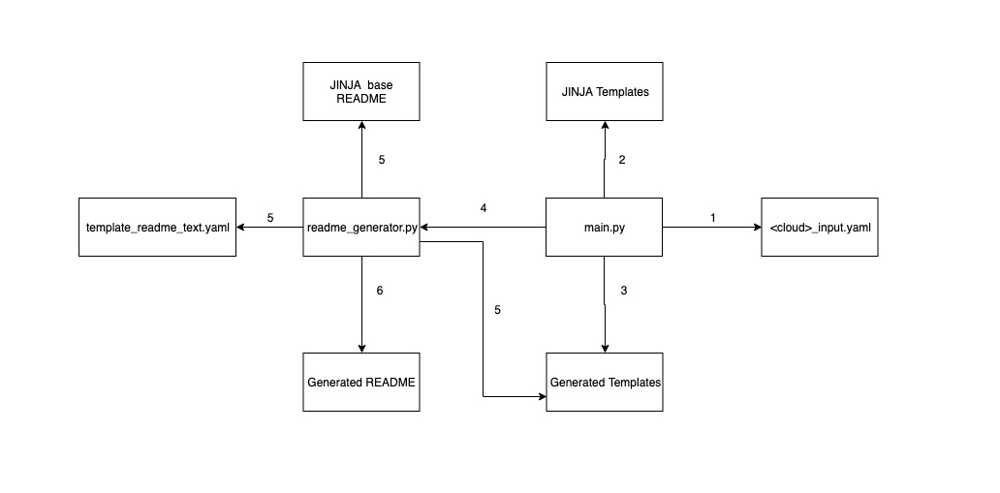

# Introduction

This directory includes template generator tool intended for generating Cloud Templates as well as README files which describe each template requirements, features and parameters. 

## Usage

The template generator uses Makefile as a build tool and the following build options are availabe:

- Generate Templates (All Cloud): ```make all```

### Additional options

- Generate Azure Templates: ```make azure```
- Generate Google Cloud Templates: ```make gce```

For a complete list of up to date options run: ```make help```

Notes: 

- Per best practice, a python virtual environment will be prior to executing the template generator; therefore, please ensure that Python3 is available.


## Overview (High Level Archetecture)

### Directory structure

- azure: includes files related to azure template and README files generation
    - files: contains base deploy scripts (PS and bash), base README files as well as config yml used for README generation
- gce: includes files related to gce templates and README files generations
    - experimental: JINJA templates used for building the experimental cloud templates
    - supported: JINJA tempaltes used for building the supported cloud templates 
    - files: includes JINJA template and base README for GCE README files generation
- common: contains common scripts, local version of verifyHash


### Components description

This project consists of the following components: 
    
- main.py - python script which includes all main logic for template geneartion; the script uses yml config file to construct the path to each template and then using JINJA templating mechanism, the script generates and outputs templates for each cloud, solution, stackType and etc
- \<cloud_name\>_input.yaml - configuration file which contains directories hierarchy, and the directories are used for distinguishing between clouds, solutions, stackTypes and etc
- JINJA templates (files with 'jn2' extension) - these files include condition logic which can be used for including particular snippets for every case.   


### Components Diagram




## Workflow

1. main.py recursively loads \<cloud\>-input.yaml configuration file which represents templates directory structure as well as this file is used for setting variables map, which provides details about each template
2. using variables map from YML as well as JINJA template, main.py generates cloud templates file such as:
    - template
    - parameters
    - deploy scripts (this is done only for azure cloud)
    - schema (this is only for google cloud)
3. main.py outputs generated template under corresponding directory
4. main.py triggers readme generation for each template by executing readme_generator.py script
5. readme_generator.py loads YML config with README snippets/texts as well as it loads parameter/schema file used for populating parameters table on README. It also loads base README file which represent bare bone of resulted README document
6. readme_generator.py generates and outputs README file

## Supported Clouds

- Azure
- Google Cloud

## Steps for README Generation

Since README generator uses template files, such as parameters or schema, as well as it uses variables map, which is a part of template generator, the readme generator gets executed via template generator.

The following steps can be used for updating text in README file: 
1. Locate and open base.README.md file which represents bare-bone of README file
2. Search for section where text needs to be updated/added
3. Section could already include text; however this text will be shared (i.e. Licsense Agreement) for all README files. In the most common use-case, a section will include token, which represents string encapsulated into curly brackets (i.e. {{TOKEN}})
4. Store the token name
5. Open readme_generator.py file (located under /common directory) and search for token name
6. Using {{EXTRA_PREREQS}} token as example, you should see the following: ```self.variables["EXTRA_PREREQS"] = extra_prereq```
7. Copy and seach, within readme_generator.py, using varaible name (i.e. extra_prereq), intended for populating the JINJA token. The search result should look like this: ```extra_prereq = self.get_tmpl_text('templates', template_name, 'prereq_list')```
8. "prereq_list" is field within YML config file which is used for storing text snippets which will be rendered within README, therefore, open template_text.yml (located under <cloud>/files/readme_files/template_text.yaml) and search for "prereq_list" string.
9. There are a few options what can be stored under YML field (i.e. prereq_list): 
    * clear text which will be rendered instead of token used within base README file
    * texts with conditions - it is possible to store different versions of texts using the same YML field; here is an example: 
       
       **Example 1:** this example uses exclude filter to exclude text from existing and production stacks:
      ```yaml
        additional_security_notes:
          default: "- In the */config/installCloudLibs.sh* section **\"tmsh load sys config merge file /config/verifyHash\"**"
          exclude:
            stackType:
              - existing-stack
              - production-stack
       ```
        
       **Example 2:** this example applies different text based on stackType:
      ```yaml
        support_notes:
          default: "Because this template has been created and fully tested by F5 Networks, it is fully supported by F5. This means you can get assistance if necessary from [F5 Technical Support](https://support.f5.com/csp/article/K25327565). You can modify the template itself if necessary, but if you modify any of the code outside of the lines ### START CUSTOM TMSH CONFIGURATION and ### END CUSTOM TMSH CONFIGURATION the template is no longer supported by F5."
          stackType:
            learning-stack: "While this template has been created by F5 Networks, it is in the experimental directory and therefore has not completed full testing and is subject to change.  F5 Networks does not offer technical support for templates in the experimental directory. For supported templates, see the templates in the **supported** directory."
      ```
    * list of links to other YML fields - in a case, when the same sentence is re-used by different templates; it is possible to create a dedicated YML field for this common sentence and then use this new field for including common sentence in different templates: 
        
        **Example 3:**
         ```yaml
        prereq_list:
          - byol_note
          - ssh_key_pair
          - install_google_sdk
          - standalone_prereq_general_list
          - standalone_prereq_1nic_list
          - standalone_prereq_1nic_waf_list
       ```
       and as an example, the "byol" field, which is referenced above under prereq_list, will be stored under "note_text" section of YAML config and it will look like this:
       ```yaml
           byol_note:
            default: 'An F5 Networks BYOL license (Bring Your Own License) available.'
            exclude:
              licenseType:
                - payg 
       ```
       In this example, byol_note will be used only when `licenseType=byol` and it won't be added to the pre-request list when `licenseType=payg`


In a situation, when a new section needs to be added to base.README.md, use the following steps: 

1. Open base.README.md and find place where new section needs to be added
2. Add JINJA token; i.e. {{TOKEN_NAME}}
3. Open readme_generator.py and add code for populating JINJA token:
      ```yaml
      yml_field_name = self.get_custom_text('templates', template_name,"yml_field_name")
      self.variables["TOKEN_NAME"] = yml_field_name
     ```
4. Open template_text.yaml config file and include new field under "templates/<template_name>"
    ```yaml
    templates:
     standalone_1nic:
       yml_field_name: 'Some text here'
    ```
       

Updating README parameters:

- Each README file includes table which outlines all input parameters for Cloud Templates
- Template Generator uses parameter.json (for azure) or py.schema (for gce) files to get parameters data
- Then, template geneator adds parameters to README

The following steps describes how to update parameters: 

- For Azure:

    1. Under /azure directory, locate parameter.json (or parameters_bigiq.json if this is bigiq case) template
    2. Find parameter which needs to be updated
    3. Update parameter value
    4. Run Template Generator to generate Azure Templates and READMEs (i.e. ```make azure```)
    
- For GCE: 

    1. Under /gce/<supported/expiremental> directory, locate JINJA tempalte for schema file (do not panic because these templates are pretty simple)
    2. Review JINJA template for schema file. As it can be seen, JINJA allows to enable condition logic to set parameters for different cases
    3. Locate paramater which needs to be updated and make the change
    4. Execute template generator to generate new Google Cloud templates: (i.e. ```make gce```)


## Feature Ideas

This is a place to record a growing and shrinking list of improvements that can be made to the generator, as they come to the contributors.

- Generator is in python, we should enforce linting.
- Azure BIG-IQ templates should be folded into standard jinja templating instead of having seperate `parameters_bigiq.json` file.